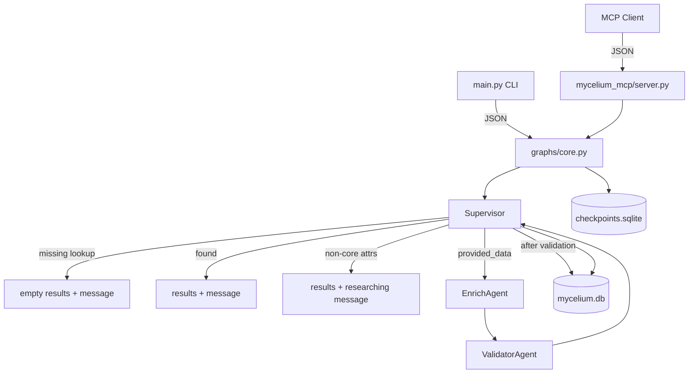

# Mycelium

A maintainable LangGraph prototype for **AI-managed data sources**. External agents query people records via MCP; a **supervisor** coordinates core lookup, ingest routing, validation, and specialist handoff for non-core attributes.

## Quick start

```bash
uv sync --all-extras
cp .env.example .env

# Query existing CRM seed record
uv run mycelium query --person-key "Nichanan Kesonpat"

# Same query with a stable conversation thread (echoed in JSON as thread_id)
uv run mycelium query --person-key "Nichanan Kesonpat" --thread-id "session-abc"

# Request non-core attributes (core record in results; message describes ongoing research)
uv run mycelium query --person-key "Nichanan Kesonpat" --attributes age x_handle

# Ingest a missing person (core fields only)
uv run mycelium ingest --person-key "new@example.com" --data '{"id":"","name":"New User","employer":"Example Corp"}'

# MCP server (stdio)
uv run mycelium-mcp
```

See [docs/database-notes.md](docs/database-notes.md) if you have an older `data/mycelium.db` from before the schema simplification.

### Response shape

CLI and MCP return **`PersonResponse`** JSON: `results`, `message`, `debug`, plus optional correlation fields:

```json
{
  "results": [{ "id": "…", "name": "…", "employer": "…" }],
  "message": "Found core record for …",
  "debug": "…",
  "trace_id": null,
  "thread_id": "session-abc"
}
```

- **`thread_id`** — Passed via `--thread-id` (CLI) or top-level `thread_id` in MCP request JSON; used for session continuity and LangGraph checkpointing.
- **`trace_id`** — Populated when LangSmith tracing is enabled (`LANGCHAIN_TRACING_V2`); links the response to the run in LangSmith.

## Enabling LangSmith Tracing

LangSmith provides observability for the graph executions (supervisor routing, ingest paths, etc.).

1. Sign up for a free account at [smith.langchain.com](https://smith.langchain.com).
2. Go to Settings → API Keys and create a new key. **Choose Key Type: Personal Access Token (PAT)** (not Service Key). This will produce a key starting with `lsv2_pt_`.
3. Copy `.env.example` to `.env` and fill in:
   - `LANGCHAIN_TRACING_V2=true`
   - `LANGCHAIN_API_KEY=lsv2_pt_...` (paste your PAT)
   - `LANGCHAIN_PROJECT=mycelium` (or your project name)
     **No need to pre-create this project in the LangSmith UI.** The first trace sent with this project name will automatically create a new project called "mycelium" (or whatever you set) under your workspace. You can later rename, organize, or add tags in the LangSmith dashboard if desired. This variable controls which "folder"/project your traces appear under in the LangSmith UI.
4. (Optional) For full trace URLs in output, set `LANGSMITH_ORG_ID` and `LANGSMITH_PROJECT_ID`.
5. Run commands as usual. Responses will include `trace_id`, and the CLI will print a direct LangSmith trace URL when tracing is active.

To disable (no key needed, no data sent): set `LANGCHAIN_TRACING_V2=false` or unset it. `trace_id` will be `null`.

See `docs/architecture.md` and `.env.example` for more.

## Local Debugging with LangSmith Studio (LangGraph Studio)

The Studio setup gives you a rich visual debugger for the exact graph (supervisor routing, the full ingest path, state inspection, etc.).

The `langgraph dev` command runs your graph execution locally on your machine. The Studio UI (the visual part) is a web app at smith.langchain.com that connects to your local server via a tunnel (currently ngrok). This is the supported way to get the nice interactive graph view.

**Recommended way to start:**

```bash
./bin/run-studio
```

Then in another terminal:

```bash
ngrok http 2024
```

(This forces tracing off. The script starts the dev server on localhost; you expose it with ngrok.)

The terminal running the dev server will print the local address. ngrok will print the public https://...ngrok.io (or ngrok-free.app) URL.

**Important:** Tunnels are ephemeral. Every new ngrok session (or `./bin/run-studio` restart) gives a new URL. Always use the URL from the *current* terminals. Do not reuse old ones from previous runs or old browser tabs.

Once connected you can send test inputs matching the CLI/MCP and visually step through the supervisor, enrich, and validator nodes.

See `.env.example` and the troubleshooting notes below.

The `langgraph.json` has the graph entrypoint and expanded CORS settings for Studio (smith.langchain.com origins + methods/headers/credentials). If you change it, you must restart the dev server.

**Troubleshooting "Failed to initialize Studio TypeError: Failed to fetch"**:
- The cloud Studio page cannot directly fetch from your localhost. You must use a tunnel (ngrok in the current setup).
- Make sure `LANGCHAIN_TRACING_V2=false` (or unset) so the dev server doesn't try to phone home to LangSmith during startup.
- After starting `./bin/run-studio` + `ngrok http 2024`, copy the https ngrok URL.
- In a separate browser tab, visit that plain ngrok URL first and complete the ngrok "Visit Site" / warning page until you see clean JSON `{"ok":true}`.
- Then go to https://smith.langchain.com/studio/ in a *fresh* tab.
- Click "Connect to a local server" and paste the current ngrok URL.
- Hard-refresh the Studio page (Cmd/Ctrl-Shift-R) if needed.
- If still issues, try a different browser (Chrome/Firefox are usually more lenient).
- Check terminal output for any server startup errors (e.g. port in use — use `--port 8001`).
- The CORS config in langgraph.json (full allow_methods, allow_headers, allow_credentials) allows the smith.langchain.com origins. If you edit it, restart the dev server.

**For the specific error "Failed to connect to Agent Server because the domain 'xxx.ngrok.io' is not allowed"** (or similar for any tunnel):
- This is the Studio UI's security check for the tunnel domain (tunnels change every run).
- On the error page you are on (the one with the URL you pasted), look for **"Advanced Settings"** (usually at the bottom or in the connection panel).
- In Advanced Settings, add the exact domain from the error (both the bare domain and the `https://` version).
- Save/apply, then click Connect or refresh.
- Next time you get a new ngrok URL, you'll need to add the new domain in Advanced Settings again (or use the "Connect to local server" flow each time).

This is normal for tunnel-based local dev. The terminal output from ngrok and langgraph dev will show the exact current URL.

**For "Failed to initialize Studio" / "TypeError: Failed to fetch" / "ConnectionError: Unable to connect..."** (the most common tunnel gotcha):
- You **must** have `./bin/run-studio` actively running and `ngrok http 2024` (or your tunnel) actively running in terminals right now.
- **Tunnels are ephemeral:** Old URLs are dead once the ngrok session or dev server stops. You must use the URL from the *current* running sessions.
- **Steps (official + proven flow):**
  1. Start `./bin/run-studio`, then in another terminal run `ngrok http 2024`.
  2. Note the **current** 🚀 API URL from ngrok (https://...ngrok.io).
  3. In a separate browser tab, visit that **plain new API URL** first. Complete any ngrok warning/visit page until it shows clean `{"ok":true}` JSON.
  4. Open a **completely fresh** tab to `https://smith.langchain.com/studio/` (hard refresh or new tab; old tabs may have stale connections).
  5. Click **"Connect to a local server"** (the manual button — do not just open an old pre-filled link or rely on auto-connect).
  6. Paste the **current live** ngrok URL.
  7. In Advanced Settings (if it complains about domain), add the new bare domain + `https://` version.
  8. Click Connect.
- The langgraph.json has expanded CORS — restart the dev server after editing it.
- Try Incognito or Firefox.
- Verify locally the server responds (`curl http://127.0.0.1:2024/ok`), then test the *current* ngrok URL directly in a browser tab.

## Architecture



| Layer | Path | Role |
|-------|------|------|
| Models | `src/models/state.py` | `Person`, `PersonQuery`, `PersonResponse`, graph state |
| Storage | `src/storage/core.py` | SQLite core `people` table (id, name, employer) |
| Agents | `src/agents/supervisor.py`, `enrich.py`, `validator.py` | Explicit responsibilities |
| Graph | `src/graphs/core.py` | LangGraph + `SqliteSaver` checkpointer |
| MCP | `src/mycelium_mcp/server.py` | `query_person`, `submit_person_data`, `list_specialist_routing` |
| Seed | `data/seed_crm.json` | 457 contacts from `raw_data.json` (dedup: Andrea Kalmans → Lontra Ventures, Pete Townsend → Techstars) loaded on startup |

## Specialist routing (Phase 1)

Core CRM fields are **id**, **name**, and **employer** only. When a query asks for anything else (e.g. `age`, `x_handle`):

1. The supervisor returns the core person in `results` and explains in `message` that those attributes are still being researched.
2. No shared derivative-dataset tables or registry exist in Phase 1 — specialist agents are coordinated by the supervisor, not stored as formal datasets in core storage.
3. Future phases will spawn real specialist agents per attribute domain; enrich/validator today only handle minimum viable core ingest.

See [docs/architecture.md](docs/architecture.md) for current architecture and direction.

## Repository layout

```
mycelium/
├── data/seed_crm.json
├── src/
│   ├── agents/
│   ├── graphs/core.py
│   ├── models/state.py
│   ├── storage/core.py
│   ├── mycelium_mcp/server.py
│   └── main.py
├── prompts/system/CORE_PROMPT.md
└── docs/architecture.md
```

## Development

```bash
uv run pytest
uv run ruff check src tests
```

## Status

MVP core flow: MCP + CLI + SQLite persistence + supervisor graph. Next: real specialist agent spawning, vector search, LLM enrichment.
