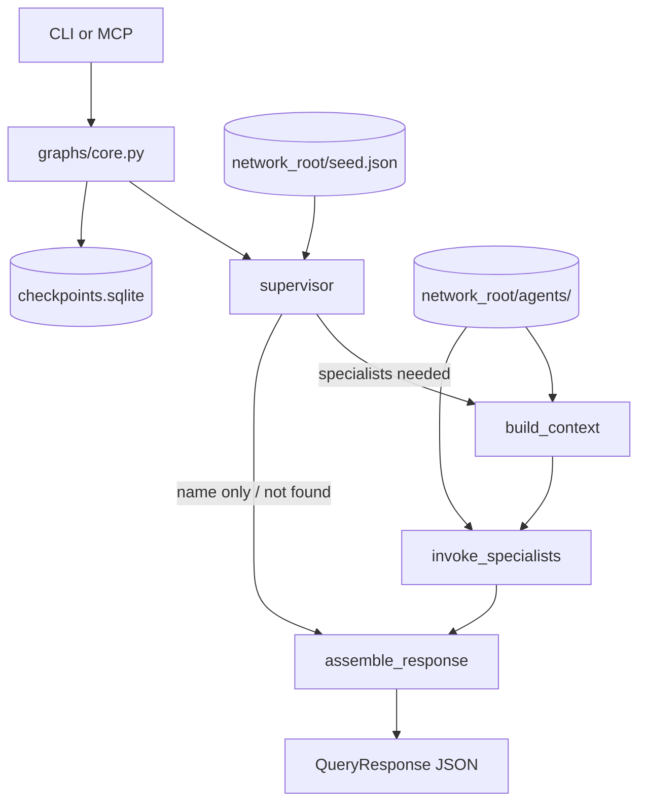

# Mycelium

**Download the framework** (this repo), then **run named networks** at paths you choose. Each **network** is an isolated data namespace (seed, ontology, specialist registry, storage, checkpoints). The **supervisor** and specialist agents operate inside one network at a time.

A fresh clone has **no live network** until you bootstrap. Run **`./bin/refresh-example-network crm`** (copies the committed CRM example to `~/mycelium-networks/crm` and registers it as default). Register named networks in **`~/.config/mycelium/networks.json`** (override with **`MYCELIUM_NETWORKS_CONFIG`**) so you can use **`--network <name>`** without repeating paths. Pre-networks snapshot: git tag **`prototype`**.

Public repo: [github.com/myceliumdata/mycelium](https://github.com/myceliumdata/mycelium) · Architecture: [docs/architecture.md](docs/architecture.md) · Networks plan: [docs/plans/networks-terminology.md](docs/plans/networks-terminology.md) · License: MIT

## Quick start

```bash
git clone https://github.com/myceliumdata/mycelium.git
cd mycelium
uv sync --all-extras
cp .env.example .env
# Add OPENAI_API_KEY and TAVILY_API_KEY to .env for synchronous field research on cache miss.

# Bootstrap or reset the CRM example (default: ~/mycelium-networks/crm)
./bin/refresh-example-network crm

# Query (uses default registered network)
uv run mycelium query --entity-key "Nichanan Kesonpat"
```

**When to use which:**

| Goal | Command |
|------|---------|
| **CRM example** (committed reference; wipe stale research before demos) | `./bin/refresh-example-network crm` |
| **Custom domain** (your categories + specialists) | `uv run mycelium network create <name> --root <path> --seed <file> --prompt "..."` |
| **Live demo UI** (network state while you query) | `./bin/restart-admin` → open `http://127.0.0.1:5173` |

**Demo runbook:** Before a demo, run `./bin/refresh-example-network crm --yes` to restore a clean seed and drop cached specialist research. **Restart your MCP server** (e.g. Claude Desktop) after refresh so it reloads the wiped network. Use a **fresh `thread_id`** per query attribute when demonstrating research (avoids stale checkpoint state).

Custom network example (fake paths):

```bash
uv run mycelium network create wheat_farm \
  --root ~/mycelium-networks/wheat \
  --seed ./seed.json \
  --prompt "Agronomic network: wheat yield, soil chemistry, weather risk — not person CRM" \
  --display-name "Wheat Farm" \
  --default
```

`network create` copies seed, runs an LLM **skeleton ontology** (categories + specialists under `<root>/specialists/`), registers the name, and prints an MCP snippet. **Ontology** is fixed at create; **classification** still grows `attribute_map` lazily when clients request unknown attributes. See [docs/plans/networks-phase5.md](docs/plans/networks-phase5.md).

### CLI

```bash
# Seed identity only (name + employer from your network's seed.json)
uv run mycelium query --entity-key "Nichanan Kesonpat"

# Request non-core attributes (merged into results when specialists have data)
uv run mycelium query --entity-key "Andrea Kalmans" --attributes email

# Stable conversation thread (echoed as thread_id in JSON)
uv run mycelium query --entity-key "Nichanan Kesonpat" --thread-id "session-abc"

# Explicit example path (no registry required)
uv run mycelium query --network-dir examples/networks/crm --entity-key "Nichanan Kesonpat"

# Registered network name (from ~/.config/mycelium/networks.json)
uv run mycelium query --network crm --entity-key "Andrea Kalmans"

# Network management
uv run mycelium network create my_net --root ~/mycelium-networks/my_net --seed ./seed.json --prompt "..."
uv run mycelium network register crm --root ~/mycelium-networks/crm --default
uv run mycelium network list
uv run mycelium network use crm
uv run mycelium network status
uv run mycelium network status --network crm --verbose
uv run mycelium network status --network crm --json
```

**`network status`** is a read-only demo/ops snapshot (scannable default layout with ✅/❌). Use **`--verbose`** for root path, agent modules, and field-level debug detail. **`--json`** pipes full data to `jq`.

Example (fresh network):

```text
Network: crm (CRM example)
Seed: ✅ (15)
Current ontology: ❌
Existing specialists: ❌
```

The CLI starts a **fresh process** each run and reloads registry/storage from disk. Network selection order: **`--network-dir`** → **`--network`** → **`MYCELIUM_NETWORK_ROOT`** → **`MYCELIUM_NETWORK`** → default from config. With no network configured, commands fail with a pointer to `./bin/refresh-example-network crm`.

### Credentials vs network data

**`.env` is framework-level** — set once per clone/machine (`cp .env.example .env`). API keys (`OPENAI_API_KEY`, `TAVILY_API_KEY`, LangSmith vars, etc.) are shared across all networks; they are **not** stored under `network_root` and are **not** part of `network register` / `network create`. Each network only owns its **data** (seed, categories, agents, DB, checkpoints). MCP: keep `cwd` on the framework repo; add `MYCELIUM_NETWORK_ROOT` or `MYCELIUM_NETWORK` per server — reuse the same API keys in each client `env` block. Detail: [docs/architecture.md](docs/architecture.md#framework-credentials-vs-network-data-june-2026).

**Research latency (CLI and MCP):** With `OPENAI_API_KEY` and `TAVILY_API_KEY` set, the **first** query for a missing attribute (e.g. `email`) runs **synchronous** LLM + Tavily web search and may take tens of seconds. Results are persisted under `<network_root>/agents/<category>/` (gitignored). **Repeat queries** for the same person + attribute are fast — specialists read from cache and skip research unless retry flags apply.

**Research prompts:** Prompts use **MVR bind disambiguation** (`network.json` `bind_fields`) and **peer specialist context** (findings from other categories for the same entity). Inspect prompts in LangSmith under the research LLM span. Detail: [docs/README.md](docs/README.md#research-prompts-june-2026), [docs/plans/research-robustness-backlog.md](docs/plans/research-robustness-backlog.md).

### MCP server

```bash
uv run mycelium-mcp
```

MCP is a **long-lived stdio process** — **one server per network**. Configure your client with the **framework repo as `cwd`**; bind each server to a `network_root` via **`MYCELIUM_NETWORK_ROOT`** or **`MYCELIUM_NETWORK`**. Restart MCP after `./bin/refresh-example-network` so the server picks up wiped artifacts.

Single network (after bootstrap) — by path or registered name:

```json
{
  "command": "uv",
  "args": ["run", "mycelium-mcp"],
  "cwd": "/absolute/path/to/mycelium",
  "env": { "MYCELIUM_NETWORK_ROOT": "/Users/you/mycelium-networks/crm" }
}
```

```json
{
  "command": "uv",
  "args": ["run", "mycelium-mcp"],
  "cwd": "/absolute/path/to/mycelium",
  "env": { "MYCELIUM_NETWORK": "crm" }
}
```

(`MYCELIUM_NETWORK` looks up the name in `~/.config/mycelium/networks.json` on the machine running the server.)

Two networks in parallel (paths are examples):

```json
{
  "mycelium-crm": {
    "command": "uv",
    "args": ["run", "mycelium-mcp"],
    "cwd": "/absolute/path/to/mycelium",
    "env": { "MYCELIUM_NETWORK_ROOT": "/Users/you/mycelium-networks/crm" }
  },
  "mycelium-fleet": {
    "command": "uv",
    "args": ["run", "mycelium-mcp"],
    "cwd": "/absolute/path/to/mycelium",
    "env": { "MYCELIUM_NETWORK_ROOT": "/Users/you/mycelium-networks/car_fleet" }
  }
}
```

**`query_entity`** accepts JSON (`EntityQuery` fields plus optional top-level `thread_id`):

```json
{
  "entity_key": "Andrea Kalmans",
  "requested_attributes": ["email"],
  "thread_id": "optional-session-id"
}
```

You must include **`requested_attributes`** for non-core fields. Without it, responses contain seed identity only (`id`, `name`, `employer`).

**Attribute fan-out:** Each requested attribute is classified to a category (contact, social, professional, etc.) and routed to the matching specialist. Multiple attributes may invoke **multiple specialists** in one query (e.g. `["email", "linkedin"]` → contact + social). Core fields (`name`, `employer`) come from seed; everything else is specialist-owned.

The MCP server reloads registry, categories, seed, and specialist modules from disk before each query; **restart MCP only after a code deploy or if reload fails** and results still disagree with a fresh CLI query. MCP returns the same `trace_id` as the CLI when LangSmith tracing is on (verify in the LangSmith UI under project `mycelium`). Call **`describe_network`** at connect time for the author `guide.md`, ontology, and usage policy. Other tools: `health_check`.

### Admin daemon

```bash
# Bind via registered network name (same env model as MCP)
MYCELIUM_NETWORK=crm uv run mycelium-admin

# Or explicit root
MYCELIUM_NETWORK_ROOT=~/mycelium-networks/crm uv run mycelium-admin
```

Long-lived **HTTP on localhost** (default `http://127.0.0.1:8741`) — one process per network for operator demos and the **admin UI** (`admin-ui/`). **v0 is read-only**; all snapshot fields come from `src/network/introspection.py` (same as `mycelium network status --json`).

| Endpoint | Purpose |
|----------|---------|
| `GET /health` | Liveness + bound network metadata |
| `GET /status` | Full status JSON (`?category=`, `?entity=` mirror CLI flags) |
| `GET /capabilities` | Guide, ontology, policy (same payload as MCP `describe_network`) |

After `./bin/refresh-example-network`, the daemon picks up wiped seed on the next `GET /status` (seed cache is reset per request). **Restart the daemon after a code deploy** or if specialist module counts look stale.

Compare daemon output to CLI:

```bash
curl -s http://127.0.0.1:8741/status | jq '.seed_people_count, .ontology_present'
uv run mycelium network status --network crm --json | jq '.seed_people_count, .ontology_present'
```

#### Admin UI

Browser client in `admin-ui/` (`mycelium-admin-ui`) — **API-only** (no direct reads of `seed.json` or MCP). Restart the daemon after a Python code deploy; rebuild the SPA after frontend changes.

**Default view** is scannable for demos: **Overview** shows ✅/❌ for seed count, categories, and specialists; specialist rows expand for storage detail. **Entity lookup** and **Network guide & ontology** start collapsed. The UI polls `/status` every 3s (silent) so specialists appear as MCP/CLI queries populate storage — no manual refresh button.

**Development** (recommended — one command):

```bash
./bin/restart-admin              # default network crm
./bin/restart-admin fleet        # MYCELIUM_NETWORK=fleet when unset
./bin/restart-admin --dry-run    # print kill/start plan only
```

Kills anything on `:8741` and `:5173`, starts `mycelium-admin` in the background and Vite in the foreground. Ctrl-C stops both. Caller-exported `MYCELIUM_NETWORK` / `MYCELIUM_NETWORK_ROOT` win over script defaults.

Manual two-terminal workflow:

```bash
# Terminal A
MYCELIUM_NETWORK=crm uv run mycelium-admin

# Terminal B
cd admin-ui && npm install && npm run dev
```

Open the Vite URL (default `http://127.0.0.1:5173`). The dev server proxies `/health`, `/status`, and `/capabilities` to the admin daemon.

**Demo (single process)** — one URL for screen recordings:

```bash
./bin/restart-admin --demo
# or: cd admin-ui && npm run build && MYCELIUM_NETWORK=crm uv run mycelium-admin
# → http://127.0.0.1:8741/
```

Override the API base when the UI is not same-origin (unusual for local demos):

```bash
VITE_ADMIN_API_URL=http://127.0.0.1:8741 npm run dev
```

See [docs/database-notes.md](docs/database-notes.md) if you have an older `data/mycelium.db` from before the schema simplification.

### Rebuild or start fresh

Use a **new network root** instead of resetting in place:

```bash
# Custom domain (LLM ontology from creation prompt)
uv run mycelium network create my_net --root /abs/path --seed ./seed.json --prompt "..."

# Rebuild same root (overwrites ontology artifacts; does not touch seed.json)
uv run mycelium network create my_net --root /abs/path --seed ./seed.json --prompt "..." --force

# CRM example (reset live root)
./bin/refresh-example-network crm --yes
```

To drop a network entirely, remove its directory and edit `~/.config/mycelium/networks.json` (or set `MYCELIUM_NETWORKS_CONFIG`).

## Response shape

CLI and MCP return **`QueryResponse`** JSON:

```json
{
  "outcome": "assembled",
  "suggestions": [],
  "results": [
    {
      "id": "3fe6db14-a41d-50fe-9959-c5263dc5f53b",
      "name": "Andrea Kalmans",
      "employer": "Lontra Ventures",
      "email": "akalmans@example.com"
    }
  ],
  "message": "Found record for Andrea Kalmans; assembled from seed and specialist contributions.",
  "debug": "…",
  "trace_id": null,
  "thread_id": "session-abc"
}
```

Every CLI and MCP query response includes **`outcome`** (machine-readable: `found`, `assembled`, `not_found`, `entity_key_unresolved`, or `error`) and **`suggestions`** (near-miss entity keys when `outcome` is `entity_key_unresolved`). Agents should branch on `outcome` before trusting `results`; use `message` for per-attribute status. MCP schema: `mycelium://schema/query-response`.

- **`results`** — One dict per seed match. Always includes `"id"`. With `requested_attributes`, includes only those keys after specialist-first merge.
- **`message`** — Human-readable status (seed found, research pending, N/A, etc.).
- **`thread_id`** — CLI `--thread-id` or MCP top-level `thread_id`; used for LangGraph checkpointing.
- **`trace_id`** — Set when LangSmith tracing is enabled.

## How it works (summary)

1. **Seed** — `<network_root>/seed.json` is the static origin (CRM example: 15 public-safe people). Runtime assigns stable UUIDs (`agents/seed.py`).
2. **Supervisor** — Resolves `entity_key`, classifies attributes (`categories.json` under network root — runtime only; sample shape in [`docs/examples/sample-categories.json`](docs/examples/sample-categories.json)).
3. **Agent factory** — Creates specialist modules on demand (`<network_root>/specialists/*_specialist.py`; CRM reference modules also live under `src/agents/specialists/`).
4. **Graph** — `supervisor` → `build_context` → `invoke_specialists` → `assemble_response` (or direct assemble for name-only / not found).
5. **Research** — Specialists run sync LLM + Tavily on cache miss when keys are set; persist to `<network_root>/agents/<category>/storage.json`.

Runtime agent data under your `network_root` (`agents/`, `specialists/`, `agent_registry.json`, `categories.json`) is local-only and never committed.



| Layer | Path | Role |
|-------|------|------|
| Models | `src/models/state.py` | `SeedRecord`, `EntityQuery`, `QueryResponse`, graph state |
| Seed | `src/agents/seed.py`, `<network_root>/seed.json` | Static origin + stable UUID assignment |
| Example | `examples/networks/crm/` | Committed CRM reference network |
| Supervisor | `src/agents/supervisor.py` | Seed resolution, classification, specialist planning |
| Classification | `src/agents/classification/` | Attribute → category map |
| Factory | `src/agents/factory/` | Jinja template → generated specialists |
| Research | `src/tools/research.py`, `src/tools/tavily.py` | Sync LLM + web search, persist fields |
| Graph | `src/graphs/core.py` | LangGraph; async checkpointer (Studio), sync path (MCP) |
| MCP | `src/mycelium_mcp/server.py` | `describe_network`, `query_entity`, `health_check` |
| CLI | `src/main.py` | `mycelium query`, `mycelium network`, `mycelium seed` |

Full detail: [docs/architecture.md](docs/architecture.md). Research: [docs/plans/specialist-research-phase1.md](docs/plans/specialist-research-phase1.md), prompt context ([docs/README.md](docs/README.md#research-prompts-june-2026)).

## LangSmith tracing

1. Account at [smith.langchain.com](https://smith.langchain.com).
2. Create a **Personal Access Token** (`lsv2_pt_…`).
3. In `.env`: `LANGCHAIN_TRACING_V2=true`, `LANGCHAIN_API_KEY=…`, `LANGCHAIN_PROJECT=mycelium`.
4. CLI trace URLs: with `LANGCHAIN_API_KEY` and `LANGCHAIN_PROJECT` set, the app auto-resolves org/project IDs for clickable deep links (`/o/…/projects/p/…/r/…`). Optional `LANGSMITH_ORG_ID` and `LANGSMITH_PROJECT_ID` override that lookup. Short `/r/{trace_id}` links may show "Page not found" in the LangSmith UI when scope cannot be resolved.

Disable with `LANGCHAIN_TRACING_V2=false` or unset; `trace_id` will be `null`.

## LangGraph Studio (optional)

Visual debugging via local dev server + tunnel. Studio requires a **configured network** (same as CLI/MCP) — repo-root `data/` is **retired** and gitignored; runtime artifacts live only under `<network_root>/`.

```bash
./bin/refresh-example-network crm   # once, if not already registered
./bin/run-studio
# separate terminal: ngrok http 2024
```

`run-studio` resolves the active network and exports `MYCELIUM_*` path vars before starting LangGraph dev (checkpoints and registry write under your `network_root`, not repo `data/`). Connect from [smith.langchain.com/studio](https://smith.langchain.com/studio/) using the **current** ngrok URL (tunnels are ephemeral). Restart `./bin/run-studio` after graph or schema changes. See `.env.example` and `langgraph.json`.

## Development

```bash
uv run pytest -m smoke -q          # frequent dev checks
uv run pytest -q                     # full suite before major merges
uv run ruff check src tests bin/
```

Smoke vs full: `@pytest.mark.smoke` vs `@pytest.mark.full` in `tests/`. CI runs ruff + smoke on push/PR (non-blocking). Cursor workflow: `prompts/cursor/WORKFLOW.md`.

## Repository layout

```
mycelium/
├── examples/networks/crm/      # committed CRM example (seed.json, network.json)
├── src/agents/                 # supervisor, classification, factory, dispatch
├── src/graphs/core.py
├── src/mycelium_mcp/server.py
├── src/main.py
├── bin/refresh-example-network
├── docs/architecture.md
└── prompts/
```

## Status

**Implemented (June 2026):** Query-only CLI/MCP, seed-data-context graph, classification engine, agent factory, **specialist research Phase 1** (synchronous LLM + Tavily), **research prompt context enrichment** (MVR bind disambiguation + peer specialist findings in prompts), **Networks Phases 1–5** (path resolver, name registry, CRM example, integration testing, **`network create`** with per-network `specialists/` and skeleton ontology — slices `1500`–`1800`), public repo under [myceliumdata](https://github.com/myceliumdata).

**Roadmap:** Query-as-seed launch (v2), inter-network handoff (Phase 6), per-network LangSmith projects — see [TODO.md](TODO.md) and [docs/plans/networks-terminology.md](docs/plans/networks-terminology.md).
