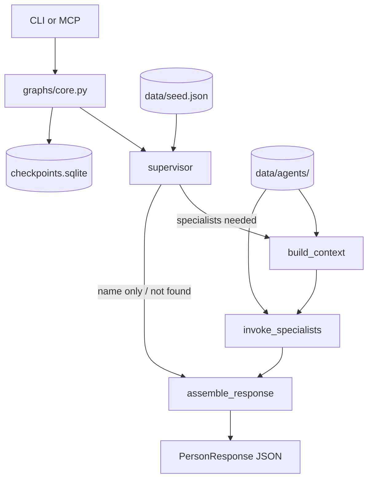

# Mycelium

**AI-managed people data** via networks of LangGraph specialist agents. External clients **query** records through the CLI or MCP; a **supervisor** resolves seed identity, classifies requested attributes, and coordinates specialists that own domain data (contact, social, demographic, etc.).

Public repo: [github.com/myceliumdata/mycelium](https://github.com/myceliumdata/mycelium) · Architecture: [docs/architecture.md](docs/architecture.md) · License: MIT

## Quick start

```bash
git clone https://github.com/myceliumdata/mycelium.git
cd mycelium
uv sync --all-extras
cp .env.example .env
# Add OPENAI_API_KEY and TAVILY_API_KEY to .env for synchronous field research on cache miss.
```

### CLI

```bash
# Seed identity only (name + employer from data/seed.json)
uv run mycelium query --person-key "Nichanan Kesonpat"

# Request non-core attributes (merged into results when specialists have data)
uv run mycelium query --person-key "Andrea Kalmans" --attributes email

# Stable conversation thread (echoed as thread_id in JSON)
uv run mycelium query --person-key "Nichanan Kesonpat" --thread-id "session-abc"
```

The CLI starts a **fresh process** each run and reloads registry/storage from disk.

**Research latency:** With `OPENAI_API_KEY` and `TAVILY_API_KEY` set, the first query for a missing attribute (e.g. `email`) may run **synchronous** LLM + Tavily web search and take tens of seconds. Results are cached under `data/agents/<category>/` (gitignored).

### MCP server

```bash
uv run mycelium-mcp
```

MCP is a **long-lived stdio process**. Configure your client with the **repository as working directory** so `.env` and `data/` resolve correctly:

```json
{
  "command": "uv",
  "args": ["run", "mycelium-mcp"],
  "cwd": "/absolute/path/to/mycelium"
}
```

**`query_person`** accepts JSON (`PersonQuery` fields plus optional top-level `thread_id`):

```json
{
  "person_key": "Andrea Kalmans",
  "requested_attributes": ["email"],
  "thread_id": "optional-session-id"
}
```

You must include **`requested_attributes`** for non-core fields. Without it, responses contain seed identity only (`id`, `name`, `employer`).

The MCP server reloads registry, categories, seed, and specialist modules from disk before each query; **restart MCP only after a code deploy or if reload fails** and results still disagree with a fresh CLI query. Other tools: `list_specialist_routing`, `health_check`.

See [docs/database-notes.md](docs/database-notes.md) if you have an older `data/mycelium.db` from before the schema simplification.

### Dev reset

```bash
./bin/reset-mycelium --all --yes   # seed-only platform; removes generated specialists
```

Uses `.venv/bin/python3` automatically when present. Preview with `--dry-run --all`.

## Response shape

CLI and MCP return **`PersonResponse`** JSON:

```json
{
  "results": [
    {
      "id": "3fe6db14-a41d-50fe-9959-c5263dc5f53b",
      "name": "Andrea Kalmans",
      "employer": "Lontra Ventures",
      "email": "akalmans@example.com"
    }
  ],
  "message": "Found record for Andrea Kalmans; assembled from seed and specialist contributions.",
  "debug": "…",
  "trace_id": null,
  "thread_id": "session-abc"
}
```

- **`results`** — One dict per seed match. Always includes `"id"`. With `requested_attributes`, includes only those keys after specialist-first merge.
- **`message`** — Human-readable status (seed found, research pending, N/A, etc.).
- **`thread_id`** — CLI `--thread-id` or MCP top-level `thread_id`; used for LangGraph checkpointing.
- **`trace_id`** — Set when LangSmith tracing is enabled.

## How it works (summary)

1. **Seed** — `data/seed.json` is the static origin (~457 people). Runtime assigns stable UUIDs (`agents/seed.py`).
2. **Supervisor** — Resolves `person_key`, classifies attributes (`data/categories.json`, gitignored cache seeded from code).
3. **Agent factory** — Creates specialist modules on demand (`src/agents/specialists/*_specialist.py`, gitignored).
4. **Graph** — `supervisor` → `build_context` → `invoke_specialists` → `assemble_response` (or direct assemble for name-only / not found).
5. **Research** — Specialists run sync LLM + Tavily on cache miss when keys are set; persist to `data/agents/<category>/storage.json`.

Runtime agent data (`data/agents/`, `data/agent_registry.json`, generated specialists, `categories.json`) is **gitignored** and recreated locally.



| Layer | Path | Role |
|-------|------|------|
| Models | `src/models/state.py` | `Person`, `PersonQuery`, `PersonResponse`, graph state |
| Seed | `src/agents/seed.py`, `data/seed.json` | Static origin + stable UUID assignment |
| Supervisor | `src/agents/supervisor.py` | Seed resolution, classification, specialist planning |
| Classification | `src/agents/classification/` | Attribute → category map |
| Factory | `src/agents/factory/` | Jinja template → generated specialists |
| Research | `src/tools/research.py`, `src/tools/tavily.py` | Sync LLM + web search, persist fields |
| Graph | `src/graphs/core.py` | LangGraph; async checkpointer (Studio), sync path (MCP) |
| MCP | `src/mycelium_mcp/server.py` | `query_person`, `list_specialist_routing`, `health_check` |
| CLI | `src/main.py` | `mycelium query`, `mycelium seed` |

Full detail: [docs/architecture.md](docs/architecture.md). Phase 1 research plan: [docs/plans/specialist-research-phase1.md](docs/plans/specialist-research-phase1.md).

## LangSmith tracing

1. Account at [smith.langchain.com](https://smith.langchain.com).
2. Create a **Personal Access Token** (`lsv2_pt_…`).
3. In `.env`: `LANGCHAIN_TRACING_V2=true`, `LANGCHAIN_API_KEY=…`, `LANGCHAIN_PROJECT=mycelium`.
4. Optional: `LANGSMITH_ORG_ID` and `LANGSMITH_PROJECT_ID` for trace URLs in CLI output.

Disable with `LANGCHAIN_TRACING_V2=false` or unset; `trace_id` will be `null`.

## LangGraph Studio (optional)

Visual debugging via local dev server + tunnel:

```bash
./bin/run-studio
# separate terminal: ngrok http 2024
```

Connect from [smith.langchain.com/studio](https://smith.langchain.com/studio/) using the **current** ngrok URL (tunnels are ephemeral). Restart `./bin/run-studio` after graph or schema changes. See `.env.example` and `langgraph.json`.

## Development

```bash
uv run pytest -m smoke -q          # frequent dev checks
uv run pytest -q                     # full suite before major merges
uv run ruff check src tests bin/
```

Smoke vs full: `@pytest.mark.smoke` vs `@pytest.mark.full` in `tests/`. Cursor workflow: `prompts/cursor/WORKFLOW.md`.

## Repository layout

```
mycelium/
├── data/seed.json              # committed static seed
├── data/agents/                # runtime specialist storage (gitignored)
├── src/agents/                 # supervisor, classification, factory, dispatch
├── src/graphs/core.py
├── src/mycelium_mcp/server.py
├── src/main.py
├── bin/reset-mycelium
├── docs/architecture.md
└── prompts/
```

## Status

**Implemented (June 2026):** Query-only CLI/MCP, seed-data-context graph, classification engine, agent factory, Phase 1 **synchronous** specialist research (LLM + Tavily), public repo under [myceliumdata](https://github.com/myceliumdata).

**Roadmap:** Networks terminology, query-as-seed, client clarification threads, inter-network handoff — see [TODO.md](TODO.md).