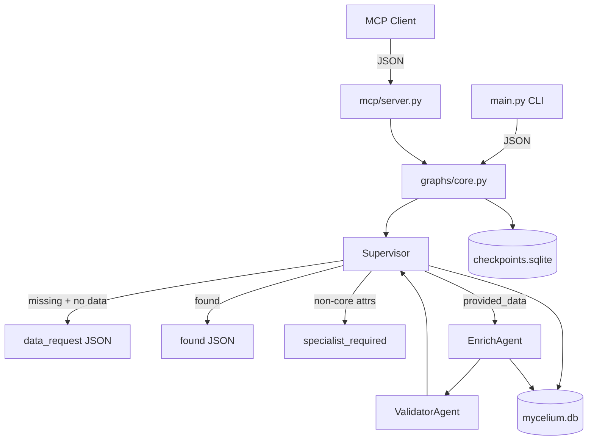

# Mycelium

A maintainable LangGraph prototype for **AI-managed data sources**. External agents query people records via MCP; a **supervisor** coordinates core lookup, ingest routing, validation, and specialist handoff for non-core attributes.

## Quick start

```bash
uv sync --all-extras
cp .env.example .env

# Query existing CRM seed record
uv run mycelium query --person-key "ada.lovelace@analytical.engine"

# Request non-core attributes (supervisor returns specialist_required)
uv run mycelium query --person-key "ada.lovelace@analytical.engine" --attributes age x_handle

# Ingest a missing person (core fields only)
uv run mycelium ingest --person-key "new@example.com" --data '{"name":"New User","employer":"Example Corp"}'

# MCP server (stdio)
uv run mycelium-mcp
```

See [docs/database-notes.md](docs/database-notes.md) if you have an older `data/mycelium.db` from before the schema simplification.

## Architecture



| Layer | Path | Role |
|-------|------|------|
| Models | `src/models/state.py` | `Person`, `PersonQuery`, `PersonResponse`, graph state |
| Storage | `src/storage/core.py` | SQLite core `people` table (id, name, employer) |
| Agents | `src/agents/supervisor.py`, `enrich.py`, `validator.py` | Explicit responsibilities |
| Graph | `src/graphs/core.py` | LangGraph + `SqliteSaver` checkpointer |
| MCP | `src/mcp/server.py` | `query_person`, `submit_person_data`, `list_specialist_routing` |
| Seed | `data/seed_crm.json` | 12 sample CRM people loaded on startup |

## Specialist routing (Phase 1)

Core CRM fields are **id**, **name**, and **employer** only. When a query asks for anything else (e.g. `age`, `x_handle`):

1. The supervisor returns status `specialist_required` with `deferred_attributes` listing what was requested.
2. No shared derivative-dataset tables or registry exist in Phase 1 — specialist agents are coordinated by the supervisor, not stored as formal datasets in core storage.
3. Future phases will spawn real specialist agents per attribute domain; enrich/validator today only handle minimum viable core ingest.

See [docs/phase-1-direction.md](docs/phase-1-direction.md) for the full Phase 1 model.

## Repository layout

```
mycelium/
├── data/seed_crm.json
├── src/
│   ├── agents/
│   ├── graphs/core.py
│   ├── models/state.py
│   ├── storage/core.py
│   ├── mcp/server.py
│   └── main.py
├── prompts/system/CORE_PROMPT.md
└── docs/vision.md
```

## Development

```bash
uv run pytest
uv run ruff check src tests
```

## Status

MVP core flow: MCP + CLI + SQLite persistence + supervisor graph. Next: real specialist agent spawning, vector search, LLM enrichment.
