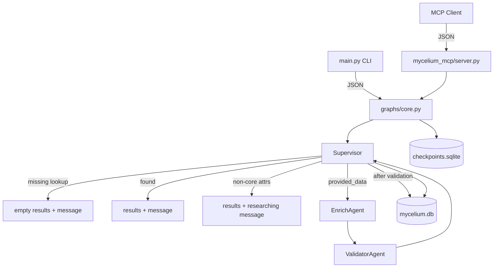

# Mycelium

A maintainable LangGraph prototype for **AI-managed data sources**. External agents query people records via MCP; a **supervisor** coordinates core lookup, ingest routing, validation, and specialist handoff for non-core attributes.

## Quick start

```bash
uv sync --all-extras
cp .env.example .env

# Query existing CRM seed record
uv run mycelium query --person-key "Nichanan Kesonpat"

# Same query with a stable conversation thread (echoed in JSON as thread_id)
uv run mycelium query --person-key "Nichanan Kesonpat" --thread-id "session-abc"

# Request non-core attributes (core record in results; message describes ongoing research)
uv run mycelium query --person-key "Nichanan Kesonpat" --attributes age x_handle

# Ingest a missing person (core fields only)
uv run mycelium ingest --person-key "new@example.com" --data '{"id":"","name":"New User","employer":"Example Corp"}'

# MCP server (stdio)
uv run mycelium-mcp
```

See [docs/database-notes.md](docs/database-notes.md) if you have an older `data/mycelium.db` from before the schema simplification.

### Response shape

CLI and MCP return **`PersonResponse`** JSON: `results`, `message`, `debug`, plus optional correlation fields:

```json
{
  "results": [{ "id": "…", "name": "…", "employer": "…" }],
  "message": "Found core record for …",
  "debug": "…",
  "trace_id": null,
  "thread_id": "session-abc"
}
```

- **`thread_id`** — Passed via `--thread-id` (CLI) or top-level `thread_id` in MCP request JSON; used for session continuity and LangGraph checkpointing.
- **`trace_id`** — Populated when LangSmith tracing is enabled (`LANGCHAIN_TRACING_V2`); links the response to the run in LangSmith.

## Enabling LangSmith Tracing

LangSmith provides observability for the graph executions (supervisor routing, ingest paths, etc.).

1. Sign up for a free account at [smith.langchain.com](https://smith.langchain.com).
2. Go to Settings → API Keys and create a new key. **Choose Key Type: Personal Access Token (PAT)** (not Service Key). This will produce a key starting with `lsv2_pt_`.
3. Copy `.env.example` to `.env` and fill in:
   - `LANGCHAIN_TRACING_V2=true`
   - `LANGCHAIN_API_KEY=lsv2_pt_...` (paste your PAT)
   - `LANGCHAIN_PROJECT=mycelium` (or your project name)
     **No need to pre-create this project in the LangSmith UI.** The first trace sent with this project name will automatically create a new project called "mycelium" (or whatever you set) under your workspace. You can later rename, organize, or add tags in the LangSmith dashboard if desired. This variable controls which "folder"/project your traces appear under in the LangSmith UI.
4. (Optional) For full trace URLs in output, set `LANGSMITH_ORG_ID` and `LANGSMITH_PROJECT_ID`.
5. Run commands as usual. Responses will include `trace_id`, and the CLI will print a direct LangSmith trace URL when tracing is active.

To disable (no key needed, no data sent): set `LANGCHAIN_TRACING_V2=false` or unset it. `trace_id` will be `null`.

See `docs/architecture.md` and `.env.example` for more.

## Local Debugging with LangSmith Studio (LangGraph Studio)

The Studio setup gives you a rich visual debugger for the exact graph (supervisor routing, the full ingest path, state inspection, etc.).

The `langgraph dev` command runs your graph execution locally on your machine. The Studio UI (the visual part) is a web app at smith.langchain.com that connects to your local server via the tunnel. This is the supported way to get the nice interactive graph view.

**Recommended way to start:**

```bash
./bin/run-studio
```

(This forces tracing off and uses `--tunnel` for reliable connection to the hosted Studio UI.)

The terminal will print three useful URLs (example only — yours will be different every run):
- 🚀 API: the address of your local Agent Server (use this when manually connecting).
- 🎨 Studio UI: a direct link that opens the hosted Studio pre-configured (convenience only).
- 📚 API Docs: Swagger UI for the local server.

**Important:** Every run of `./bin/run-studio` gives a **brand new random tunnel subdomain**. The old one dies when that terminal stops. Always use the URLs printed in the *current* terminal session. Do not reuse old ones from previous runs or old browser tabs.

Once connected you can send test inputs matching the CLI/MCP and visually step through the supervisor, enrich, and validator nodes.

See `.env.example` and the troubleshooting notes below for the exact "domain not allowed" steps (they are normal because tunnels are temporary).

The `langgraph.json` has the graph entrypoint and expanded CORS settings for Studio (smith.langchain.com origins + methods/headers/credentials). If you change it, you must restart `./bin/run-studio`.

**Troubleshooting "Failed to initialize Studio TypeError: Failed to fetch"**:
- You **must** pass `--tunnel` (see command above). The cloud Studio page cannot directly fetch from your localhost.
- Make sure `LANGCHAIN_TRACING_V2=false` (or unset) so the dev server doesn't try to phone home to LangSmith during startup.
- After starting, the script prints a 🎨 Studio UI link (with ?baseUrl=...). Open that directly — it is the easiest way to land in Studio already pointed at your server. Alternatively click "Connect to a local server" and paste the 🚀 API URL (https://...trycloudflare.com).
- Hard-refresh the Studio page (Cmd/Ctrl-Shift-R).
- If still issues, try a different browser (Chrome/Firefox are usually more lenient than Safari with localhost).
- Check terminal output for any server startup errors (e.g. port in use — use `--port 8001`).
- The CORS config in langgraph.json (full allow_methods, allow_headers, allow_credentials) allows the smith.langchain.com origins. If you edit it, restart the dev server.

**For the specific error you are seeing ("Failed to connect to Agent Server because the domain 'xxx.trycloudflare.com' is not allowed")**:
- This is the Studio UI's security check for the tunnel domain (Cloudflare tunnels change every run).
- On the error page you are on (the one with the URL you pasted), look for **"Advanced Settings"** (usually at the bottom or in the connection panel).
- In Advanced Settings, find the field for "Allowed origins", "Allowed Agent Server domains", "Allowed base URLs", or similar.
- Add the exact domain from the error: `updated-intensity-disposition-urls.trycloudflare.com`
- Also add the full origin: `https://updated-intensity-disposition-urls.trycloudflare.com`
- Save/apply, then click Connect or refresh.
- The tunnel URL is in the `baseUrl` query param of the link you shared.
- Next time you run `langgraph dev --tunnel`, you'll get a *new* random tunnel domain, so you'll need to add the new one in Advanced Settings again (or use the "Connect to local server" flow each time, which often lets you approve it).

This is normal for the `--tunnel` mode. The terminal output from `langgraph dev --tunnel` will show the exact URL and any connection instructions.

**For "Failed to initialize Studio" / "TypeError: Failed to fetch" / "ConnectionError: Unable to connect..."** (the most common tunnel gotcha):
- You **must** have `./bin/run-studio` actively running in a terminal right now (check with `ps` or look at the terminal window). It prints a banner with the **live** URLs for *this run only*.
- **Tunnels are ephemeral:** The `updated-intensity-disposition-urls.trycloudflare.com` (or any old one) from a previous banner is dead once that process stopped. Curling an old one gives Cloudflare "Tunnel error 1033". You must use the URLs from the *current* running script's banner.
- **Steps (official + proven flow):**
  1. In the terminal with the running script, note the **new** 🚀 API URL from the fresh banner (e.g. https://brand-new-random-words.trycloudflare.com).
  2. In a separate browser tab, visit that **plain new API URL** first. Complete any Cloudflare challenge until it shows clean `{"ok":true}` JSON.
  3. Open a **completely fresh** tab to `https://smith.langchain.com/studio/` (hard refresh or new tab; old tabs may have stale connections).
  4. Click **"Connect to a local server"** (the manual button — do not just open an old 🎨 link or rely on auto-connect).
  5. Paste the **current live** 🚀 API URL.
  6. In Advanced Settings (if it complains about domain), add the new bare domain + `https://` version.
  7. Click Connect.
- The langgraph.json has expanded CORS — restart the script (Ctrl-C + `./bin/run-studio`) after editing it.
- Try Incognito or Firefox.
- Verify locally the server responds, then test the *current* tunnel URL directly in browser tab.

## Architecture



| Layer | Path | Role |
|-------|------|------|
| Models | `src/models/state.py` | `Person`, `PersonQuery`, `PersonResponse`, graph state |
| Storage | `src/storage/core.py` | SQLite core `people` table (id, name, employer) |
| Agents | `src/agents/supervisor.py`, `enrich.py`, `validator.py` | Explicit responsibilities |
| Graph | `src/graphs/core.py` | LangGraph + `SqliteSaver` checkpointer |
| MCP | `src/mycelium_mcp/server.py` | `query_person`, `submit_person_data`, `list_specialist_routing` |
| Seed | `data/seed_crm.json` | 457 contacts from `raw_data.json` (dedup: Andrea Kalmans → Lontra Ventures, Pete Townsend → Techstars) loaded on startup |

## Specialist routing (Phase 1)

Core CRM fields are **id**, **name**, and **employer** only. When a query asks for anything else (e.g. `age`, `x_handle`):

1. The supervisor returns the core person in `results` and explains in `message` that those attributes are still being researched.
2. No shared derivative-dataset tables or registry exist in Phase 1 — specialist agents are coordinated by the supervisor, not stored as formal datasets in core storage.
3. Future phases will spawn real specialist agents per attribute domain; enrich/validator today only handle minimum viable core ingest.

See [docs/architecture.md](docs/architecture.md) for current architecture and direction.

## Repository layout

```
mycelium/
├── data/seed_crm.json
├── src/
│   ├── agents/
│   ├── graphs/core.py
│   ├── models/state.py
│   ├── storage/core.py
│   ├── mycelium_mcp/server.py
│   └── main.py
├── prompts/system/CORE_PROMPT.md
└── docs/architecture.md
```

## Development

```bash
uv run pytest
uv run ruff check src tests
```

## Status

MVP core flow: MCP + CLI + SQLite persistence + supervisor graph. Next: real specialist agent spawning, vector search, LLM enrichment.
