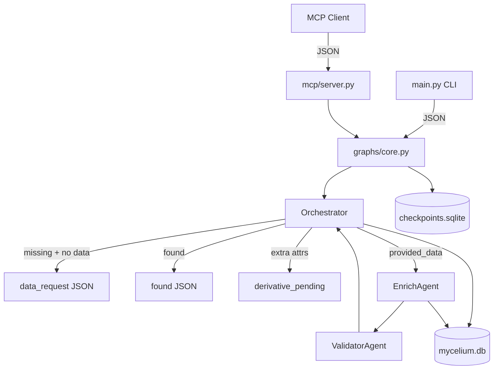

# Mycelium

A maintainable LangGraph prototype for **AI-managed data sources**. External agents query people records via MCP; an orchestrator routes lookups, ingest, validation, and derivative dataset stubs.

## Quick start

```bash
uv sync --all-extras
cp .env.example .env

# Query existing CRM seed record
uv run mycelium query --person-key "ada.lovelace@analytical.engine"

# Request derivative attributes (stub dataset created)
uv run mycelium query --person-key "ada.lovelace@analytical.engine" --attributes age x_handle

# Ingest a missing person
uv run mycelium ingest --person-key "new@example.com" --data '{"name":"New User","email":"new@example.com","employer":"Example Corp"}'

# MCP server (stdio)
uv run mycelium-mcp
```

## Architecture



| Layer | Path | Role |
|-------|------|------|
| Models | `src/models/state.py` | `Person`, `PersonQuery`, `PersonResponse`, graph state |
| Storage | `src/storage/core.py` | SQLite CRM + derivative tables + embedding stub |
| Agents | `src/agents/orchestrator.py`, `enrich.py`, `validator.py` | Explicit responsibilities |
| Graph | `src/graphs/core.py` | LangGraph + `SqliteSaver` checkpointer |
| MCP | `src/mcp/server.py` | `query_person`, `submit_person_data`, `list_derivative_datasets` |
| Seed | `data/seed_crm.json` | 12 sample CRM people loaded on startup |

## Derivative datasets (Phase 1 stub)

When a query requests attributes outside core CRM fields (e.g. `age`, `x_handle`):

1. Orchestrator creates a row in `derivative_datasets` with `status=pending`, then `stub_active`.
2. Response status is `derivative_pending` with a `derivative` reference.
3. Future phases spawn a real specialist agent per dataset; enrich only writes placeholder `derivative_records`.

## Repository layout

```
mycelium/
├── data/seed_crm.json
├── src/
│   ├── agents/
│   ├── graphs/core.py
│   ├── models/state.py
│   ├── storage/core.py
│   ├── mcp/server.py
│   └── main.py
├── prompts/system/CORE_PROMPT.md
└── docs/vision.md
```

## Development

```bash
uv run pytest
uv run ruff check src tests
```

## Status

MVP core flow: MCP + CLI + SQLite persistence + orchestrator graph. Next: real derivative agent spawning, vector search, LLM enrichment.
