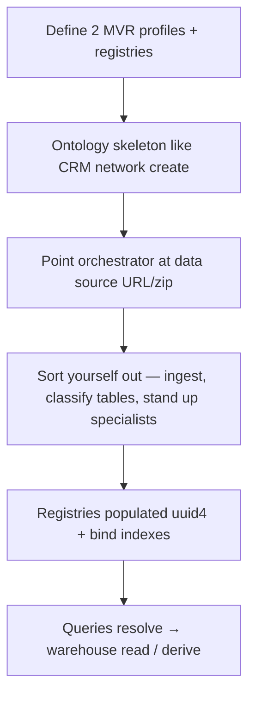
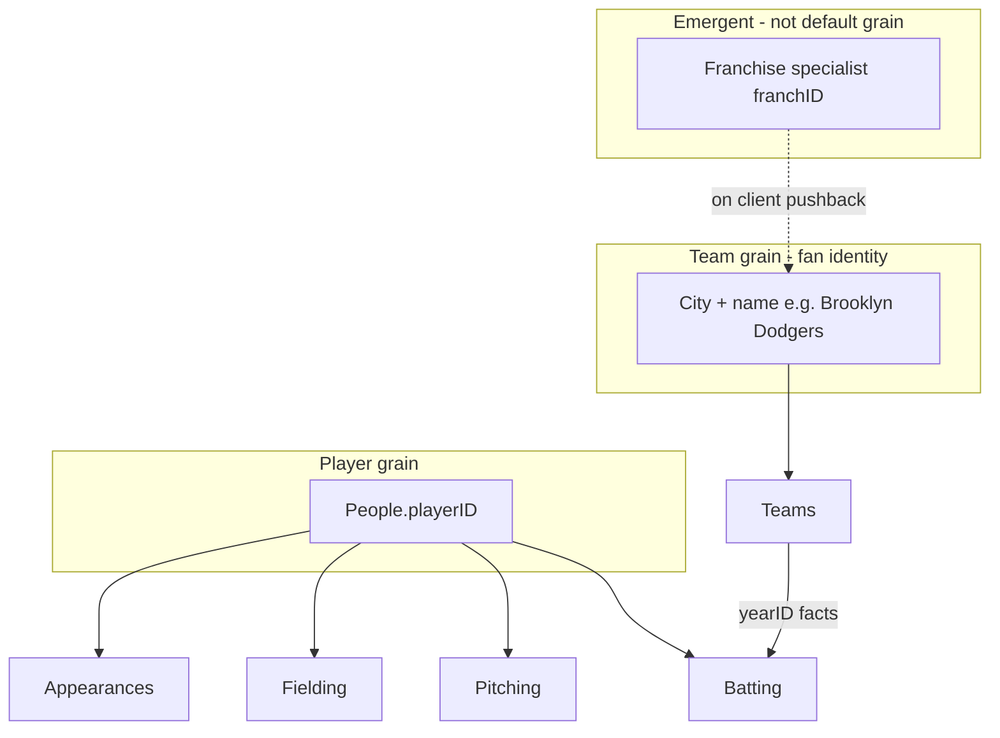

# Baseball example — program design (`baseball` network)

**Status:** **Exploratory** — design in progress (June 2026)  
**Ur artifact:** [`mycelium_lahman_design_prompt.md`](mycelium_lahman_design_prompt.md) — original Grok design brief; preserved, not maintained as source of truth  
**Conversations:** [`conversations/2026-06-14-data-factory-origin.md`](conversations/2026-06-14-data-factory-origin.md), [`conversations/2026-06-15-baseball-example-design.md`](conversations/2026-06-15-baseball-example-design.md)  
**Roadmap:** [`TODO.md`](../../TODO.md) → `baseball` example

---

## Goal

Second committed example network beside CRM: **Lahman baseball** under the name **`baseball`**, in a **single network**. Demonstrate:

1. Where the framework still assumes CRM-shaped people / seed / research-only attributes
2. **Agent-managed data factory** — warehouse ingest, derivations, provenance, evolving organization (see origin conversation)

Not a full application — iterative starter: design, schemas, skeleton ingest/query paths, example queries.

---

## Dataset

- **Source:** Lahman Baseball Database (CSVs, 1871–2025)
- **Local copy:** `~/mycelium-networks/baseball/seed/lahman_1871-2025_csv.zip` (~40MB)
- **Hosting:** TBD — avoid git blob if possible; SABR Box not bot-fetchable; may self-host + ingest script
- **Schema pass:** ✅ done 2026-06-16 — unzipped `~/mycelium-networks/baseball/seed/lahman_1871-2025_csv/`; see § Lahman schema below

---

## Locked decisions (Paul, June 2026)

| Topic | Decision |
|-------|----------|
| Network name | `baseball` |
| Topology | **One network** (not multiple networks) |
| Registry grains | **Two:** **player** and **team** (fan-facing city+name — **not** Lahman `franchID` as primary) |
| Registry `id` | **uuid4** assigned on load |
| Lahman `playerID` / `teamID` | **Source metadata** — provenance and re-import; not MVR; not a parallel public `id` |
| Player MVR (draft) | **Name + team** — team disambiguates homonyms |
| Multi-team careers | `Aaron + Braves` and `Aaron + Red Sox` → **same** player uuid; any team the player played for is a valid lookup alias |
| Design archives | Substantive sessions → `docs/plans/conversations/` |

---

## Registry grains

### Player

- **What:** A person in `People` and all parallel stat tables (`Batting`, `Pitching`, `Fielding`, `Appearances`, awards, …).
- **MVR (draft):** human-meaningful **name + team** (field names and normalization TBD).
- **Bind index (open):** cannot be one compound `name|team` key — index **each** `(name, team)` pair observed in Lahman → same uuid.

### Team

- **What (Paul, June 2026):** **Fan-facing team identity** — how people actually talk: **city + name** (e.g. **Brooklyn Dodgers** vs **Los Angeles Dodgers** = **two** teams). Not Lahman `franchID` as the primary registry grain — see [`conversations/2026-06-16-team-vs-franchise-grain.md`](conversations/2026-06-16-team-vs-franchise-grain.md).
- **Franchise:** Lahman `TeamsFranchises` / `franchID` is **correct for research**, but only a small audience thinks that way. **Franchise specialist** + emergent linkage — client asks “aren’t those the same?” → offer re-aggregation by franchise.
- **`Teams.csv` rows:** year-scoped **facts** for a fan team in a season (W/L, park, stats) — `yearID` remains query scope.
- **Lahman `teamID` / `franchID`:** warehouse provenance — not MVR, not default organization for answers.
- **Team MVR:** **full canonical name** (locked). Discovery via **network bootstrap specialists** + `guide.md` policy — **not** framework-hardcoded columns; see [`conversations/2026-06-16-canonical-names-bootstrap-specialists.md`](conversations/2026-06-16-canonical-names-bootstrap-specialists.md). Nickname-alone → incomplete / suggest.
- **Example:** `franchID=LAD` spans Brooklyn Dodgers (≤1957, `BRO`) and LA Dodgers (1958+, `LAN`) — **one franchise in Lahman, two team identities in our default ontology.**

---

## Identity layers (all grains)

| Layer | Role |
|-------|------|
| **MVR** | Lookup / create — human-meaningful bind fields |
| **`id`** | uuid4 — client shortcut after resolve (`step 1` with `id`) |
| **Source keys** | Lahman IDs — import stability and lineage only |

---

## New concepts (from ur prompt — not CRM today)

1. **Background data via URLs** — ingest Lahman (and docs/glossaries); taxonomy routes tables to specialists
2. **Derived data** — aggregates, rates, trends; not only web-researched attributes
3. **Provenance / lineage** — derived values link to base rows + computation reference + metadata
4. **Agent-managed retention (deferred)** — cache vs one-shot vs time series (e.g. franchise lifetime BA); economics later

**Storage direction (draft):** SQLite or DuckDB for base + derived + provenance; `entities.json` registries per grain (framework extension TBD).

---

## Router / supervisor (draft)

1. **Which grain?** player vs team
2. **Resolve** — MVR lookup or `id`
3. **Operation** — read warehouse / join roster / derive
4. **Specialists** — possibly several; merge (stats tables are parallel, none privileged)

---

## Explicit non-goals (for now)

- CRM-assumption code audit (too early)
- Cursor implementation slices (until schema + team MVR + index design firmer)
- Derivative retention policy
- Blockchain example (separate motivation — see origin conversation)
- Committing 40MB Lahman zip to git

---

## Alias resolution (draft — Paul, June 2026)

**Problem:** Shorthand and nicknames fail today’s fuzzy bind-field ranker (`SequenceMatcher` — good for typos, not `645` → `645 Ventures` or `Yanks` → Yankees). See [`fuzzy-lookup-policy.md`](fuzzy-lookup-policy.md).

**Direction:** **LLM-in-the-loop alias expansion** instead of growing explicit alias/prefix tables in the framework.

- On 0-hit (or low-confidence) lookup, prompt a **local LLM** with network context, e.g.  
  *“In the context of baseball teams, what could `Yanks` refer to?”*  
  CRM analogue: *“In the context of companies, what could `465` refer to?”*
- Model returns canonical bind-field value(s) → retry step-1 with `suggested_lookup` (same outcome contract as fuzzy typos).
- **Assume local LLMs eventually** — cost acceptable for this path; avoid hardcoding domain alias maps in Python.

**Not the same as** multi-team player bind (Aaron + Braves / Aaron + Red Sox → same uuid): that is **indexing known Lahman pairs** after canonical resolution, not nickname expansion.

**Explicit non-goal (for now):** prefix indexes, per-network alias tables in repo — unless LLM path proves insufficient.

---

## Cold start (draft — Paul, June 2026)

Bootstrap is **not** CRM-shaped (tiny `people[]` seed → research fills gaps). Sequence:

1. **Two MVRs** — player + team (`network.json`; framework extension TBD).
2. **Ontology** — `network create` / creation prompt → `categories.json` + specialist skeleton (same *mechanism* as CRM, different prompt).
3. **Data source handoff** — orchestrator told where Lahman lives (URL, zip path, glossary docs); **ingestion** is agent-driven, not static `seed.json` import alone.
4. **Autonomous organization** — sees `Pitching.csv` (etc.) → decides **which specialist** owns it → specialist decides **warehouse layout**, materializations, derivations. Empirical — “interesting to see how that works.”
5. **JSON specialist storage** — likely unwieldy at Lahman volume; **defer** (warehouse is primary; `storage.json` not the bulk store).

**Bootstrap (locked):** identity/canonical proposals **auto-commit** for v0 — measure quality before adding operator gates ([`conversations/2026-06-16-canonical-names-bootstrap-specialists.md`](conversations/2026-06-16-canonical-names-bootstrap-specialists.md)).

**Cold-start open:** scripted warehouse load vs agent autonomy boundary beyond identity commit.

---

## Problems to resolve (checklist)

| # | Problem | Notes |
|---|---------|--------|
| 1 | **Multi-MVR + multi-registry** | One `baseball` network, two bind policies, two entity stores (framework design) |
| 2 | **Cold start / ingest handoff** | Protocol for “here is the data source; organize it” |
| 3 | **Table → specialist routing** | Taxonomy / supervisor: pitching vs batting vs bio vs teams |
| 4 | **Specialist autonomy** | What pitching specialist *does* with rows (schema, indexes, derived artifacts) |
| 5 | **Registry population** | When/how People/Teams → uuid4 rows + multi-alias `(name, team)` index |
| 6 | **Team MVR + franchise mapping** | Lahman `teamID` / moves; LLM aliases (`Yanks`) |
| 7 | **Grain + scope in queries** | Player vs team identity; year/season as scope not MVR |
| 8 | **Query protocol fit** | Two-step + `requested_attributes` vs warehouse SQL/derive ops |
| 9 | **Derivation + provenance** | Recipe storage, lineage, agent retention (deferred) |
| 10 | **LLM alias resolution** | Shorthand bind fields; local LLM assumption |
| 11 | **Seed hosting** | ~40MB zip; no Box bot fetch |
| 12 | **Lahman schema pass** | ✅ § Lahman schema (2026-06-16) |
| 13 | **Re-import / annual refresh** | Lahman updates vs uuid stability |
| 14 | **Cross-grain queries** | e.g. team roster + player career — multi-specialist merge |
| 15 | **Bulk storage** | Warehouse yes; JSON `storage.json` volume — separate track |

---

## Open questions

1. **Team MVR fields** — partly LLM alias path; franchise identity still TBD
2. **Fan team entities** — how many distinct city+name teams; bootstrap from `Teams.name` vs agent-emergent; franchise links later
3. **Warehouse layout** — v0 tables; agent-extensible schema
4. **Seed hosting** — self-host URL vs manual download
5. **Framework changes** — multi-registry, multi-MVR, multi-alias index, ingest API
6. **Example queries** — 3–5 concrete derived questions (ur prompt)
7. **Cold start v0** — scripted warehouse load vs agent autonomy (identity auto-commit **locked**)

---

## Lahman schema (2025 CSV — schema pass 2026-06-16)

**Local path:** `~/mycelium-networks/baseball/seed/lahman_1871-2025_csv/` (27 tables, **~706k** fact rows — confirms warehouse not JSON bulk storage).  
**Docs:** `readme2025.txt` in same folder. **Encoding:** UTF-8 with BOM; use `utf-8-sig`.

### Hub tables (identity & anchors)

| Table | Rows | Role |
|-------|-----:|------|
| **People** | 24,270 | Player biographical hub; `playerID` links all player facts. `ID` column is Lahman-internal numeric — **not used in joins** (per readme). |
| **TeamsFranchises** | 203 | **Franchise lineage** (franchise specialist / emergent) — not primary team registry |
| **Teams** | 3,614 | **Year-scoped** row: `yearID` + `teamID` + `franchID` + `name` (fan-facing label) + standings + team totals |
| **Parks** | 345 | Ballparks |

### Player-attached fact tables (parallel — none privileged)

| Table | Rows | Grain |
|-------|-----:|-------|
| **Batting** | 128,598 | `playerID`, `yearID`, `stint`, `teamID`, `lgID` + counting stats |
| **Pitching** | 57,630 | same grain + pitching stats |
| **Fielding** | 174,332 | same + `POS` (position) |
| **Appearances** | 128,512 | games by position per player-year-team |
| **FieldingOF** / **FieldingOFsplit** | 12k / 45k | outfield splits (legacy/split views) |

**`stint`:** multiple rows per player per year when traded mid-season (important for derivations — aggregate before rate stats).

### Team / season context (not player identity)

| Table | Rows | Role |
|-------|-----:|------|
| **Managers** | 4,410 | Manager per team-year |
| **HomeGames** | 3,303 | Home games per team-year-park |
| **TeamsHalf** / **ManagersHalf** | 142 / 93 | split-season |

### Postseason, awards, enrichment

| Table | Rows |
|-------|-----:|
| BattingPost, PitchingPost, FieldingPost | 19k / 7k / 18k |
| SeriesPost | 440 |
| AllstarFull | 6,425 |
| AwardsPlayers, AwardsManagers, AwardsShare* | various |
| HallOfFame | 6,426 |
| CollegePlaying, Schools, Salaries | 18k / 1.3k / 26k |

### ER (corrected)

- **Roster:** no player list on `Teams` — membership via **Appearances** or any player fact table for that `yearID` + `teamID`.
- **Player MVR bind index source:** derive `(nameFirst, nameLast, Teams.name)` from **Appearances** ⋈ **People** ⋈ **Teams** (all teams a player appeared for).

### Scale notes (design)

- **751** homonym `(nameFirst, nameLast)` pairs in People — team in MVR is required for disambiguation.
- **Hank Aaron** (`aaronha01`): 3 distinct `Teams.name` values from batting — all must alias to one player uuid.
- **Negro leagues:** `lgID` can be 3 chars; included in 2025 release (readme §2.1).

---

## Bootstrap experiment (v0 — shipped in repo)

Standalone script (not query graph): `examples/networks/baseball/bootstrap_experiment.py` / `bin/bootstrap-baseball-experiment`.

- Ingests Lahman → `~/mycelium-networks/baseball/warehouse/lahman.sqlite`
- **Heuristic:** distinct season team labels → auto-commit `bootstrap/team_registry.json`
- **`--llm`:** OpenAI proposes canon + aliases from `guide.md` + schema sample (test when key available)

See `examples/networks/baseball/README.md`.

---

## Slice map

**Framework bootstrap phase (CRM):** ✅ `src/network/bootstrap/` — `run_network_bootstrap`, `seed.json` handler via `network.json` → `bootstrap` (`module` + class `handler`; framework `network.*` modules or pack handlers under `bootstrap_handlers/`). Baseball cold start should add a **warehouse handler** pack under `bootstrap_handlers/`, not fork refresh/create.

**Experiment v0** (standalone, pre-formal-bootstrap): `bootstrap_experiment.py` — disposition TBD; do not treat as the long-term path.

| Order | Scope |
|-------|--------|
| 0 | ~~Unzip Lahman; ER/schema note~~ ✅ done |
| 0b | ~~Formal bootstrap phase (CRM seed)~~ ✅ done — extend for baseball warehouse |
| 1 | `examples/networks/baseball/` skeleton + `network.json` + hosting story |
| 2 | Baseball bootstrap handler: warehouse ingest + team/player registry via bootstrap contract |
| 3 | Player registry load + multi-alias index |
| 4 | Team registry + MVR (may merge with 2) |
| 5 | One end-to-end query (resolve player → simple derived stat) |

---

*Updated: 2026-06-16 — Lahman schema pass; fan-facing team grain locked; CRM bootstrap module shipped.*