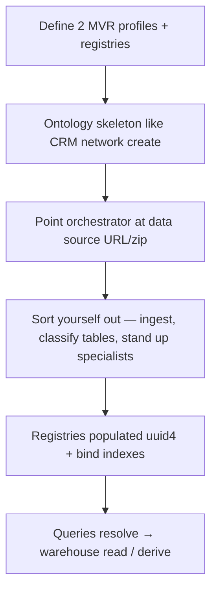

# Baseball example — program design (`baseball` network)

**Status:** **Exploratory** — design in progress (June 2026)  
**Ur artifact:** [`mycelium_lahman_design_prompt.md`](mycelium_lahman_design_prompt.md) — original Grok design brief; preserved, not maintained as source of truth  
**Conversations:** [`conversations/2026-06-14-data-factory-origin.md`](conversations/2026-06-14-data-factory-origin.md), [`conversations/2026-06-15-baseball-example-design.md`](conversations/2026-06-15-baseball-example-design.md)  
**Roadmap:** [`TODO.md`](../../TODO.md) → `baseball` example

---

## Goal

Second committed example network beside CRM: **Lahman baseball** under the name **`baseball`**, in a **single network**. Demonstrate:

1. Where the framework still assumes CRM-shaped people / seed / research-only attributes
2. **Agent-managed data factory** — warehouse ingest, derivations, provenance, evolving organization (see origin conversation)

Not a full application — iterative starter: design, schemas, skeleton ingest/query paths, example queries.

---

## Dataset

- **Source:** Lahman Baseball Database (CSVs, 1871–2025)
- **Local copy:** `~/mycelium-networks/baseball/seed/lahman_1871-2025_csv.zip` (~40MB)
- **Hosting:** TBD — avoid git blob if possible; SABR Box not bot-fetchable; may self-host + ingest script
- **Schema pass:** pending unzip + column/relationship review

---

## Locked decisions (Paul, June 2026)

| Topic | Decision |
|-------|----------|
| Network name | `baseball` |
| Topology | **One network** (not multiple networks) |
| Registry grains | **Two:** **player** and **team** |
| Registry `id` | **uuid4** assigned on load |
| Lahman `playerID` / `teamID` | **Source metadata** — provenance and re-import; not MVR; not a parallel public `id` |
| Player MVR (draft) | **Name + team** — team disambiguates homonyms |
| Multi-team careers | `Aaron + Braves` and `Aaron + Red Sox` → **same** player uuid; any team the player played for is a valid lookup alias |
| Design archives | Substantive sessions → `docs/plans/conversations/` |

---

## Registry grains

### Player

- **What:** A person in `People` and all parallel stat tables (`Batting`, `Pitching`, `Fielding`, `Appearances`, awards, …).
- **MVR (draft):** human-meaningful **name + team** (field names and normalization TBD).
- **Bind index (open):** cannot be one compound `name|team` key — index **each** `(name, team)` pair observed in Lahman → same uuid.

### Team

- **What:** A **team** as an organization/franchise identity — **not** “team in a specific season” as a separate registry concept unless we later decide otherwise.
- **Why “team-season” appeared in early notes:** Lahman `Teams.csv` is one row per **`teamID` + `yearID`** (1927 Yankees ≠ 1928 Yankees as rows). That is **year-scoped stats**, not necessarily a second identity grain. **Working assumption:** registry row = **team**; **year** is query/derivation scope (like “career stats” vs “1927 stats” for a player).
- **Team MVR (open):** human fields TBD (franchise name, city, abbreviation, …).

---

## Identity layers (all grains)

| Layer | Role |
|-------|------|
| **MVR** | Lookup / create — human-meaningful bind fields |
| **`id`** | uuid4 — client shortcut after resolve (`step 1` with `id`) |
| **Source keys** | Lahman IDs — import stability and lineage only |

---

## New concepts (from ur prompt — not CRM today)

1. **Background data via URLs** — ingest Lahman (and docs/glossaries); taxonomy routes tables to specialists
2. **Derived data** — aggregates, rates, trends; not only web-researched attributes
3. **Provenance / lineage** — derived values link to base rows + computation reference + metadata
4. **Agent-managed retention (deferred)** — cache vs one-shot vs time series (e.g. franchise lifetime BA); economics later

**Storage direction (draft):** SQLite or DuckDB for base + derived + provenance; `entities.json` registries per grain (framework extension TBD).

---

## Router / supervisor (draft)

1. **Which grain?** player vs team
2. **Resolve** — MVR lookup or `id`
3. **Operation** — read warehouse / join roster / derive
4. **Specialists** — possibly several; merge (stats tables are parallel, none privileged)

---

## Explicit non-goals (for now)

- CRM-assumption code audit (too early)
- Cursor implementation slices (until schema + team MVR + index design firmer)
- Derivative retention policy
- Blockchain example (separate motivation — see origin conversation)
- Committing 40MB Lahman zip to git

---

## Alias resolution (draft — Paul, June 2026)

**Problem:** Shorthand and nicknames fail today’s fuzzy bind-field ranker (`SequenceMatcher` — good for typos, not `645` → `645 Ventures` or `Yanks` → Yankees). See [`fuzzy-lookup-policy.md`](fuzzy-lookup-policy.md).

**Direction:** **LLM-in-the-loop alias expansion** instead of growing explicit alias/prefix tables in the framework.

- On 0-hit (or low-confidence) lookup, prompt a **local LLM** with network context, e.g.  
  *“In the context of baseball teams, what could `Yanks` refer to?”*  
  CRM analogue: *“In the context of companies, what could `465` refer to?”*
- Model returns canonical bind-field value(s) → retry step-1 with `suggested_lookup` (same outcome contract as fuzzy typos).
- **Assume local LLMs eventually** — cost acceptable for this path; avoid hardcoding domain alias maps in Python.

**Not the same as** multi-team player bind (Aaron + Braves / Aaron + Red Sox → same uuid): that is **indexing known Lahman pairs** after canonical resolution, not nickname expansion.

**Explicit non-goal (for now):** prefix indexes, per-network alias tables in repo — unless LLM path proves insufficient.

---

## Cold start (draft — Paul, June 2026)

Bootstrap is **not** CRM-shaped (tiny `people[]` seed → research fills gaps). Sequence:

1. **Two MVRs** — player + team (`network.json`; framework extension TBD).
2. **Ontology** — `network create` / creation prompt → `categories.json` + specialist skeleton (same *mechanism* as CRM, different prompt).
3. **Data source handoff** — orchestrator told where Lahman lives (URL, zip path, glossary docs); **ingestion** is agent-driven, not static `seed.json` import alone.
4. **Autonomous organization** — sees `Pitching.csv` (etc.) → decides **which specialist** owns it → specialist decides **warehouse layout**, materializations, derivations. Empirical — “interesting to see how that works.”
5. **JSON specialist storage** — likely unwieldy at Lahman volume; **defer** (warehouse is primary; `storage.json` not the bulk store).

**Cold-start open:** minimum human/scripted bootstrap vs full agent autonomy on day one; v0 may hybrid (scripted warehouse load + agent ontology growth).

---

## Problems to resolve (checklist)

| # | Problem | Notes |
|---|---------|--------|
| 1 | **Multi-MVR + multi-registry** | One `baseball` network, two bind policies, two entity stores (framework design) |
| 2 | **Cold start / ingest handoff** | Protocol for “here is the data source; organize it” |
| 3 | **Table → specialist routing** | Taxonomy / supervisor: pitching vs batting vs bio vs teams |
| 4 | **Specialist autonomy** | What pitching specialist *does* with rows (schema, indexes, derived artifacts) |
| 5 | **Registry population** | When/how People/Teams → uuid4 rows + multi-alias `(name, team)` index |
| 6 | **Team MVR + franchise mapping** | Lahman `teamID` / moves; LLM aliases (`Yanks`) |
| 7 | **Grain + scope in queries** | Player vs team identity; year/season as scope not MVR |
| 8 | **Query protocol fit** | Two-step + `requested_attributes` vs warehouse SQL/derive ops |
| 9 | **Derivation + provenance** | Recipe storage, lineage, agent retention (deferred) |
| 10 | **LLM alias resolution** | Shorthand bind fields; local LLM assumption |
| 11 | **Seed hosting** | ~40MB zip; no Box bot fetch |
| 12 | **Lahman schema pass** | Unzip; complete ER / table roles in this doc |
| 13 | **Re-import / annual refresh** | Lahman updates vs uuid stability |
| 14 | **Cross-grain queries** | e.g. team roster + player career — multi-specialist merge |
| 15 | **Bulk storage** | Warehouse yes; JSON `storage.json` volume — separate track |

---

## Open questions

1. **Team MVR fields** — partly LLM alias path; franchise identity still TBD
2. **Franchise vs Lahman `teamID`** — relocations/rebrands; one team uuid?
3. **Warehouse layout** — v0 tables; agent-extensible schema
4. **Seed hosting** — self-host URL vs manual download
5. **Framework changes** — multi-registry, multi-MVR, multi-alias index, ingest API
6. **Example queries** — 3–5 concrete derived questions (ur prompt)
7. **Cold start v0** — how much is scripted vs “sort yourself out” agent autonomy

---

## Slice map

**None queued.** First slice candidates after schema pass:

| Order | Scope |
|-------|--------|
| 0 | Unzip Lahman; ER/schema note in this doc |
| 1 | `examples/networks/baseball/` skeleton + `network.json` + hosting story |
| 2 | Ingest warehouse (People + core tables) |
| 3 | Player registry load + multi-alias index |
| 4 | Team registry + MVR |
| 5 | One end-to-end query (resolve player → simple derived stat) |

---

*Updated: 2026-06-16 — team grain (not team-season); ur prompt preserved separately.*