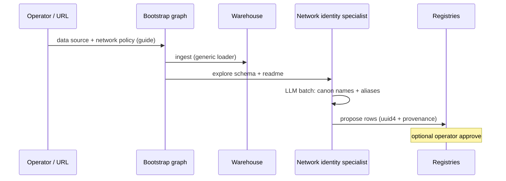

# Canonical names — who decides, generic vs network-specific

**Date:** 2026-06-16  
**Participants:** Paul + Grok/Cursor  
**Status:** Design — corrects “framework assumes Lahman `Teams.name`”  
**Related:** [`2026-06-16-canonical-team-city-names.md`](2026-06-16-canonical-team-city-names.md), [`baseball-example-program.md`](../baseball-example-program.md)

---

## Locked

- **Team display / MVR canon:** **full canonical name** (e.g. `Los Angeles Dodgers`) — not city + nickname as separate MVR fields.

---

## Paul’s concerns

1. **Which datasets/columns** are used to create canonical names must **not** be assumed in framework core (Lahman `Teams.name` was Grok shorthand, not a Mycelium rule).
2. **Can it happen without our input?** — not fully; see below.
3. **Don’t make Mycelium too smart for one domain** — avoid hardcoding baseball/Lahman in supervisor.
4. **Custom orchestrator vs generic mechanism** — prefer generic framework + **network overrides** (specialists / bootstrap pack).

---

## What “input” means (tiers)

| Tier | Who | Example |
|------|-----|---------|
| **A — Network policy (once)** | Paul + Grok in `guide.md`, `network.json` MVR, creation prompt | “Team = fan-facing full name; Brooklyn Dodgers ≠ LA Dodgers; nickname-alone ambiguous” |
| **B — Bootstrap run (automated)** | Agents + local LLM explore ingested source | Discover candidate strings, aliases, propose registry rows |
| **C — Per-entity labeling** | Not required | No hand-labeling 241 teams if B works |
| **D — Operator correction** | Later, when wrong | Operator override + provenance (existing backlog) |

**Without A:** agents have no stable policy — they might merge franchises or split nicknames randomly.  
**Without B:** Paul would have to script every extraction.  
**Goal:** **A + B**, not C for every row.

---

## Generic framework (not Lahman-specific)

Mycelium should provide **hooks and tools**, not baseball logic in `supervisor.py`:

| Generic capability | Purpose |
|--------------------|---------|
| **Bootstrap phase** | Separate from query graph: ingest → propose registries → commit |
| **Background warehouse** | Tabular/files; network-agnostic loader |
| **Registry grains** | Configurable MVR profiles per grain (extension) |
| **Tools** | `list_sources`, `sample_table`, `distinct_values`, `propose_identity_rows`, `append_alias` |
| **LLM alias step** | Domain context from **`guide.md` + canonical list** — already generic |
| **Specialist dispatch** | Network’s `specialists/` override framework templates |

**Do not:** custom baseball orchestrator replacing supervisor.  
**Do:** **bootstrap specialists** (or bootstrap subgraph) invoked at cold start / on new data source.

---

## Network-specific (baseball pack)

Committed or generated under `examples/networks/baseball/` / live `network_root`:

- **`guide.md`** — what player and team *mean*; full-name canon; franchise is emergent specialist
- **Creation prompt** — ontology skeleton (ingest, batting, pitching, franchise, …)
- **Bootstrap / identity specialists (override)** — e.g. explore readme + CSVs, **propose** team registry from whatever columns match policy (for Lahman, *likely* season team labels — but that’s the specialist’s discovery, not framework code)
- **Franchise specialist** — links fan teams when client asks; not default organizer

Framework never imports `Teams.csv`; baseball specialists might.

---

## Bootstrap flow (draft)

**Query-time supervisor** unchanged — uses registries once populated.

---

## Generic vs custom — answer

| Approach | Verdict |
|----------|---------|
| Custom orchestrator per domain | **No** — forks product |
| Framework bootstrap protocol + tools | **Yes** |
| Network **specialist overrides** for identity extraction | **Yes** — baseball-specific logic lives in network pack |
| Lahman `Teams.name` in `src/` | **No** |

Same pattern for CRM: framework generic; CRM doesn’t need identity bootstrap because `seed.json` is the policy.

---

## Locked (Paul, June 2026)

- **Bootstrap proposals:** **auto-commit** for v0 — test what agents produce before adding operator gates. Revisit manual intervention only if quality fails in practice.

## Open

- One identity specialist per grain vs one ingest specialist
- How bootstrap is triggered (`network create --seed`, admin button, first query)

---

*Archived June 2026.*