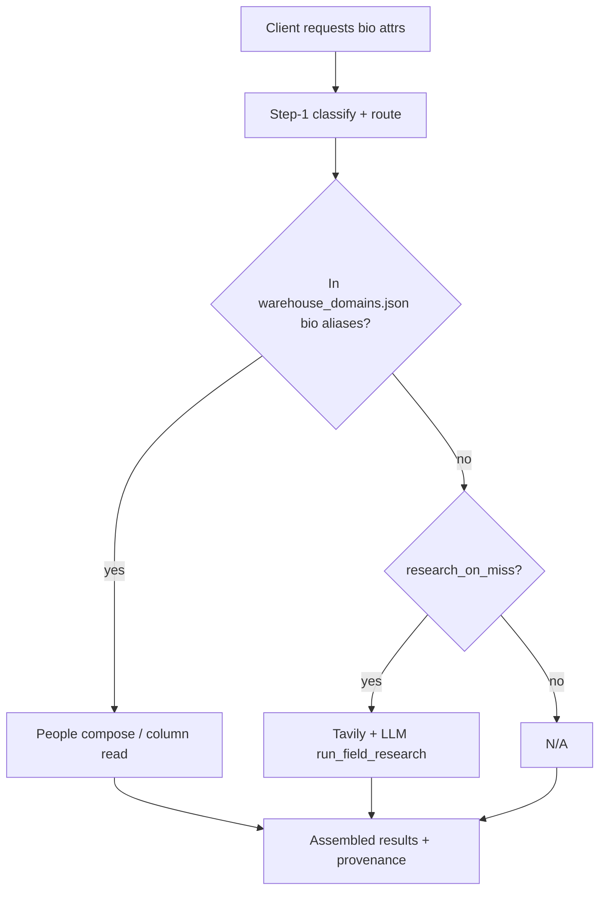

# Baseball morning decision brief (2026-06-21)

**Updated after review session** — the “5-minute signoff” grew into a design conversation. This doc is now **two paths**:

| Path | Time | What you do |
|------|------|-------------|
| **Bio unblock only** | ~5 min | Skim **Part H** (what’s already settled) → tick **Part D** if bio Q1–Q8 still open → paste to Grok |
| **Full context** | ~15 min | Parts A–G below (derivative audit, training wheels, bio detail) |

**Still blocks Cursor `2410`:** Part D bio picks (unless you already sent them).  
**Does not block `2410`:** peer orchestration, `race`, analytic tier, metering review — locked in a separate doc (Part H).

Related: [`2026-06-21-baseball-bio-research-specialist.md`](2026-06-21-baseball-bio-research-specialist.md), [`2026-06-21-peer-aware-specialists-analytic-orchestration.md`](2026-06-21-peer-aware-specialists-analytic-orchestration.md), [`TODO.md`](../../TODO.md).

---

## Part H — Post-review summary (read this first)

*What the hour-long conversation settled — so you don’t re-debate it when signing off bio.*

### Now understood (no action needed for `2410`)

| Topic | Lock / insight | Where captured |
|-------|----------------|----------------|
| **Manifest derivatives** | Common stats pre-defined in `warehouse_domains.json`; fast deterministic recipes | This brief Part A; promotion → `TODO.md` |
| **LLM derive guinea pigs** | Only `career_avg` + `ops` (+ synonym) in gate **today**; pitching/fielding derive **queued** in slice `2400` (WHIP, K/9, fielding %) | `prompts/cursor/next/2026-06-21-2400-…` |
| **Product specialists** | Cross-table **artifacts** (roster, franchise); **not** on warehouse graph bases; recipe in pack code | M11/M12 shipped |
| **Product + web** | Product/analytic tiers **do not** scrape for facts another specialist owns | Orchestration doc |
| **Peer routing** | Option 2: specialists **peer-aware**; delegate via **dispatch** (no god router) | Orchestration doc |
| **`race` / 1985 BA example** | **Bio** owns `race` (research on miss); analytic specialist **discovers cohort** from warehouse, then asks bio | Orchestration doc |
| **Research cost** | No technical cap — **metering** prices orchestrated work; client pays | `TODO.md` metering review |
| **Table bounding** | Soft hints in briefing, not hard SQL ACLs — unpredictability is the point | Orchestration doc |

### Still your call (bio slice `2410`)

Parts **C / D** below — Q1–Q8, especially **HOF anchor** (1982 election vs 1999 ceremony). Tavily cost is **not** a reason to pick Q2=B (metering handles volume later).

### Explicitly later (not morning scope)

- `race` on bio ontology (after `2410` proves research path)
- Analytic specialist + cohort orchestration
- Metering quote design for multi-hop delivers
- `docs/architecture/whys/manifest-derivatives.md`

---

## 60-second cheat sheet (bio signoff only)

| Topic | Grok default pick | Your only hard call |
|-------|-------------------|---------------------|
| Derivative audit | Fielding anchors fixed (`da5b006`); manifest vs derive split is intentional | Tick Part A checklist or add a note |
| Training wheels | **A** — batting wheels off; rest are guardrails | **B** only if you want pitching/fielding derive (`2400`) before sign-off |
| Bio Q1 framework | **A** — `WarehouseResearchStatSpecialist` in `src/` | |
| Bio Q2 trigger | **A** — `research_on_miss: true` on bio domain | Cost → metering later, not Q2=B |
| Bio Q3 gate pig | **`hall_of_fame_year` only** | Skip nickname until normalization story exists |
| Bio Q4 ontology | **A** — hand-add guinea pig(s) | |
| Bio Q5 provenance | **A** — mixed warehouse + research in one deliver | |
| Bio Q6 latency | **A** — sync Tavily (CRM default) | |
| Bio Q7 ordering | **A** bio first if bio is the focus; **B** if WHIP/K/9 excites you | |
| Bio Q8 boundary | **A** — research v1, manifest HOF later | **Pick HOF anchor semantics** (election **1982** vs ceremony **1999**) |

**Copy-paste answer block** — fill and send to Grok:

```text
DERIVATIVE AUDIT: done [ ]  notes: ___________
TRAINING WHEELS:  A / B / C
BIO Q1–Q8: A,A,hall_of_fame_year,A,A,A,A,A  HOF anchor: election / induction
```

(Replace letters if you disagree.)

---

## Part A — Derivative stats currently under test

### What “derivative” means here

| Kind | Mechanism | Provenance shape | Example attrs |
|------|-----------|------------------|---------------|
| **Manifest warehouse** | SQL / compose on Lahman sqlite | `computation.inline` + `parameters.lahman.playerID` | `career_hr`, `career_era`, `birth_date` |
| **LLM derive-on-miss** | Python codegen + sandbox (no Tavily) | inline Python + optional `model` | `career_avg`, `ops` *(only these in gate today)* |
| **Product specialist** | Cross-table join in pack code; **not** warehouse graph base | inline + scope params | `roster`, `franchise_teams` |
| **Analytic / orchestration** | Warehouse cohort + peer dispatch (bio, batting) | computation on aggregate; shallow provenance | *not built* — e.g. `best_batting_group_by_race` |

### Live gate inventory (27 scenarios)

| Scenario | Attr(s) | Player/team | Kind | Anchor / expect | Notes |
|----------|---------|-------------|------|-----------------|-------|
| bb-m2-01 | `career_hr`, `birth_date` | Aaron | manifest | 755, 1934-02-05 | Multi-specialist |
| bb-m2-02 | `career_rbi`, `career_hits` | Aaron | manifest | 2297, 3771 | |
| bb-m2-03 | 6 attrs | Aaron | mixed | hr + bio | Fan-out |
| bb-m2-04 | `bats`, `throws`, `birth_city` | Aaron | manifest | R, R, Mobile | |
| bb-bio-01 | `height`, `weight`, `birth_country` | Aaron | manifest | 72, 180, USA | |
| bb-bio-02 | `final_game`, `death_date` | Aaron | manifest | 1976-10-03, 2021-01-22 | |
| bb-derive-01 | `career_avg` | Aaron | **LLM derive** | ≈ 0.305 | Needs API keys |
| bb-derive-02 | `ops` | Aaron | **LLM derive** | ≈ 0.928 | Free-form label |
| bb-derive-03 | `batting_average` | Aaron | derive + **intent cache** | same as career_avg | Depends on 01 |
| bb-pitch-01 | `career_wins`, `career_strikeouts` | Aaron | manifest | 0, 0 | Zero pitching rows |
| bb-pitch-02 | `career_wins`, `career_strikeouts` | Nolan Ryan | manifest | 324, 5714 | |
| bb-pitch-03 | `career_era` | Nolan Ryan | manifest **rate recipe** | ≈ 3.194 | `career_era_weighted`, not LLM |
| bb-multi-01 | `career_hr`, `career_wins` | Aaron | mixed | 755, 0 | |
| bb-field-01 | `career_games`, `career_putouts` | Aaron | manifest **Fielding** | **3020**, **7436** | Fixed `da5b006` — not Batting G (3298) |
| bb-roster-01 | `roster` | 1957 BRO | product | contains Duke Snider | Scoped cache |
| bb-franchise-01 | `franchise_teams` | Brooklyn Dodgers | product | JSON label list | |
| bb-team-01/02 | `season_wins`, `season_losses` | Dodgers | manifest + scope | 84, 70 | |
| bb-scope-01 | `career_hr` + bogus year | Aaron | manifest | 755 ignores scope | career_sum |

### Quick audit questions (tick when reviewed)

- [ ] Every **manifest** anchor was discovered from the correct Lahman table/convention (fielding lesson applied everywhere).
- [ ] **LLM derive** attrs (`career_avg`, `ops`) are intentionally not manifest aliases (miss path is the point).
- [ ] **career_era** stays manifest — enabling pitching `derive_on_miss` later must not steal it (regression called out in `2400` slice).
- [ ] Product attrs (`roster`, `franchise_teams`) are not wired through warehouse graph bases (by design).

**Paul note:** _______________________________________________

### A.1 — Provenance examples (what the gate already asserts)

These are the shapes your picks must preserve. Truncated from smoke tests.

**Manifest bio (`birth_date`) — warehouse hit:**

```json
{
  "status": "found",
  "value": "1934-02-05",
  "sources": [{"kind": "dataset", "id": "lahman"}],
  "computation": {"inline": "... people_compose_iso_date(birthYear, birthMonth, birthDay) ..."},
  "parameters": {
    "lahman.playerID": "aaronha01",
    "warehouse": "warehouse/lahman.sqlite",
    "attribute": "birth_date",
    "columns": "birthYear,birthMonth,birthDay"
  },
  "actor": {"specialist": "bio_specialist"}
}
```

**LLM derive (`career_avg`) — codegen hit:**

```json
{
  "status": "found",
  "value": "0.305",
  "computation": {"inline": "def compute(...): ... query_warehouse('SELECT SUM(H), SUM(AB) ...')"},
  "parameters": {
    "warehouse": "warehouse/lahman.sqlite",
    "attribute": "career_avg"
  },
  "actor": {"specialist": "batting_specialist"}
}
```

**Mixed multi-specialist (`bb-m2-01`: `career_hr` + `birth_date`) — already works:**

One step-2 `results[0]` row; provenance has **per-attribute** versions from batting + bio specialists (same pattern you’d use for `birth_date` + `hall_of_fame_year`).

### A.2 — Fielding lesson (why audit matters)

| Source | Aaron `career_games` | Wrong anchor (pre-fix) |
|--------|----------------------|-------------------------|
| **Batting** `G` sum | 3298 | Used in gate before `da5b006` |
| **Fielding** `G` sum | **3020** | Correct — `bb-field-01` |

Always discover anchors from the **domain table** named in `warehouse_domains.json`, not a sibling domain.

### A.3 — What happens today for `hall_of_fame_year`

`hall_of_fame_year` is **not** in `categories.json` `bio.examples` or `attribute_map`. Until Q4 is implemented:

```bash
uv run mycelium query --network baseball \
  --lookup-json '{"player":"Hank Aaron"}' \
  --requested-attributes hall_of_fame_year
```

Step-1 will **not** route this label to `bio_specialist` the way `birth_date` does. The slice must hand-add ontology entries (Q4) before the gate can run.

Lahman **does** have the fact today (not in bio manifest):

```bash
sqlite3 ~/mycelium-networks/baseball/warehouse/lahman.sqlite \
  "SELECT yearid, inducted, votes, needed FROM HallOfFame WHERE playerID='aaronha01';"
# 1982|Y|406|312
```

Aaron has **no** `CollegePlaying` row — `college_attended` would be a pure research guinea pig if you pick it later.

### A.4 — Planned LLM derive (slice `2400` — not in gate yet)

You asked for baseball-meaningful derive guinea pigs post-reload; they were designed but **not implemented** at program sign-off (27/27).

| Planned ID | Attr | Player | Domain | Discovery anchor (your sqlite) |
|------------|------|--------|--------|--------------------------------|
| `bb-derive-04` | `career_whip` | Nolan Ryan | pitching | ≈ 1.247 |
| `bb-derive-05` | `k_per_9` | Nolan Ryan | pitching | ≈ 9.55 |
| `bb-derive-06` | `career_innings_pitched` | Nolan Ryan | pitching | ≈ 5386.0 |
| `bb-derive-07` | `fielding_percentage` | Hank Aaron | fielding | ≈ 0.982 |
| `bb-derive-08` | `whip` | Nolan Ryan | pitching | synonym → `career_whip` |

Claim **`2400`** when you want these; independent of bio **`2410`** unless Q7=B.

---

## Part B — Training wheels: what’s off vs still on

M3 “training wheels” = `derive_candidates` whitelist. **Removed in M4** for batting.

### Off (production policy today)

| Wheel | Status |
|-------|--------|
| `derive_candidates` whitelist | **Removed** — any batting manifest miss can derive |
| Batting domain gate | `derive_on_miss: true` in `warehouse_domains.json` |
| Free-form labels | `ops` in ontology routes to batting without alias |

### Still on (intentional guardrails — confirm these stay)

| Guardrail | What it does | Example |
|-----------|--------------|---------|
| **Domain flag** | Only batting has `derive_on_miss` | Pitching `career_whip` → N/A today, not derive |
| **Semantic review** | LLM rejects implausible derive values before cache | M3c review prompt on `ops` |
| **Sandbox** | Derive code can only use `query_warehouse()` | No network/file I/O in derive |
| **Intent normalization** | Synonyms map to slug before cache | `batting_average` → `career_batting_average` |
| **Gate fresh derive** | `gate-live` clears batting cache before derive phase | Ensures real LLM path, not stale cache |
| **Env keys** | Derive scenarios skip without `OPENAI_API_KEY` | Not a code cap — operator must set keys |

### Training-wheels sign-off (pick one)

- [ ] **A — Signed off:** Batting derive is “wheels off”; remaining rows are safety rails, not training wheels.
- [ ] **B — Not yet:** Enable pitching/fielding `derive_on_miss` (`2400` slice) before calling wheels off globally.
- [ ] **C — Other:** _______________________________________________

### B.1 — Derive vs research (don’t mix them up)

| Question type | Tool | Keys | Sandbox? | Example label |
|---------------|------|------|----------|---------------|
| “Sum HR from Batting” | **derive_on_miss** | `OPENAI_API_KEY`, codegen model | Yes — `query_warehouse()` only | `career_whip` (after `2400`) |
| “When was he inducted into Cooperstown?” | **research_on_miss** | `OPENAI_API_KEY`, `TAVILY_API_KEY` | N/A — Tavily web search | `hall_of_fame_year` |
| “Birth date from People” | **manifest alias** | None | N/A | `birth_date` |

**CRM analog (already shipped):** `contact_specialist` + `email` on cache miss → `run_field_research` (sync Tavily). Bio research is the same hook, different category and context (player name, not employer).

### B.2 — What `2400` changes (if you pick training wheels **B** or Q7 **B**)

| Domain | Today | After `2400` |
|--------|-------|--------------|
| Batting | `derive_on_miss: true` | unchanged |
| Pitching | manifest only (`career_era` weighted) | `derive_on_miss: true` + gates for `career_whip`, `k_per_9`, … |
| Fielding | manifest sums only | `derive_on_miss: true` + `fielding_percentage` gate |
| Bio | warehouse People reads | **still no derive** — research is `2410`, separate flag |

Framework fix in `2400`: pass `domain=self.domain` into derive codegen (today defaults to `"batting"` — would break pitching/fielding derive).

---

## Part C — Bio specialist: 8 decisions with examples

**Locked already (no need to re-debate):**

- Bio uses **warehouse first** (Lahman `People`).
- **No** `derive_on_miss` on bio (no sqlite codegen for “college attended”).
- **Yes** Tavily path for facts outside manifest.

---

### Q1 — Framework shape

**User story:** Client asks for `birth_date` + `hall_of_fame_year` on Hank Aaron in one step-1.

| Option | Behavior | Pros | Cons |
|--------|----------|------|------|
| **A — `WarehouseResearchStatSpecialist` in `src/`** | One `BioSpecialist` class: warehouse loop, then `run_field_research` for remaining misses | Matches M14 hierarchy; second network inherits | Not `…Player…` — network nomenclature stays in pack hooks |
| **B — Pack-only: `BioSpecialist.run()` override** | Same flow, logic only in `bio_specialist.py` | Fastest slice | Duplicates CRM factory template; violates Paul lock |
| **C — Split categories `bio` + `bio_web`** | Warehouse attrs → `bio_specialist`; web attrs → generated research specialist | Clean separation | Two agents, routing/ontology split; awkward combined queries |

**Example step-1:**

```bash
uv run mycelium query --network baseball \
  --lookup-json '{"player":"Hank Aaron"}' \
  --requested-attributes birth_date,hall_of_fame_year
```

| Option | Step-2 result |
|--------|----------------|
| A | One specialist, one contrib: `birth_date` from People, `hall_of_fame_year` from Tavily |
| C | Two specialists fan-out; assembler merges (like `bb-m2-01` today) |

**Grok lean:** **A** — framework base + thin `BioSpecialist`.

**Code today (`bio_specialist.py` — 37 lines, no research):**

```python
class BioSpecialist(BaseballWarehousePlayerHooks, WarehousePlayerStatSpecialist):
    category = "bio"
    domain = "bio"
    agent_name = "bio_specialist"
```

**After option A:**

```python
class BioSpecialist(BaseballWarehousePlayerHooks, WarehouseResearchStatSpecialist):
    category = "bio"
    domain = "bio"
    agent_name = "bio_specialist"
```

`WarehouseResearchStatSpecialist.run()` ≈ warehouse loop (unchanged for `birth_date`) → for each owned field still empty, call `run_field_research` when `research_on_miss` is set on bio domain.

**After option C (split):** step-1 fans out to `bio_specialist` + generated `bio_web_specialist`; assembler merges — same as `debut_team` + `career_hr` + `birth_date` in `test_baseball_multi_attr_deliver.py`, but with an extra research specialist in the graph.

**Paul pick:** [ ] A  [ ] B  [ ] C

---

### Q2 — When does Tavily run?

| Option | Rule | Example: `hall_of_fame_year` | Example: typo `brith_date` |
|--------|------|------------------------------|------------------------------|
| **A — `research_on_miss: true`** | Any bio label not in `warehouse_domains.json` aliases → research after warehouse N/A | Tavily runs | Probably N/A (not in ontology) |
| **B — Manifest allowlist** | Only listed `research_labels: [...]` get Tavily | Runs if listed | No research |
| **C — Client flag only** | Research only if `EntityQuery.research: true` (new field) | No run unless flag | No run |

**CRM today:** generated specialists research on cache miss when keys set — closest to **A**.

**Risk of A:** Client sends garbage label → Tavily spend. Mitigation: ontology must route label to `bio` first.

**Grok lean:** **A** for v1 (parity with CRM); add allowlist later if cost bites.

**Manifest snippet per option:**

```json
// Option A — add to bio domain in warehouse_domains.json
"research_on_miss": true

// Option B — instead of (or in addition to) the flag
"research_labels": ["hall_of_fame_year", "primary_nickname"]

// Option C — no manifest flag; check EntityQuery.research === true in specialist
```

**Walkthrough — `birth_date` + `hall_of_fame_year` on Aaron:**

| Step | Option A | Option B (allowlist has HOF only) | Option C |
|------|----------|-----------------------------------|----------|
| Warehouse pass | `birth_date` found from People | same | same |
| `hall_of_fame_year` miss | Tavily runs | Tavily runs | **Skipped** unless client sends `research: true` |
| Second query, cached HOF | cache hit, no Tavily | same | same |

**Walkthrough — typo `brith_date`:** ontology won’t map → step-1 classification error or N/A; **no Tavily spend** (all options).

**Paul pick:** [ ] A  [ ] B  [ ] C  Allowlist if B: _______________

---

### Q3 — Live gate guinea pig(s)

| Candidate | Sample query | Expected (Aaron) | Gate difficulty |
|-----------|--------------|------------------|-----------------|
| **`hall_of_fame_year`** | `requested_attributes: [hall_of_fame_year]` | Lahman `HallOfFame.yearid` = **`1982`** (election) — not ceremony year | Anchor semantics matter (see Q8) |
| **`primary_nickname`** | `requested_attributes: [primary_nickname]` | `"Hammer"` (normalize?) | Fuzzy string match |
| **`college_attended`** | could be Lahman `CollegePlaying` later | `"None"` or school name | Table exists in sqlite already |

**Synonym scenario (optional, like bb-derive-03):**

```text
hall_of_fame_induction_year → intent slug hall_of_fame_year (cache hit)
```

**Grok lean:** Gate **01 = `hall_of_fame_year` only** for v1; skip nickname until normalization story is clear.

**Paul pick:**

- [ ] `hall_of_fame_year` only
- [ ] + `primary_nickname`
- [ ] + synonym scenario
- [ ] Other: _______________

**Guinea pig comparison (Aaron `aaronha01`):**

| Label | Lahman sqlite? | Tavily likely answer | Gate assertion style |
|-------|----------------|----------------------|----------------------|
| `hall_of_fame_year` | **Yes** — `HallOfFame.yearid` = `1982` | Often **1999** (Cooperstown ceremony) — see Q8 | `equals: "1982"` or `"1999"` — **you must pick** |
| `primary_nickname` | No (`nameGiven` = `Henry Louis`, not a nickname) | `"Hammer"` / `"Hammerin' Hank"` | fuzzy `contains` or normalized string |
| `college_attended` | No row for Aaron | `"N/A"` or school name | Aaron → N/A; pick another player if you want a positive anchor |

**Proposed gate YAML (Cursor adds after your Q3 pick):**

```yaml
- id: bb-bio-research-01
  phase: bio_research
  description: hall_of_fame_year research on miss
  skip_if_missing_env: [OPENAI_API_KEY, TAVILY_API_KEY]
  step1:
    lookup:
      player: "{{ anchors.player }}"
    requested_attributes: [hall_of_fame_year]
    provenance: true
  step2: true
  assert_step2:
    outcome: assembled
    path:
      results[0].hall_of_fame_year:
        equals: "{{ anchors.hall_of_fame_year }}"  # YOU pick 1982 vs 1999
```

**Optional synonym (`bb-bio-research-02`, mirrors `bb-derive-03`):**

```yaml
requested_attributes: [hall_of_fame_induction_year]
depends_on: bb-bio-research-01
assert_step2:
  intent_slug: hall_of_fame_year
  same_timestamp_as: bb-bio-research-01
```

---

### Q4 — Ontology / routing

Today `hall_of_fame_year` is **not** in `categories.json` or `attribute_map` — step-1 won’t route it to `bio_specialist` until added.

**Example fix (hand-add):**

```json
// categories.json bio.examples +=
"hall_of_fame_year"

// attribute_map +=
"hall_of_fame_year": "bio"
```

| Option | Work |
|--------|------|
| **A — Hand-add** guinea pig(s) only | 2 lines per attr; fine for gate |
| **B — Ontology generator pass** | Refresh `categories.json` from manifest + “research bio” list |
| **C — Supervisor classify only** | No map entry; rely on LLM classification each query | Slower, less deterministic |

**Grok lean:** **A** for slice; **B** as follow-on.

**Without Q4 fix — step-1 failure mode:**

```text
requested_attributes: [hall_of_fame_year]
→ supervisor/classifier cannot map label to bio_specialist
→ delivery never includes bio research path
```

**With Q4 option A — minimal diff:**

```json
// examples/networks/baseball/categories.json
"bio": {
  "examples": [ "birth_date", ..., "hall_of_fame_year" ]
},
"attribute_map": {
  "hall_of_fame_year": "bio"
}
```

**Paul pick:** [ ] A  [ ] B  [ ] C

---

### Q5 — Mixed provenance in one deliver

**Query:** `birth_date` + `hall_of_fame_year` with `provenance: true`.

| Field | Provenance flavor |
|-------|-------------------|
| `birth_date` | `computation.inline` with `people_compose`; `parameters.columns` |
| `hall_of_fame_year` | `sources[]` with Tavily URLs; research metadata |

**Today:** `bb-m2-01` already mixes batting + bio provenance in one response — different specialists, one assembled `results[]`.

| Option | Policy |
|--------|--------|
| **A — Allow mix** | Per-attribute provenance type in same entity (current assembler behavior) |
| **B — Reject mix** | Research attrs must be separate queries |
| **C — Strip research provenance** | Return value only, no URLs on bio research v1 |

**Grok lean:** **A** — matches computation-centric + research coexistence in architecture whys.

**Example step-2 `provenance.entities[0].attributes` after bio research (option A):**

```json
{
  "birth_date": {
    "versions": [{
      "status": "found",
      "value": "1934-02-05",
      "sources": [{"kind": "dataset", "id": "lahman"}],
      "computation": {"inline": "... people_compose ..."},
      "actor": {"specialist": "bio_specialist"}
    }]
  },
  "hall_of_fame_year": {
    "versions": [{
      "status": "found",
      "value": "1982",
      "sources": [
        {"kind": "url", "url": "https://baseball-reference.com/..."},
        {"kind": "url", "url": "https://baseballhall.org/..."}
      ],
      "computation": {"model": "gpt-4o-mini", "research": true},
      "actor": {"specialist": "bio_specialist"}
    }]
  }
}
```

(CRM `email` research uses the same URL-in-`sources[]` pattern — no `computation.inline` Python.)

| Option | Client experience |
|--------|-------------------|
| **A** | One query, one `results[0]` row, rich per-field provenance |
| **B** | Force two queries — bad UX for “tell me about Aaron” |
| **C** | Value returned, provenance stripped — harder to debug gate failures |

**Paul pick:** [ ] A  [ ] B  [ ] C

---

### Q6 — Latency / cost

| Option | Step-2 UX | CRM analog |
|--------|----------|------------|
| **A — Sync Tavily** (default) | 10–40s on first miss; cache hit fast | `email` research |
| **B — Pending** | Step-2 returns `pending` for research fields; client polls | Not implemented |
| **C — Sync with budget** | Max N Tavily calls per deliver | New work |

**Example first hit:**

```text
Step-1: hall_of_fame_year only → step-2 waits for Tavily (~30s)
Step-2 repeat: reads cache → instant
```

**Grok lean:** **A** for v1 (reuse `run_field_research`).

**Timing expectations (from CRM + batting derive gates):**

| Call | First miss | Repeat (cache) | Keys required |
|------|------------|----------------|---------------|
| `birth_date` | ~1–3 s | ~instant | none |
| `career_avg` derive | ~15–45 s | ~instant | OpenAI + codegen model |
| `hall_of_fame_year` research | ~10–40 s | ~instant | OpenAI + **Tavily** |

Gate scenarios use `skip_if_missing_env: [OPENAI_API_KEY, TAVILY_API_KEY]` — missing keys → scenario skipped, not failed (same as derive phase).

**Paul pick:** [ ] A  [ ] B  [ ] C

---

### Q7 — Slice ordering

| Option | Rationale |
|--------|-----------|
| **A — Bio research first (`2410`)** | Unblocks “follow-up bio questions” product story; independent of derive |
| **B — Multi-domain derive first (`2400`)** | WHIP/K/9 gate story; framework `domain=` fix benefits all derive |
| **C — Parallel** | Two Cursor agents (if you run parallel) |

**Grok lean:** **A** if bio is tomorrow’s focus; **B** if you want derivative stats expansion first.

| If you pick | Cursor claims | Gate count after | Product story |
|-------------|---------------|------------------|---------------|
| **A — `2410` first** | bio research slice | 27 → **29** (+2 bio_research) | “Ask follow-up bio questions on the web” |
| **B — `2400` first** | multi-domain derive | 27 → **31** (+4 derive) | “WHIP, K/9, fielding % on miss path” |
| **C — parallel** | both (two agents) | up to **33** | Fastest wall-clock if you run parallel Cursor |

Slices are **independent** — no hard dependency either way.

**Paul pick:** [ ] A  [ ] B  [ ] C

---

### Q8 — Warehouse vs research boundary

Lahman sqlite **already has** (M13 ingest, not in `warehouse_domains.json`):

- `HallOfFame` — induction year, vote %, …
- `CollegePlaying` — schools per player

| Option | `hall_of_fame_year` policy |
|--------|--------------------------|
| **A — Research v1, manifest later** | Tavily now; add `people_join` / HOF alias in a later slice |
| **B — Manifest first** | Add HOF alias before enabling bio research — research only for truly un-ingested facts |
| **C — Research only forever** | Some facts never get manifest aliases (narrative, nickname) |

**Concrete check:**

```bash
sqlite3 ~/mycelium-networks/baseball/warehouse/lahman.sqlite \
  "SELECT yearid FROM HallOfFame WHERE playerID='aaronha01' AND inducted='Y' LIMIT 1;"
# Expect: 1982 (HOF election year) — NOT 1999 induction ceremony year; anchor semantics matter!
```

**Important:** “Hall of Fame year” is ambiguous — **election year (1982)** vs **induction ceremony (1999)**. Pick anchor semantics before gate.

**Grok lean:** **A** for slice velocity + gate on research path; document election vs induction in anchor; **B** as fast follow-on if you want HOF from sqlite without Tavily.

**Paul pick:** [ ] A  [ ] B  [ ] C  
**HOF anchor means:** [ ] election year  [ ] induction year  [ ] other: _______

### Q8 deep dive — election vs ceremony (read this before picking HOF anchor)

| Meaning | Aaron value | Where it lives | Fan-facing phrasing |
|---------|-------------|----------------|---------------------|
| **BBWAA election year** | **1982** | Lahman `HallOfFame.yearid` where `inducted='Y'` | “Elected to the Hall of Fame in 1982” |
| **Cooperstown induction ceremony** | **1999** | Web bios, plaques | “Inducted in 1999” (5-year rule after election) |

Tavily will often return **1999** unless the research prompt explicitly asks for “year elected by BBWAA.” Lahman returns **1982**.

| Q8 pick | Gate anchor | Tavily path | Follow-on work |
|---------|-------------|-------------|----------------|
| **A — research v1** | Pick **1982** or **1999** explicitly; document in anchor JSON | Gate proves research pipeline | Later: add manifest `hof_join` alias → warehouse fast path |
| **B — manifest first** | **1982** from sqlite (deterministic) | Research deferred until attrs with **no** Lahman table | Slower slice; gate tests warehouse not Tavily |
| **C — research forever** | Fuzzy attrs only (`primary_nickname`) | HOF eventually manifest | Two gate phases |

**If you pick A + election anchor (1982):** Cursor must tune research context string (“year elected, not ceremony”) or gate will flake when Tavily returns 1999.

**If you pick A + induction anchor (1999):** Aligns with casual web language; diverges from Lahman `yearid`.

**Fast follow-on manifest (option B path) — not in v1 slice, shown for context:**

```json
"hall_of_fame_year": {
  "convention": "hof_election_year",
  "table": "HallOfFame",
  "filter": "inducted = 'Y'"
}
```

---

## Part D — One-page answer sheet (copy to Grok)

```text
DERIVATIVE AUDIT: done [ ]  notes: ___________
TRAINING WHEELS:  A / B / C
BIO Q1:  A / B / C
BIO Q2:  A / B / C
BIO Q3:  hall_of_fame_year / +nickname / +synonym
BIO Q4:  A / B / C
BIO Q5:  A / B / C
BIO Q6:  A / B / C
BIO Q7:  A / B / C
BIO Q8:  A / B / C  HOF anchor: election / induction
```

After picks → Grok updates conversation lock + flips `2410` slice to **READY** for Cursor.

---

## Part E — Suggested CLI smoke (tomorrow, optional)

After decisions, before Cursor:

```bash
# Confirm HOF data exists locally (for Q8)
sqlite3 ~/mycelium-networks/baseball/warehouse/lahman.sqlite \
  "SELECT yearid, inducted FROM HallOfFame WHERE playerID='aaronha01';"
# Expect: 1982|Y

# Tables ingested but not yet in bio manifest
sqlite3 ~/mycelium-networks/baseball/warehouse/lahman.sqlite \
  ".tables" | tr ' ' '\n' | grep -iE 'hall|college'

# Current bio warehouse path still works (no Tavily)
./bin/gate-live baseball --phase m2

# Batting derive still works (OpenAI keys required)
./bin/gate-live baseball --phase derive

# Full sign-off regression (27/27 baseline)
./bin/gate-live baseball
```

**Manual hand-test after Cursor implements `2410`:**

```bash
export OPENAI_API_KEY=...
export TAVILY_API_KEY=...

uv run mycelium query --network baseball \
  --lookup-json '{"player":"Hank Aaron"}' \
  --requested-attributes hall_of_fame_year \
  --provenance

# Then re-run same delivery_id — should be cache hit, no Tavily wait
```

---

## Part F — Decision flow (visual)



Derive path (`derive_on_miss`) is **parallel branch on batting/pitching/fielding** — never on bio for v1.

---

## Part G — What Grok does after you paste Part D

1. Lock choices in [`2026-06-21-baseball-bio-research-specialist.md`](2026-06-21-baseball-bio-research-specialist.md) (flip Status → design locked).
2. Update `2410` slice: remove **DRAFT**, set guinea pig + HOF anchor per your Q3/Q8 picks.
3. Flip slice to **READY** in `prompts/cursor/next/2026-06-21-2410-baseball-bio-research-specialist.md`.
4. Add `hall_of_fame_year: "1982"` or `"1999"` to anchor JSON per your election/induction pick.
5. You tell Cursor to claim `2410` (or `2400` first if Q7 = B).

**Already done from review session:** [`2026-06-21-peer-aware-specialists-analytic-orchestration.md`](2026-06-21-peer-aware-specialists-analytic-orchestration.md) + `TODO.md` (peer orchestration, metering review, manifest promotion). **`race`** follows after `2410` — not part of Part D.