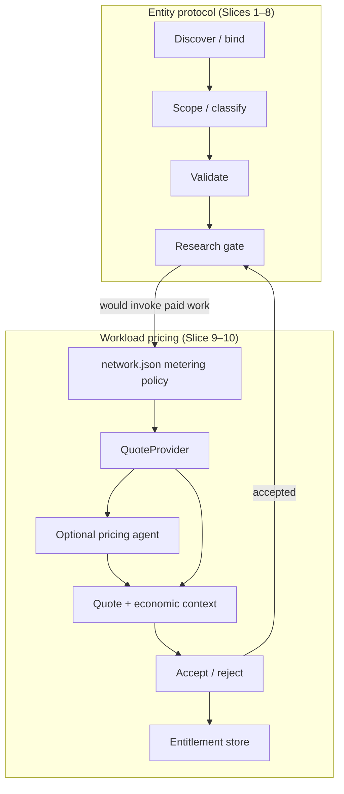

# Negotiation phases & metering — Slice 9 design spec

**Status:** **Locked** (June 2026) — Q9a–Q9m decided. Q9h-A (`entitlements.json`) may revise later. Code deferred per Q9e-A.  
**Program:** [`entity-protocol-and-registry-program.md`](entity-protocol-and-registry-program.md)  
**Depends on:** Slices 1–8 shipped (done)  
**Implementation:** Slice 10 — [`entity-metering-implementation.md`](entity-metering-implementation.md) + Cursor prompt `prompts/cursor/next/2026-06-09-2100-entity-metering-implementation.md`

---

## Summary

Slice 9 separates **entity negotiation** (Slices 1–8: bind, validate, gate) from **workload pricing** (what it costs to produce and consume data). Pricing is:

1. Declared in **`network.json`** (policy, like MVR).
2. Computed by a pluggable **`QuoteProvider`** (crude built-in default; networks override).
3. Enforced at the **commit gate** (Slice 6 + Slice 10 hooks) — no research/backfill until quote accepted.

**Governing principle:** In a purely agentic system, economics are **predictable** — agents see precise, multi-line-item quotes before commit, including cache state and avoidable duplicate cost. Funding models are **network-selectable**; the framework ships crude implementations that networks can override.

**Terminology (June 2026):** This spec is **negotiation** (MCP `quote_required` / `quote_id`). **x402** is **settlement** (HTTP 402 + facilitator) — see [`entity-metering-payment-phase11.md`](entity-metering-payment-phase11.md). Do not call negotiation "x402 metering."

---

## Design principles (with rationale)

### P1 — Predictable economics (agentic default)

**Decision:** Every billable commit returns a structured quote *before* work starts. Quotes expose line items, cache state, funding model, and avoidable duplicate cost.

**Why:** Paul’s thesis — agents can know costs to a very precise degree. Unlike human SaaS users, agents compare marginal consumption vs duplicate production and route accordingly. Opaque lump-sum pricing invites surprise bills and economically irrational duplicate work.

**Example (Paul → Jan, CRM):**

- Paul commits research for Angela Murphy @ TalentCare: quote shows `research: $2.00`, `query_value: $0.05` (included in delivery).
- Jan queries the same entity next day. Cache hit. Quote shows `query_value: $0.05` only, plus:

  ```json
  "avoidable_cost": { "research_usd": 1.95, "if": "query_only_accepted" },
  "funding_model": "marginal"
  ```

Jan’s agent will not voluntarily pay $2.00 research when $0.05 query is offered — unless the network **forces** full-duplicate pricing (see Model B below).

---

### P2 — Entity negotiation ≠ workload pricing

**Decision:** Slices 1–8 outcomes (`entity_unknown`, `entity_validated`, etc.) are unchanged. Metering attaches only when the research gate would invoke paid work (Phase C+).

**Why:** Conflating “who is this person?” with “how much does a 1M-block backfill cost?” produces brittle protocols. CRM needs simple research+query meters; blockchain needs backfill + freshness entitlements + query pools — same gate, different `QuoteProvider`.

**Example:** Resolving Kalman → Kalmans (Phase A) stays free. Bind + validate Paul Murphy @ Acme (Phases A–B) stays free. Tavily research for email (Phase C) is quoted.

---

### P3 — Three billable surfaces

**Decision:** All networks map workloads to one or more of:

| Surface | What it is | Typical CRM | Typical blockchain |
|---------|------------|-------------|-------------------|
| **Production** | One-time or scoped ingest (research, backfill, index build) | Tavily research commit | Subgraph/RPC backfill |
| **Freshness** | Time-bounded entitlement to *current* data (SLA) | Optional “re-research every N days” | Poll interval, lag bound, retention |
| **Consumption** | Read against stored data | Query value; query with provenance | Point reads, GraphQL, audit trail |

**Why:** Paul identified that even CRM should split **query value** vs **query with provenance** (attribution, audit, sources). Blockchain makes the split unavoidable: A pays for expensive indexing; B queries — someone must fund capacity.

**Example (blockchain):** Quote for “Uniswap V3 swaps, last 30 days, 5s freshness” might show:

- `backfill: $480` (1M blocks)
- `freshness: $12/mo` (`period_seconds: 2592000`, `poll_interval_seconds: 5`)
- `query_allowance: 10k reads/mo` or per-read meter

---

### P4 — Multi-line-item quotes (not lump sum)

**Decision:** Default quote granularity is **per job, multi-line-item** — production + freshness + consumption allowance in one quote. Renewals extend or replace entitlements; they are not silent auto-charges.

**Why:** Agents need to optimize across dimensions. A sponsor might accept backfill + skip freshness; a querier might buy query-only on a cache hit. Lump sums hide the levers.

**Deferred:** Per-attribute quotes (Q9a-B) remain available as a network override for specialist-heavy networks.

---

### P5 — Funding models are policy, not physics

**Decision:** Networks choose a `funding_model` in `network.json`. Framework provides crude defaults; networks plug in `QuoteProvider` + optional pricing agent (Agent Factory pattern).

**Why:** Paul: “Users of the framework get to decide which one they want to use.” Different networks (CRM demo vs public chain index) need different defaults. New models can be added without protocol changes — only policy + provider.

---

### P6 — Model B (everyone pays full research) is supported, not default

**Decision:** Per-tenant full duplicate pricing is a **legacy / opt-in** funding model, not the agentic equilibrium.

**Why:** Today’s SaaS often charges every customer as if they were alone — duplicate work is vendor margin. That rests on opacity. In an agentic world, Jan’s agent sees Paul already funded research and will route to marginal query pricing.

**When Model B is legitimate:**

| Case | Example |
|------|---------|
| **Private index** | Sponsor marks index `visibility: private` — Jan cannot see Paul’s entitlement |
| **Scope mismatch** | Jan needs different attrs, stricter SLA, or provenance path — delta production, not rent |
| **Network policy** | Compliance requires fresh research per principal |
| **No shared index yet** | First mover hasn’t sponsored public capacity |

**When Model B is wrong:** Public CRM entity, identical scope, valid cache — charging Jan $2.00 research again is extractive; agents will treat it as a bug or hostile network.

---

## Architecture



### Layer 1 — `network.json` metering policy

Mirrors MVR: declarative per-network defaults, loaded at runtime, CRM fallback when absent.

```json
{
  "metering": {
    "enabled": false,
    "default_funding_model": "marginal",
    "quote_provider": "builtin",
    "phases": {
      "discover_bind": "free",
      "scope_classify": "free",
      "validate": "free",
      "commit_research": "quoted",
      "deliver_followup": "quoted"
    },
    "meter_first_delivery": true,
    "principal": {
      "marginal_optional": true,
      "required_for_funding_models": ["sponsor_public", "pool"]
    },
    "workloads": {
      "crm_research": {
        "kinds": ["production", "consumption"],
        "consumption_meters": ["query_value", "query_provenance"]
      }
    },
    "funding_models": {
      "marginal": { "cache_hit": "query_only" },
      "full_duplicate": { "cache_hit": "full_research" },
      "sponsor_public": { "sponsor_pays": ["production", "freshness"] },
      "pool": { "query_revenue_share": true }
    }
  }
}
```

**Crude default:** `enabled: false`, `default_funding_model: marginal` — Slice 10 stubs audit paths without blocking demos.

### Layer 2 — `QuoteProvider` (pluggable)

**Interface (conceptual):**

```python
class QuoteProvider(Protocol):
    def quote(
        self,
        *,
        network_id: str,
        workload: WorkloadSpec,
        cache_state: CacheState,
        principal: BillingPrincipal | None,
        policy: MeteringPolicy,
    ) -> Quote: ...
```

**Built-in crude implementation:**

- Fixed per-workload prices from `network.json` or env table.
- Cache hit → swap production line item for consumption only (`marginal` default).
- No wallet, no HTTP 402 — returns `Quote` object only.

**Override paths:**

1. **Python class** — `quote_provider: "my_pkg.MyProvider"` in `network.json`.
2. **Pricing agent** — optional specialist invoked by factory when `quote_provider: "agent"` (async quote; Slice 10+).
3. **Data specialist override** — network’s data/indexing specialist returns workload-specific line items (blockchain subgraph quote inputs: block range, SLA).

### Layer 3 — Commit gate (Slice 6 + 10)

When `metering.enabled` and research/backfill would run:

1. Build `WorkloadSpec` from requested attributes, SLA, provenance flag.
2. Resolve `cache_state` from registry (`last_researched_at`, `attr_sources`) + entitlement store.
3. Call `QuoteProvider` → `Quote`.
4. If no `quote_id` accepted on query → `outcome: quote_required` (Slice 10).
5. On accept → run work; write entitlement; audit line items.

**Billing principal:** `sponsor_id`, wallet, or tenant — required for sponsor/pool/rebate models; optional for simple CRM marginal (anonymous query fees allowed by policy).

---

## Phase model (locked mapping)

| Phase | Name | Slices | Cost | Rationale |
|-------|------|--------|------|-----------|
| **A** | Discover / bind | 1–4 | Free | Negotiation must be cheap; Kalman/Kalmans must not invoke specialists |
| **B** | Scope attributes + ontology | 2, classify | Free | Quote *inputs* gathered here; no Tavily until commit |
| **C** | Commit + research / backfill | 5–6 gate | **Quoted** | First paid surface; multi-line-item quote |
| **D** | Deliver + follow-ups | assemble, re-query | **Quoted** (default) | Every read metered incl. first assembly (`meter_first_delivery: true`); override bundles first delivery into Phase C |

**Paul direction (unchanged):** Core validation (Slice 5) stays **free** even when metering is enabled.

---

## Workload kinds & meters

### WorkloadKind enum (protocol)

| Kind | Description |
|------|-------------|
| `production` | Research, backfill, index build |
| `freshness` | Time-bounded SLA entitlement |
| `consumption` | Read against stored data |

### Consumption sub-meters (CRM lesson)

| Meter | Bills for | Example |
|-------|-----------|---------|
| `query_value` | Answer from cache | Jan gets Angela’s email |
| `query_provenance` | Answer + sources + audit trail | Jan needs citations for compliance |

**Why split:** Provenance is strictly more work (assembly, attribution, `attr_sources`) — separate line item lets agents skip it when unnecessary.

### WorkloadSpec (quote input)

```json
{
  "entity_id": "…",
  "requested_attributes": ["email"],
  "provenance": false,
  "sla": {
    "max_staleness_seconds": null,
    "poll_interval_seconds": null,
    "retention_seconds": null
  },
  "scope_hash": "sha256:…"
}
```

`scope_hash` — canonical hash of entity + attrs + SLA + provenance; used to match cache hits and entitlements.

---

## Quote schema

```json
{
  "quote_id": "q_01H…",
  "expires_at": "2026-06-09T12:00:00Z",
  "workload": { "…": "WorkloadSpec" },
  "cache_state": "hit|miss|partial",
  "funding_model": "marginal|full_duplicate|sponsor_public|pool|delta",
  "line_items": [
    { "kind": "production", "meter": "research", "amount_usd": 2.0, "description": "Tavily research commit" },
    { "kind": "consumption", "meter": "query_value", "amount_usd": 0.05, "description": "Cache read" }
  ],
  "total_usd": 2.05,
  "avoidable_cost": {
    "research_usd": 1.95,
    "if": "query_only_accepted",
    "entitlement_id": "ent_…"
  },
  "entitlement_offer": {
    "entitlement_id": "ent_…",
    "period_seconds": 2592000,
    "covers": ["production", "freshness"],
    "sponsor_id": null
  }
}
```

**`cache_state` values:**

- `hit` — full scope satisfied by existing entitlement/cache.
- `partial` — some attrs cached; delta production quoted.
- `miss` — no usable cache; full production quoted.

**`funding_model` values:**

| Model | Behavior | Agentic default? |
|-------|----------|------------------|
| `marginal` | Cache hit → consumption only | **Yes** |
| `delta` | Pay for scope/SLA extension only | **Yes** |
| `sponsor_public` | Sponsor funds production+freshness; others query | **Yes** (expensive workloads) |
| `pool` | Query revenue flows to contributors | **Yes** (anonymous agents) |
| `full_duplicate` | Every principal pays full production | **No** — legacy / private / policy |

---

## Entitlements & freshness

Freshness is a **time-bounded entitlement**, not permanent network state.

```json
{
  "entitlement_id": "ent_01H…",
  "scope_hash": "sha256:…",
  "sponsor_id": "wallet:0x…",
  "visibility": "public|private",
  "period_seconds": 2592000,
  "expires_at": "2026-07-09T12:00:00Z",
  "sla": {
    "max_staleness_seconds": 5,
    "poll_interval_seconds": 5
  },
  "funded_line_items": ["production", "freshness"]
}
```

**Human vs agent renewal:** Same schema. Human “1 month” = `period_seconds: 2592000`. Agent “renew every 200ms” = `period_seconds: 1` with auto-accept policy on the caller side. The network does not special-case humans.

**Renewal:** New quote or extension quote referencing `entitlement_id` — never silent rollover (agent must accept).

---

## Capacity funding models (full table)

| Model | Who pays production | Who pays consumption | Second-user behavior | Default? |
|-------|--------------------|-----------------------|----------------------|----------|
| **Marginal** | First committer | Each querier (small fee) | Jan pays query only on cache hit | **CRM yes** |
| **Delta** | Payer of scope extension | Queriers | Jan pays only for *new* attrs/SLA | **Yes** |
| **Sponsor public** | Sponsor | Queriers | Index public; sponsor recoups via query fees | **Blockchain yes** |
| **Query amortizes** | First indexer (rebate eligible) | Queriers; share to indexer | Query fees flow to first indexer / LP pool | **Blockchain scale** |
| **Pool / LP** | Contributors | Queriers; pro-rata distribution | Anonymous agents claim via wallet | **Anonymous agents** |
| **Full duplicate (Model B)** | Every principal | Often bundled in “research” | Jan pays full research again | **No** — opt-in |

### Paul / Jan narrative (CRM)

| Actor | Action | Marginal default | Model B (opt-in) |
|-------|--------|------------------|------------------|
| Paul | First research on Angela Murphy @ TalentCare | Pays research + query | Pays research + query |
| Jan | Same entity, next day | Pays query_value $0.05 | Pays full research $2.00 |
| Jan + provenance | Needs sources | Pays query_value + query_provenance uplift | Pays full research (if policy bundles) |

### Blockchain narrative (A indexes, B queries)

| Actor | Action | Sponsor + pool default |
|-------|--------|------------------------|
| A | 1M-block backfill | Pays backfill + freshness entitlement; may choose `visibility: public` |
| B | Point read / GraphQL | Pays consumption; fraction to pool / A’s rebate |
| C | Stricter freshness | Delta quote — only incremental freshness cost |

---

## Network defaults (locked — Q9g)

| Network type | `default_funding_model` | Enabled meters | Notes |
|--------------|-------------------------|----------------|-------|
| **CRM example** | `marginal` | `production`, `query_value`, `query_provenance` | `metering.enabled: false` for demos |
| **Blockchain example** | `sponsor_public` + `pool` | All three kinds + SLA inputs | Entitlements required for freshness |

**Phase D default (Q9m-B):** `meter_first_delivery: true` — every assembly/read is a consumption line, including Paul's first `assembled` response. Networks override with `meter_first_delivery: false` to bundle first delivery into Phase C production quote.

---

## Relationship to implementation slice (post–Q9e-A)

When code lands (not Slice 9; deferred per Q9e-A):

- `outcome: quote_required` + `quote` payload on `QueryResponse`
- `quote_id` on accepted `EntityQuery`
- Audit log markers for phase transitions
- `describe_network` / MCP policy strings
- `MYCELIUM_AUTO_ACCEPT_QUOTES` or `network.json` bypass for CRM demo

**Not in v1 code:** HTTP 402, wallet, payment provider, rebate/pool schema (Q9j-B), async quotes (Q9f-B is sync-only for now).

---

## Locked decisions (Paul + Grok, June 2026)

| # | Decision | Rationale |
|---|----------|-----------|
| D1 | Separate entity negotiation from workload pricing | CRM vs blockchain use same gate, different providers |
| D2 | `network.json` policy + pluggable `QuoteProvider` | Framework users choose model; crude default overridable |
| D3 | Multi-line-item per-job quotes | Agentic predictable economics |
| D4 | Three billable surfaces: production, freshness, consumption | Backfill ≠ SLA ≠ query; provenance is consumption uplift |
| D5 | `marginal` is agentic default; `full_duplicate` opt-in | Model B is legacy SaaS, not equilibrium |
| D6 | Quotes expose `cache_state`, `funding_model`, `avoidable_cost` | Agents optimize before commit |
| D7 | Phases A–B + validation free; Phase C quoted | Cheap negotiation until commit |
| D8 | Freshness = time-bounded entitlement with `period_seconds` | Same schema for human and agent renewal |
| D9 | New funding models addable without protocol change | Policy + provider only |
| D10 | Multi-line-item per-job quotes (Q9a-A) | Production + freshness + consumption on one quote |
| D11 | CRM meters: production + query_value + query_provenance (Q9g-A) | Provenance uplift separate |
| D12 | Phase D default: every query metered, including first assembly (Q9m-B); override via `network.json` | Most agentic — all consumption explicit |
| D13 | Classify Phase B, free, before quote (Q9c-A) | `WorkloadSpec` accurate before pricing |
| D14 | Always sync quotes for now (Q9f-B) | One code path; async deferred for blockchain |
| D15 | Quote accept via `quote_id` on `EntityQuery` retry (Q9l-A) | Same pattern as `binding` |
| D16 | Validation always free (Q9b-A) | No friction on bind path |
| D17 | Design doc: this file + program summary (Q9d-A) | Single source |
| D18 | Markdown only until implementation slice (Q9e-A) | No `metering.py` until later |
| D19 | Rebate/pool omitted until payment integration (Q9j-B) | No `pool_id` schema in v1 |
| D20 | `full_duplicate` explicit opt-in in `network.json` (Q9k-A) | Model B supported, not default |
| D21 | Entitlements in `entitlements.json` under network_root (Q9h-A) | May revise storage later; uniform CRM + blockchain model for now |
| D22 | Principal optional for marginal; required for sponsor/pool commits (Q9i-A) | Keeps identity options open; server-derived principal compatible |

---

## Open questions

None — Q9a–Q9m locked June 2026.

---

## Examples index (conversation → spec)

| Conversation example | Spec section |
|---------------------|--------------|
| Paul pays research; Jan should not pay full research again | P1, P6, marginal default |
| “Network wins” if everyone pays research (Model B) | P6, full_duplicate — opt-in only |
| Agentic predictable economics | P1, quote schema `avoidable_cost` |
| CRM: query vs query with provenance | P3, consumption sub-meters |
| Blockchain: A backfills, B queries | P3, sponsor_public, pool |
| Human “1 month” vs agent “1s + renew 200ms” | Entitlements `period_seconds` |
| MVR-like policy in `network.json` | Layer 1 |
| Data specialist + pricing agent override | Layer 2 override paths |
| Cheap negotiation until commit | Phase model, D7 |

---

## Decision questionnaire (Paul — answer in conversation)

Work through these in any order. Reply with e.g. `Q9f: B because …` or ask for more detail on any item.

---

### Q9a — Quote granularity

**Context:** When Phase C triggers, how is work priced on the quote?

| Option | What it means | Advantages | Disadvantages |
|--------|---------------|------------|---------------|
| **A — Multi-line-item per job** | One quote per commit with lines for production, freshness, consumption (and provenance uplift) | Matches agentic economics; agents see levers; one accept covers the job; blockchain backfill + SLA + queries fit naturally | Slightly more complex quote schema; provider must compute all lines |
| **B — Per-attribute** | Each requested attribute (email, title, …) is its own quoted line / accept | Fine-grained agent control; pay only for attrs you want | More round-trips if attrs need separate research; awkward for backfill (not attribute-shaped) |
| **C — Per-phase lump sum** | Single “Phase C: $X” line | Simplest quote UI; easy crude default | Hides cache/marginal economics; fights `avoidable_cost` thesis; hard to split sponsor vs querier |

**Example:** Paul requests `email` + `title` for Angela Murphy. **A** → one quote, two consumption lines or one production covering both. **B** → separate quotes per attr. **C** → “research commit $2.00” with no breakdown.

---

### Q9b — Validation in free tier

**Context:** Slice 5 rule-based validation (employer plausible, etc.) — billable when metering is on?

| Option | Advantages | Disadvantages |
|--------|------------|---------------|
| **A — Always free** | Cheap negotiation; no friction on bind path; matches prior Paul direction | Networks that want to meter validation must override |
| **B — Free for first N entities** | Growth incentive; limits abuse | Arbitrary N; agents must track count |
| **C — Metered from day one** | Every phase has clear price | Friction on every new entity; validates before value delivered |

---

### Q9c — Classify step placement

**Context:** Ontology/classify (which specialist owns `email`) — when does it run relative to the quote?

| Option | Advantages | Disadvantages |
|--------|------------|---------------|
| **A — Phase B, free, before quote** | Classify informs `WorkloadSpec` (which meters fire); quote reflects real work | Classify runs even if user rejects quote (wasted CPU, but no Tavily) |
| **B — After quote accept** | No work until pay commitment | Quote may be wrong if classify changes specialist path; may need quote revision |
| **C — Skip in metering model** | Simplest | Quote provider must duplicate classify logic or guess cost |

---

### Q9d — Design doc location

| Option | Advantages | Disadvantages |
|--------|------------|---------------|
| **A — This file + program doc summary** | Single source; already started | Long file |
| **B — Separate `metering-integration.md`** | Integration detail isolated | Split attention |
| **C — Both** | Spec vs how-to separated | Duplication risk |

---

### Q9e — When do Python types / stubs land?

**Context:** Slice 10 was sketched as code hooks (`quote_required`, etc.). When does code appear?

| Option | Advantages | Disadvantages |
|--------|------------|---------------|
| **A — Markdown only until a later implementation slice** | No premature API lock-in; design can breathe | Slice 10 scope unclear; no runnable metering |
| **B — `metering.py` stubs with types in Slice 10** | Types enforce design; Cursor can implement against them | Stubs may wrong-foot us if design shifts |
| **C — Stubs + MCP / `describe_network` strings in Slice 10** | Visiting agents see policy without full payment | More work; still no real billing |

---

### Q9f — Sync vs async quotes

**Context:** CRM cache-hit quotes are instant; blockchain 1M-block backfill may take minutes.

| Option | Advantages | Disadvantages |
|--------|------------|---------------|
| **A — Hybrid** | Sync for cache hits / point reads (Jan same turn); async job + poll for backfill/freshness | Two code paths; need job status outcome |
| **B — Always sync** | One path; CRM-simple | Blockchain fakes long jobs or blocks request |
| **C — Always async** | Uniform; fits heavy workloads | Jan’s $0.05 cache query needs extra poll — awkward for CRM |

**Example:** Jan queries Angela (cache hit). **A/B** → `quote_required` + quote in one response. **C** → `quote_pending`, poll, then accept.

---

### Q9g — CRM default meters

**Context:** What does the committed CRM example declare in `network.json`?

| Option | Advantages | Disadvantages |
|--------|------------|---------------|
| **A — production + query_value + query_provenance** | Provenance uplift priced separately; teaches the three-surface model | More lines for demo networks |
| **B — production + query_value only** | Simpler CRM | No first-class provenance pricing story |
| **C — Lump-sum research only** | Minimal | No second-user / Jan story; fights marginal default |

---

### Q9h — Entitlement storage — **LOCKED: A (may revise later)**

**Paul (June 2026):** `entitlements.json` under `network_root` (gitignored). Cleanest for now; storage layout not permanent.

**Context:** An *entitlement* is the record that says “this `scope_hash` is funded until `expires_at` with this SLA.” The `QuoteProvider` reads it to set `cache_state: hit` and offer `avoidable_cost`. Where does that record live?

#### Worked example — CRM (Angela Murphy)

Paul commits research. Network creates entitlement for `scope_hash = hash(Angela + TalentCare + [email] + no-provenance + default-SLA)`.

**Option A — `entitlements.json`:**

```json
// <network_root>/entitlements.json (gitignored)
{
  "ent_angela_email": {
    "scope_hash": "sha256:abc…",
    "entity_id": "angela-murphy-talentcare",
    "visibility": "public",
    "period_seconds": 2592000,
    "expires_at": "2026-07-09T12:00:00Z",
    "funded_line_items": ["production"],
    "sponsor_id": null
  }
}
```

Jan queries next day. Gate hashes Jan's `WorkloadSpec` → finds `ent_angela_email` → `cache_state: hit` → quote is `query_value: $0.05` only.

**Option B — on registry row:**

```json
// entities.json row
{
  "id": "angela-murphy-talentcare",
  "name": "Angela Murphy",
  "employer": "TalentCare",
  "last_researched_at": "2026-06-09T…",
  "entitlements": [{ "scope_hash": "sha256:abc…", "expires_at": "…" }]
}
```

Same Jan flow, but lookup is entity-first. Works for CRM. Breaks down when scope isn't entity-shaped (see blockchain).

**Option C — external only:**

CRM derives cache hits only from `last_researched_at` on registry — no entitlement file. Freshness SLA not modeled; “hit” means “researched recently” via crude TTL rule in `QuoteProvider`. Blockchain entitlements live only in the indexer service; Mycelium calls out for quote inputs.

| Option | CRM Angela story | Blockchain Uniswap backfill story |
|--------|------------------|-----------------------------------|
| **A — `entitlements.json`** | Clean; entitlement keyed by `scope_hash`, links optional `entity_id` | Natural: scope is `blocks 18M–19M + 5s SLA`, no entity required |
| **B — registry rows** | Fine for person entities | Awkward: backfill isn't a person; must scan all rows or overload entity |
| **C — external only** | Simplest v1: TTL on `last_researched_at` only | CRM/blockchain behave differently; freshness under-specified in CRM |

---

### Q9i — Billing principal — **LOCKED: A**

**Paul (June 2026):** Optional for marginal (Jan cache-hit needs no principal). Required when `funding_model` is `sponsor_public` or `pool` on production commits. Keeps options open — explicit `principal` on wire when wanted; server-derived from API auth also compatible.

See **§ Q9i — Billing principal (deep dive)** for walkthrough.

**Short definition:** `principal` on `EntityQuery` answers *who is the economic actor for this request?* — not *who is the entity being looked up* (Angela), but *who pays* and *who gets credit* when capacity is sponsored.

**Three jobs principal does:**

| Job | When it matters | Stored where |
|-----|-----------------|--------------|
| **Payer** | Quote accepted; someone must be charged (eventually) | Audit log; future ledger |
| **Sponsor** | Production/freshness funded for others to consume | `entitlements.json` → `sponsor_id` |
| **Consumer audit** | Abuse limits, per-tenant invoices, compliance | Audit log |

**Not the same as:** `entity_key` / `binding` (what you're looking up), `thread_id` (conversation), MCP/API auth (whether you're allowed to call the network).

#### Options (decision)

| Option | Rule |
|--------|------|
| **A — Optional for marginal; required for sponsor/pool commits** | Jan's cache query: no principal. Agent A's backfill commit: principal required. |
| **B — Always required on every `EntityQuery`** | Every call identifies payer/consumer. |
| **C — Never stored server-side** | Principal echo-only or omitted; sponsor/rebate broken. |

**Fourth pattern (not a Q9i option — network operator choice):** Derive principal from MCP/API auth server-side (tenant inferred from API key). Caller never passes `principal`; operator maps credentials → tenant. Compatible with A or B depending on whether auth is mandatory.

---

## Q9i — Billing principal (deep dive)

### What would appear on `EntityQuery`?

```json
{
  "entity_key": "Angela Murphy",
  "binding": { "employer": "TalentCare" },
  "requested_attributes": ["email"],
  "principal": {
    "kind": "wallet",
    "id": "0x742d35Cc6634C0532925a3b844Bc9e7595f0bEb0"
  }
}
```

`kind` examples: `wallet`, `tenant`, `sponsor_id` (extensible). One principal per query — the economic actor for *this* request.

### End-to-end: Paul researches Angela (CRM, marginal)

| Step | Request | Principal? | What network records |
|------|---------|------------|----------------------|
| 1 | Paul: bind + validate | None | Registry row — no billing yet |
| 2 | Paul: attrs=[email] → `quote_required` | None OK | Quote `q_123`: production $2 + consumption $0.05 |
| 3 | Paul: retry with `quote_id` | **?** | Research runs; entitlement created |

The Q9i fork is step 3 (and step 2 for sponsor flows):

- **Option A:** Paul need not send `principal` for marginal CRM. Audit: `{ quote_id, principal: null, thread_id }`. Entitlement `sponsor_id: null` — "network-funded" or anonymous first mover.
- **Option B:** Paul must send `principal: { kind: tenant, id: paul-corp }` on the accept retry. Enables per-tenant billing books from day one.
- **Option C:** Principal not stored even if sent.

**Paul pays $2.05 — who gets invoiced?** With real payments, something must identify Paul. That could be:

1. Explicit `principal` on query (B, or A when provided),
2. Server-derived from API key (operator pattern),
3. Nobody — demo mode (`metering.enabled: false` or auto-accept env).

Q9i is about (1) vs requiring it always vs never storing it — not about whether payments exist.

### End-to-end: Jan cache-hit (CRM, marginal)

| Step | Principal on query? | Quote |
|------|---------------------|-------|
| Jan: attrs=[email], cache hit | **A:** none | `query_value $0.05` only |
| Jan: accept with `quote_id` | **A:** none | Email returned |

Jan is a **consumer**, not a **sponsor**. Under A, no identity required. Under B, Jan needs `principal: { tenant: jan-corp }` before quote.

**Why you might want Jan's principal anyway (even under A):**

- Per-tenant usage reports ("jan-corp queried Angela 40 times")
- Abuse rate limits per tenant
- Not required for *pricing* in marginal model — Jan pays the same $0.05 regardless

### End-to-end: Agent A sponsors public index (blockchain)

| Step | Principal? | Why |
|------|------------|-----|
| A: backfill quote $500 | **Required under A** | Entitlement must record `sponsor_id: 0xA` so future query revenue can flow back |
| B: point read $0.02 | **A:** optional | B consumes; rebate attribution is sponsor ← consumer, not consumer identity |

Without sponsor principal on A's commit, the entitlement has `sponsor_id: null` — query fees have nowhere to go when payment integration arrives (Q9j-B deferred anyway, but design should allow the hook).

### What gets stored (Q9h-A + principal)

```json
// entitlements.json — after Paul's research (marginal, no principal)
{
  "ent_angela_email": {
    "scope_hash": "sha256:abc…",
    "entity_id": "angela-murphy-talentcare",
    "sponsor_id": null,
    "funded_line_items": ["production"]
  }
}

// entitlements.json — after Agent A's backfill (sponsor_public, principal required)
{
  "ent_uniswap_18m_19m": {
    "scope_hash": "sha256:def…",
    "entity_id": null,
    "sponsor_id": "0xAgentA",
    "funded_line_items": ["production", "freshness"]
  }
}
```

### Decision guide

| If you care about… | Lean toward |
|--------------------|-------------|
| CRM demos with zero identity plumbing | **A** — optional for marginal |
| Per-tenant audit from day one | **B**, or **A** + server-derived from API auth |
| Sponsor/rebate story when payments land | **A** or **B** — sponsor commits must record principal (A adds rule: required when `funding_model ∈ {sponsor_public, pool}`) |
| Maximum caller privacy | **A** for reads; never **C** if sponsors exist |
| Uniform one-rule protocol | **B** |

### Open sub-question (may affect Q9i choice)

When marginal CRM has no `principal`, is first-mover Paul:

- **Anonymous** — `sponsor_id: null`; capacity is a public good; or
- **Implicit** — server derives from API key if present, else null?

Paul to clarify preference when deciding Q9i.

---

### Q9j — Rebate / pool distribution (Slice 10 scope)

**Context:** Query revenue to first indexer / LP pool — how much in v1?

| Option | Advantages | Disadvantages |
|--------|------------|---------------|
| **A — Schema on quote/entitlement; settlement later** | Design doesn’t block on wallet; fields ready for blockchain | Dead fields in CRM until used |
| **B — Omit until payment integration** | Smaller Slice 10 | Blockchain example incomplete |
| **C — Crude file-based ledger in Slice 10** | Demo rebates without wallet | Fake economics; ledger semantics to maintain |

---

### Q9k — `full_duplicate` (Model B) in framework

**Context:** Should networks be able to opt into “everyone pays full research”?

| Option | Advantages | Disadvantages |
|--------|------------|---------------|
| **A — Explicit opt-in in `network.json`** | Honest; compliance / private-SaaS modes; we said users pick model | We’re endorsing a model we think is non-agentic |
| **B — Not supported** | Forces marginal/sponsor economics | Networks that want Model B hack via always-miss cache |
| **C — Only when `visibility: private`** | Ties extractive pricing to private index | Less flexible for compliance “always fresh” on public data |

---

### Q9l — Quote accept transport

**Context:** Caller accepted quote — how do they tell the network?

| Option | Advantages | Disadvantages |
|--------|------------|---------------|
| **A — `quote_id` on `EntityQuery` retry** | Same loop as `binding`; one MCP tool | Query payload grows |
| **B — Separate `accept_quote` tool** | Clean separation | Two tools to orchestrate; more MCP surface |
| **C — Both** | Flexible | Two paths to test and document |

**Example:** `query_entity` → `quote_required` → caller retries same query with `quote_id: "q_01H…"` → research runs.

---

### Q9m — Phase D: deliver + follow-ups — **LOCKED: B default, overridable**

**Paul (June 2026):** Default **B** — most agentic; every consumption explicit. Override via `meter_first_delivery: false` in `network.json`.

**Default (B) — Paul requests Angela’s email:**

```json
"line_items": [
  { "kind": "production", "meter": "research", "amount_usd": 2.00 },
  { "kind": "consumption", "meter": "query_value", "amount_usd": 0.05, "description": "First assembly" }
]
```

Paul pays $2.05. Jan’s later read: `query_value $0.05` only.

**Override (`meter_first_delivery: false`):**

```json
"line_items": [
  { "kind": "production", "meter": "research", "amount_usd": 2.00, "includes": ["first_delivery"] }
]
```

Paul pays $2.00; Jan still pays $0.05 on re-query.

---

## Next step

Slice 9 design **locked**. Slice 10 implementation spec + Cursor prompt queued (single slice).