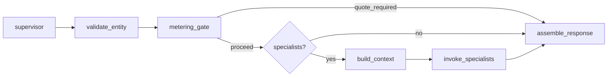

# Metering implementation — Slice 10 (single slice)

**Status:** **Shipped** (June 2026) — Cursor `prompts/cursor/done/2026-06-09-2100-entity-metering-implementation/`. Payment settlement → Slice 11 [`entity-metering-payment-phase11.md`](entity-metering-payment-phase11.md).  
**Program:** [`entity-protocol-and-registry-program.md`](entity-protocol-and-registry-program.md)  
**Paul (June 2026):** Prefer one slice if feasible; split only if diff forces it.

---

## Verdict: one slice

All v1 metering hooks fit **one implementation slice** (~15–25 files touched) if we keep non-goals strict. Split trigger: if production+consumption gate routing cannot be made testable without >400 lines of graph churn — then split into **10a production gate** / **10b consumption gate**.

---

## Objective

Ship runnable metering **stubs** (no payment provider):

1. Load `metering` policy from `network.json` (CRM default: `enabled: false`).
2. `BuiltinQuoteProvider` — fixed USD table from policy/env; `marginal` default; `full_duplicate` opt-in.
3. `entitlements.json` + `quotes.json` (gitignored runtime) under `network_root`.
4. `quote_required` outcome + `quote` on `QueryResponse`; `quote_id` + optional `principal` on `EntityQuery`.
5. Commit gate: no Tavily research without accepted quote when `metering.enabled`.
6. Consumption gate: metered assembly/read per Q9m-B default (`meter_first_delivery: true`, overridable).
7. `MYCELIUM_AUTO_ACCEPT_QUOTES=1` and `metering.enabled: false` bypass for demos.
8. MCP / `describe_network` policy strings.
9. Tests: Paul research quote → accept → research; Jan cache-hit quote → accept → assembled; metering off unchanged.

---

## Non-goals (defer)

| Item | Why |
|------|-----|
| HTTP 402, wallet, payment settlement | Q9j-B |
| `pool_id` / rebate ledger schema | Q9j-B |
| Async quotes / job polling | Q9f-B |
| Pluggable `quote_provider` class loading | Stub interface only; builtin only |
| Blockchain workloads / SLA freshness meters | CRM path only in tests |
| `query_provenance` uplift detection | Price line exists; provenance flag on `WorkloadSpec` defaults false |
| Admin UI | Backlog |

---

## Architecture (code layout)

```
src/network/metering_policy.py   # MeteringPolicy from network.json (like mvr.py)
src/network/entitlements.py        # EntitlementStore → entitlements.json
src/network/quotes.py              # Quote, WorkloadSpec, BuiltinQuoteProvider, QuoteStore
src/agents/metering_gate.py        # build_workload_spec, check_metering, write_entitlement
```

### Graph integration

Add **`metering_gate`** node after `validate_entity`:



`metering_gate_node`:

1. If `!policy.enabled` or `MYCELIUM_AUTO_ACCEPT_QUOTES` → pass.
2. If no billable attrs / free phase → pass.
3. Build `WorkloadSpec` (entity, binding, attrs, classifications, provenance=false).
4. Resolve `cache_state` from `EntitlementStore` + registry `last_researched_at`.
5. `BuiltinQuoteProvider.quote()` → `Quote`.
6. If `total_usd == 0` → pass.
7. If `query.quote_id` matches accepted quote → pass; on production accept schedule entitlement write after invoke.
8. Else → set `state.pending_quote`, route to `assemble_response` → `quote_required`.

`assemble_response`: if `pending_quote`, return `response_quote_required`.

After successful `invoke_specialists` (research actually ran): create/update entitlement in `entitlements.json`.

### Consumption-only (Jan)

`cache_state: hit` → quote has consumption lines only (no production). Gate blocks until `quote_id` accepted, then proceeds to build_context → invoke (cache) → assemble.

### Q9m-B default

When production runs: quote includes production + consumption (`meter_first_delivery: true`).

When cache hit: consumption only.

Override: `meter_first_delivery: false` → production quote omits first consumption line; assembly still metered on subsequent reads.

### Q9i-A

- `principal` optional on `EntityQuery` for marginal.
- Reject production quotes when `funding_model in {sponsor_public, pool}` and principal missing (builtin provider only needs this hook; CRM uses marginal).

---

## Model changes

### `EntityQuery`

```python
class BillingPrincipal(BaseModel):
    kind: str  # wallet | tenant | sponsor_id
    id: str

class EntityQuery(BaseModel):
    ...
    quote_id: str | None = None
    principal: BillingPrincipal | None = None
```

### `QueryResponse`

```python
class QueryResponse(BaseModel):
    ...
    quote: dict[str, Any] | None = None  # Quote payload when outcome=quote_required
```

`outcome`: add `quote_required` to description and all outcome tables.

---

## `network.json` (CRM example)

Keep `metering.enabled: false`. Add commented block or disabled section documenting policy (see phase9 spec). Do **not** break existing tests.

---

## Paths

Extend `NetworkPaths`:

- `entitlements_path` → `entitlements.json`
- `quotes_path` → `quotes.json`

Add `MYCELIUM_ENTITLEMENTS_PATH`, `MYCELIUM_QUOTES_PATH` to `_RUNTIME_ENV_FIELDS`.

---

## Builtin pricing (crude)

Env override optional, e.g.:

- `MYCELIUM_METER_RESEARCH_USD=2.0`
- `MYCELIUM_METER_QUERY_VALUE_USD=0.05`
- `MYCELIUM_METER_QUERY_PROVENANCE_USD=0.15`

Defaults in code if unset.

---

## Testing strategy

Three layers — same patterns as `test_entity_research_gate.py` and `test_entity_growth.py`.

### Layer 1 — Unit tests (fast, no graph)

Pure functions in `metering_policy`, `quotes`, `entitlements`, `metering_gate`:

| Target | Cases |
|--------|--------|
| `load_metering_policy()` | Absent block → `enabled: false`; CRM block parsed; `meter_first_delivery` default true |
| `scope_hash(WorkloadSpec)` | Same inputs → same hash; provenance flag changes hash |
| `BuiltinQuoteProvider.quote()` | `miss` → production + consumption lines (Q9m-B); `hit` + marginal → consumption only; `full_duplicate` → production on hit; `meter_first_delivery: false` → production without first consumption line |
| `EntitlementStore` | Write/read/lookup by `scope_hash`; atomic save (temp + replace) |
| `QuoteStore` | Issue quote, accept by `quote_id`, reject expired/wrong id |
| `principal_required()` | marginal + no principal → OK; sponsor_public + no principal → error |

No Tavily, no LangGraph.

### Layer 2 — Integration tests (`tests/test_entity_metering.py`)

**Fixture:** `crm_metering_env` — copy of `crm_gate_env` plus:

```python
# network.json with metering.enabled: true
# monkeypatch.setenv fixed USD for deterministic quotes
# _mock_email_research(monkeypatch)  # from test_entity_growth.py
# MYCELIUM_USE_SYNC_CHECKPOINTER=1
# delenv OPENAI_API_KEY, TAVILY_API_KEY
```

Helper to enable metering in tmp `network.json`:

```python
def _write_metering_network_json(path: Path, *, enabled: bool = True, **overrides) -> None: ...
```

**Paul / Jan narrative (primary E2E):**

```text
1. Paul bind+validate (free — no quote)
2. Paul email → quote_required
     assert outcome == "quote_required"
     assert quote["line_items"] has production + query_value (Q9m-B)
     assert quote["cache_state"] == "miss"
     quote_id = quote["quote_id"]
3. Paul retry with quote_id → assembled
     assert entitlement written to entitlements.json
     assert quotes.json records acceptance
4. Jan same entity+attrs → quote_required
     assert consumption-only line_items (no production)
     assert quote["avoidable_cost"] present or funding_model marginal
     assert quote["cache_state"] == "hit"
5. Jan retry with quote_id → assembled (no new Tavily — mock call count)
```

Use **Andrea Kalmans** (seed, already validated) for a shorter production path, or **Paul Murphy** arc for full bind+validate+research consistency with existing smokes.

| Test | Assert |
|------|--------|
| `test_metering_disabled_no_quote` | Default CRM `network.json` (`enabled: false`) → Andrea+email → `assembled`, no `quote` field |
| `test_production_quote_then_accept` | Paul/Andrea path above |
| `test_consumption_quote_cache_hit` | Jan path above |
| `test_auto_accept_bypasses_gate` | `MYCELIUM_AUTO_ACCEPT_QUOTES=1` → direct `assembled` |
| `test_invalid_quote_id_rejected` | Bad `quote_id` → `quote_required` again, new quote |
| `test_full_duplicate_policy` | Override `funding_model` → second user quote includes production line |
| `test_meter_first_delivery_false` | Override → first quote production only; assembly still on re-query |
| `test_sponsor_principal_required` | `sponsor_public` + no principal → error or quote reject (no entitlement write) |
| `test_validation_still_free` | Bind+validate turns never return `quote_required` |

**Tavily / LLM:** Never require real keys. Reuse `_mock_email_research` patching `tools.research.run_field_research`. Optionally assert mock `call_count` increments only on accepted production quotes, not on Jan cache-hit consumption-only path.

**File assertions:**

```python
entitlements = json.loads(entitlements_path.read_text())
assert any(e["scope_hash"] == expected for e in entitlements.values())
```

### Layer 3 — Regression

Run existing entity protocol tests **unchanged** — committed CRM example keeps `metering.enabled: false`:

```bash
uv run pytest tests/test_entity_research_gate.py tests/test_entity_growth.py tests/test_entity_metering.py
```

No edits required to old tests if default is off. Optional: one regression test that explicitly loads example CRM `network.json` and asserts metering absent or disabled.

### Layer 4 — Manual smoke (Paul, optional)

Not CI-blocking. Document in `output.md`:

1. Copy CRM example network; set `metering.enabled: true` in local `network.json`.
2. `query_entity` Angela → inspect `quote_required` + line items in MCP/CLI JSON.
3. Retry with `quote_id` → research runs.
4. Second query → consumption quote only.

### What we do not test in Slice 10

| Out of scope | Why |
|--------------|-----|
| Real USD settlement | No payment provider |
| HTTP 402 | Not implemented |
| Async quote jobs | Q9f-B sync only |
| Rebate ledger balances | Q9j-B |
| Blockchain SLA / freshness meters | CRM fixture only |
| Admin UI | Deferred |

### CI

- New file: `tests/test_entity_metering.py`
- Mark E2E smokes `@pytest.mark.smoke` where appropriate (match existing entity tests)
- Deterministic quotes via env USD overrides — no flaky floats

---

## Exit criteria

- [x] Layer 1 unit tests + Layer 2 integration tests pass
- [x] Layer 3 regression: existing entity protocol smokes pass unchanged
- [x] `metering.enabled: false` default — zero regression on existing entity protocol smokes
- [x] `describe_network` documents quote loop
- [x] Design spec phase9 behaviors D10–D22 reflected in code or explicit TODO in output.md

---

## If split needed

| Slice | Ships |
|-------|--------|
| **10a** | Policy, stores, models, production gate, entitlement write, production tests |
| **10b** | Consumption gate, Jan tests, `meter_first_delivery`, MCP strings |