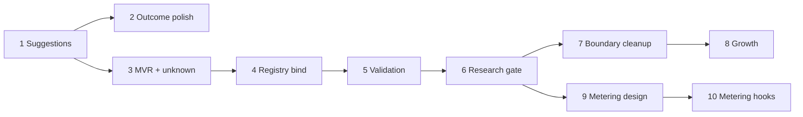

# Entity protocol & registry — full program (slice map)

**Status:** Approved by Paul (June 2026) — bootstrap seed trusted for gating; grown entities must validate. Cursor may proceed slice-by-slice per locked specs.  
**Sources:**  
- [`conversations/2026-06-08-entity-key-negotiation.md`](conversations/2026-06-08-entity-key-negotiation.md)  
- [`conversations/2026-06-08-entity-registry-validation-growth.md`](conversations/2026-06-08-entity-registry-validation-growth.md)  
- [`entity-key-suggestions-phase1.md`](entity-key-suggestions-phase1.md) (Slice 1 locked detail)

---

## Program goal

Build **agent-to-agent negotiation** from the outside in:

1. **Protocol** — structured outcomes, no silent binding, no research spend until entity is resolved.  
2. **Policy** — per-network minimum viable record (MVR) before bind.  
3. **Registry** — one place for ids, bind keys, validation state (not replicated in specialists).  
4. **Growth** — networks gain records from queries, not only bootstrap seed.  
5. **Metering** — x402-style phases on commit (design → hooks → integration later).

**Paul’s problem split (never conflate):**

| Code | Problem | Example |
|------|---------|---------|
| A | Near-miss key | Kalman vs Kalmans |
| B | Unknown entity | Paul Murphy not in system |
| C | Under-specified | Need employer before email research |
| D | Attribute research | Email — only after bind |

---

## Cross-program decisions (proposed — confirm with Paul)

| # | Decision | Proposal | Rationale |
|---|----------|----------|-----------|
| P1 | Registry pattern | **(C) Specialists propose/validate domain fields; supervisor + registry commit** | Paul’s CRM split; registry is arbiter not research agent |
| P2 | Registry storage | **`<network_root>/entities.json`** (JSON, atomic save like `categories.json`) | Matches network layout; gitignored runtime |
| P3 | Lookup order after Slice 4 | **Registry (validated/provisional) → seed bootstrap → negotiate** | Validated registry overrides seed on conflict |
| P4 | Seed role long-term | **`seed.json` = bootstrap origin only**; growth writes registry; seed export/sync optional later | Store must grow; seed not canonical forever |
| P5 | Binding input shape | **Optional `binding: dict[str, str]` on `EntityQuery`** (Slice 4+) — keys from MVR (CRM: `employer`) | Machine agents need structured follow-up; no `provided_data` blob |
| P6 | Confirmation for near-miss | **Retry with `entity_key` only** (Slice 1 — locked) | Simplest agent loop |
| P7 | Research gate | **No `current_id` → no specialists/Tavily** (enforce uniformly by Slice 6) | Fixes today’s leak: unknown key + `email` still classifies |
| P8 | Validation depth (v1) | **Sync-light**: rules + optional small LLM coherence check; no Tavily for core bind | Demos stay fast; extended attrs still use research |
| P9 | Metering | **Design in Slice 9; hooks in Slice 10; no billing before Slice 6 gate works** | x402 depends on stable negotiation outcomes |
| P10 | Bootstrap seed gating | **Seed rows = trusted for research gate** (maintainer-curated at bootstrap); **grown entities must validate** | Preserves CRM demo; not a claim of real-world factual truth |

---

## Outcome enum (full program target)

Evolves across slices; implement only when each slice ships.

| `outcome` | Slice | Meaning |
|-----------|-------|---------|
| `found` | — | Identity hit, no attr request (existing) |
| `assembled` | — | Attr merge complete (existing) |
| `not_found` | — | Generic miss (no suggestion, no unknown protocol yet) — **narrowed over time** |
| `entity_key_unresolved` | **1** | Near-miss; `suggestions[]` populated |
| `entity_unknown` | **3** | No match, no suggestions; entity not in network |
| `entity_under_specified` | **3** | Known name path but MVR incomplete (e.g. missing `employer`) |
| `entity_bound_provisional` | **4** | Bind accepted; provisional id allocated |
| `entity_validated` | **5** | Core bind fields validated; research may proceed |
| `quote_required` | **10** | (Future) commit needs metering acceptance |

Slice 1 implements the first four rows plus `entity_key_unresolved`. Later slices replace bare `not_found` for B/C cases.

---

## Slice map (implementation order)

### Slice 1 — Entity key suggestions *(spec locked)*

**Cursor prompt:** `prompts/cursor/next/2026-06-09-1000-entity-key-suggestions-protocol.md`  
**Detail:** [`entity-key-suggestions-phase1.md`](entity-key-suggestions-phase1.md)

| | |
|--|--|
| **Solves** | Problem A (Kalman/Kalmans) |
| **Ships** | `resolve_entity_key()`, `outcome` + `suggestions[]`, `entity_key_unresolved`, supervisor short-circuit, MCP policy |
| **Persists** | Nothing |
| **Non-goals** | Unknown entity, registry, binding fields, metering |

**Exit criteria:** Kalman+email → unresolved, no Tavily; Kalmans+email → normal flow.

---

### Slice 2 — Outcome infrastructure polish

| | |
|--|--|
| **Why separate** | Slice 1 adds `outcome`/`suggestions`; this slice ensures **all** response builders set `outcome` consistently; CLI/MCP schema docs; admin UI ignores new fields gracefully |
| **Ships** | Audit all `response_*` paths; JSON schema export for MCP; snapshot tests for response shape |
| **Depends on** | Slice 1 |
| **Non-goals** | New negotiation logic |

*Optional:* merge into Slice 1 if Cursor slice stays small. Keep separate if Slice 1 diff is already large.

---

### Slice 3 — MVR policy + unknown / under-specified negotiation *(no persist)*

| | |
|--|--|
| **Solves** | Problems B and C (Paul Murphy; generic name without employer) |
| **Ships** | Per-network **MVR** declaration; `entity_unknown` + `entity_under_specified` outcomes; `required_fields[]` on `QueryResponse`; supervisor short-circuit (no classify/specialists) |
| **Persists** | Nothing |

**MVR declaration (proposal):**

```json
// <network_root>/network.json (extend existing manifest)
"mvr": {
  "bind_fields": ["name", "employer"],
  "name_source": "entity_key",
  "description": "CRM people: name plus current employer before research."
}
```

Fallback for CRM example: if `mvr` absent, default `bind_fields: ["name", "employer"]` with `name` taken from `entity_key`.

**Behaviors:**

| Query | Outcome | `required_fields` |
|-------|---------|-------------------|
| `Paul Murphy` + `email` | `entity_unknown` | `["employer"]` |
| `Paul Murphy` + `employer: Acme` in future `binding` | (Slice 4) | — |
| Exact seed hit | unchanged | `[]` |

**Message (Paul Murphy):** *"No record for 'Paul Murphy'. To look up email, tell me who they work for (`employer`)."*

**Decisions (locked):**

- MVR lives in **`network.json`**
- `entity_unknown` when zero exact match and zero suggestions; `entity_under_specified` when `binding` partial (Slice 4) or MVR incomplete
- Slice 3: `entity_key` carries name; missing MVR fields → `entity_unknown` + `required_fields`

**Exit criteria:** Paul Murphy+email → `entity_unknown`, `required_fields=["employer"]`, no Tavily; Andrea Kalman still → Slice 1 path.

---

### Slice 4 — Entity registry store + provisional bind

| | |
|--|--|
| **Solves** | Allocate id; persist bind; first step of growth |
| **Ships** | `entities.json`, `EntityRegistry` module, `resolve_entity` (registry + seed), optional `EntityQuery.binding`, provisional bind on sufficient MVR |
| **Persists** | New registry rows |

**`entities.json` shape (proposal):**

```json
{
  "version": "1.0",
  "entities": {
    "<uuid>": {
      "id": "<uuid>",
      "name": "Paul Murphy",
      "employer": "Acme Corp",
      "validation_state": "provisional",
      "bind_fields": { "name": "provisional", "employer": "provisional" },
      "created_at": "…",
      "source": "query_bind"
    }
  },
  "by_name": { "paul murphy|acme corp": "<uuid>" }
}
```

**Bind rule:** When `entity_unknown`/`entity_under_specified` and caller supplies complete MVR via `binding` (e.g. `{"employer": "Acme Corp"}`), allocate uuid, write provisional entity, return `entity_bound_provisional`.

**Lookup order:** registry exact bind match → seed `find_by_key` → suggest → unknown.

**Decisions (locked):**

- Id allocation: **new uuid4** on bind (not uuid5 seed algorithm) — distinguishes grown entities
- Duplicate bind: same name+employer → same id; conflicting employer → new entity unless exact bind key match
- `EntityQuery.binding` optional dict; keys must be MVR fields

**Exit criteria:** Paul Murphy + `binding.employer` → provisional id in registry; re-query with name+employer resolves; still no email research until Slice 5/6.

---

### Slice 5 — Core validation orchestration

| | |
|--|--|
| **Solves** | Demographic validates name; professional validates employer; registry commits |
| **Ships** | Validation mode on professional + demographic specialists (lightweight); registry promotes fields `provisional` → `validated`; outcome `entity_validated` |
| **Persists** | Registry validation_state updates |

**Flow:** After provisional bind → run validators → registry arbiter commits → `validation_state: validated` when MVR satisfied.

**Decisions to lock:**

- [ ] Validator failure: stay provisional + message vs `validation_rejected` outcome — **proposal: stay provisional, explain in message**
- [ ] LLM in validation: **optional stub** (keyword rules first for CRM demo)

**Exit criteria:** Bind Paul Murphy → validators run → registry validated → ready for research gate.

---

### Slice 6 — Research gate (enforce bind + validate)

| | |
|--|--|
| **Solves** | Problem D only after A/B/C resolved; closes supervisor leak |
| **Ships** | Single gate: specialists only when `current_id` set AND registry/seed entity `validation_state == validated` (seed bootstrap treated as **pre-validated** for backward compat) |
| **Persists** | Nothing new |

**Exit criteria:** Unbound/unknown/provisional → never invokes Tavily; validated Paul Murphy + email → contact research runs.

**Bootstrap seed (locked):** seed matches are treated as **validated for gating** — no provisional loop. Research on Andrea Kalmans + `email` still works without registry mirroring. Grown entities (registry `source: query_bind`) require `validation_state: validated`.

---

### Slice 7 — Seed vs specialists boundary cleanup

| | |
|--|--|
| **Solves** | Paul’s overlap complaint (name/employer in seed + specialist storage) |
| **Ships** | Supervisor/registry owns bind lookup; specialists receive `current_id` + `target_fields` only; Jinja template + `context.py` stop replicating core fields in specialist storage; migration note for existing storage |
| **Depends on** | Slices 4–6 |
| **Detail:** TODO “Seed data vs specialists” |

**Non-goals:** Delete seed.json; rewrite all historical specialist data automatically.

---

### Slice 8 — Seed from queries & network growth

| | |
|--|--|
| **Solves** | Store must grow; launch v2 direction |
| **Ships** | Queries enrich registry; optional `network create` without `--seed`; export/sync story documented |
| **Persists** | Registry growth; optional seed regen script (operator) |

**Launch v2 (subset):** first queries establish entities via bind flow; empty seed allowed when registry + negotiation ready.

**Depends on:** Slices 4–7.

---

### Slice 9 — Negotiation phases & metering *(design only)*

| | |
|--|--|
| **Solves** | x402 alignment — price on total need |
| **Ships** | Design doc: phases A→D, `quote_id`, checkpoint negotiation state, free vs paid boundaries |
| **Code** | None (or stub types only) |

**Phases (from conversation):**

- **A** — Discover/bind entity (slices 1–4)
- **B** — Scope attributes + ontology (classify without research)
- **C** — Commit + research (paid)
- **D** — Deliver + follow-ups

**Depends on:** Slices 1–6 behavior stable.

---

### Slice 10 — Metering hooks *(implementation minimal)*

| | |
|--|--|
| **Ships** | `quote_required` outcome stub; audit_log markers for phase transitions; MCP policy strings; no real payment integration |
| **Depends on** | Slice 9 design + Slice 6 gate |

---

## Explicitly out of this program (separate tracks)

| Item | Why deferred |
|------|----------------|
| Per-record query messages (multi-match) | Kevin Zhang disambiguation works via `results` today |
| Long-running threads / suspend | Related but separate UX slice |
| Inter-network handoff | Needs distributed discovery |
| Non-person seed schemas | After person CRM path proven |
| Agent tools review | Parallel roadmap |
| Silent fuzzy resolve | Paul rejected |

---

## Dependency diagram



---

## Cursor handoff policy

| Rule | |
|------|--|
| **Per slice** | One prompt in `prompts/cursor/next/` after slice spec locked |
| **Spec before code** | Slices 3–10 need short spec files like `entity-key-suggestions-phase1.md` before queueing |
| **TODO.md** | Grok + Paul update after each slice reviewed — not Cursor |
| **Batch 1 specs (draft)** | Slice 1: [`entity-key-suggestions-phase1.md`](entity-key-suggestions-phase1.md); Slices 2–4: [`entity-outcome-infrastructure-phase2.md`](entity-outcome-infrastructure-phase2.md), [`entity-unknown-mvr-phase3.md`](entity-unknown-mvr-phase3.md), [`entity-registry-bind-phase4.md`](entity-registry-bind-phase4.md) — **Paul review before Cursor** |
| **Cursor** | All slices on hold until batch approved |

---

## Paul decisions (locked June 2026)

| Topic | Decision |
|-------|----------|
| Slice 2 | Keep separate from Slice 1 |
| MVR location | `network.json` |
| Binding field | `EntityQuery.binding` |
| Bootstrap seed | **Trusted for gating** — maintainer-curated seed skips validation loop; not a claim of real-world truth |
| Grown entities | **Must validate** before research (Slices 5–6) |
| Slice 8 | Growth first; empty-seed `network create` later |
| Program scope | Approved |

---

## Approval

| Role | Status |
|------|--------|
| Paul | **Approved** (June 2026) |
| Grok | Program locked |