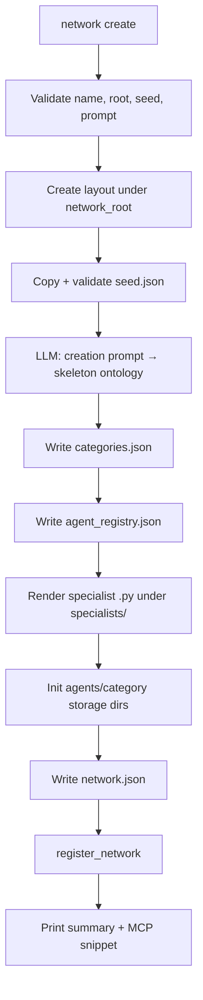

# Plan: Networks Phase 5 — Network launch v1 (`network create`)

**Status:** **Delivered** (June 2026). Slices `2026-06-09-1500` … `1800` in `prompts/cursor/done/`.  
**Depends on:** `docs/plans/networks-terminology.md` (Phases 1–4.5 complete), Agent Factory, Classification Engine.  
**Gate:** Phase 4.5 integration testing (`2026-06-09-1400`) — closed.

---

## Goal

One command stands up a **custom-domain** network with a user-chosen `network_root`, seed file, and creation prompt. Replaces the manual `copy-example-network` + `register` flow for non-CRM ontologies. The committed CRM example path (`bin/copy-example-network`) remains unchanged.

```bash
uv run mycelium network create <name> \
  --root <abs-path> \
  --seed <file> \
  (--prompt "..." | --prompt-file <file>) \
  [--display-name "..."] \
  [--default] \
  [--dry-run] \
  [--force] \
  [--no-mcp-snippet]
```

---

## Ontology vs classification (terminology)

| Concept | What it is | Where it lives | When it changes |
|---------|------------|----------------|-----------------|
| **Ontology** | The network’s domain model: which **categories** exist, what each **specialist** owns, descriptions, example attributes | `categories.json` (tree + `attribute_map`), `agent_registry.json`, `<root>/specialists/*.py` | **Create:** skeleton from creation prompt. **Later:** admin/batch (`refresh_from_llm`) or rare structural edits (future `regen-ontology`) |
| **Classification** | Runtime mapping of a **requested attribute** (e.g. `email`, `wheat_yield`) → a category in the ontology | Classification engine (`classify()`); uses `attribute_map` | **Every query:** known attrs = instant lookup; **first-time unknowns** = LLM once, then cache |

**Phase 5 creates ontology (skeleton).** Classification already handles lazy growth when clients ask for unexpected attributes. The supervisor + Agent Factory already create specialists on demand when an `assigned_agent` is missing.

**Design consequence:** `network create` materializes a **coarse category tree + specialists**, not an exhaustive attribute map. Query-time laziness stays the primary path for surprise client requests.

---

## Paul decisions (locked)

| Topic | Decision |
|-------|----------|
| CLI surface | New `network create`; keep `register` / `list` / `use` for existing roots |
| Specialist code | `<network_root>/specialists/` (not `agents/`); wire `MYCELIUM_SPECIALISTS_DIR` in `apply_network_paths()` |
| Ontology bootstrap | **Skeleton:** creation prompt → categories + specialists + descriptions; **minimal** `attribute_map` (examples only) |
| Lazy at query time | Keep existing classify-unknown + supervisor on-demand `create_specialist` paths |
| `network.json` | name, display_name, description, created_at, creation_prompt, ontology_model |
| MCP helper | Print copy-paste MCP JSON snippet on success (default on; `--no-mcp-snippet` to suppress) |
| Seed (v1) | Required `--seed`; copy to `<root>/seed.json` |
| Credentials | Framework `.env` only — defer per-network secrets (TODO) |
| LangSmith | Framework-level only — defer per-network projects (TODO) |
| Network diversity | Infinite network types (cars, planes, bacteria, clocks, wheat, …); CRM was prototype only |
| Git on create | Never auto-commit network artifacts (user-local data) |

---

## Standard layout (updated)

```
<network_root>/
  network.json
  seed.json
  categories.json          # skeleton ontology (runtime)
  agent_registry.json
  specialists/             # generated *_specialist.py (NEW in Phase 5)
  agents/<category>/       # per-specialist storage (unchanged name)
    storage.json
    storage_strategy.json
  checkpoints.sqlite
  mycelium.db              # optional legacy
```

---

## `network create` flow



### Validation

- `--root`: absolute path; mkdir if missing; fail if `network.json` exists unless `--force`
- `--seed`: JSON with `people` array (v1 shape); fail before LLM if invalid
- `--prompt` / `--prompt-file`: one required; non-empty
- Ontology LLM output: category slugs, agent name regex, 1:1 category↔specialist; one retry on validation failure

### Creation prompt → skeleton ontology

Single structured LLM call (`gpt-4o-mini` default, same as classification):

- **Input:** user creation prompt + system template (Mycelium specialist model, naming rules, diverse domain examples — not person-only)
- **Output:** `CategoryTreeData`-compatible doc:
  - `categories`: coarse domains appropriate to the prompt (3–8 typical)
  - `attribute_map`: **only** from category `examples` (normalized lowercase) — not exhaustive
  - `agent_registry`: one generated specialist per category
- **Specialist modules:** `AgentFactory.render_specialist_py` for each; `auto_commit=False`; no framework git commit

### What create does *not* do

- Predict every attribute clients will request (classification + lazy specialist creation handle that)
- Auto-edit Claude Desktop / MCP client config (prints snippet only)
- Per-network API keys or LangSmith projects

---

## Prerequisite fix (slice 5a)

`apply_network_paths()` today does not set `MYCELIUM_SPECIALISTS_DIR`. All networks share `src/agents/specialists/`, which breaks multiple custom ontologies.

**5a changes:**

- Add `specialists_dir: Path` to `NetworkPaths` → `<root>/specialists`
- Export via `apply_network_paths()` and preserve in `refresh_runtime_from_disk()`
- Fix `RegisteredAgent.storage_path` / factory paths to use `MYCELIUM_AGENT_DATA_DIR` (not hardcoded `data/agents/`)
- Tests: two isolated roots, distinct specialist files under each `specialists/`

---

## Implementation slices

| Slice | Deliverable |
|-------|-------------|
| **5a** | Per-network `specialists/` + env wiring + storage path fix |
| **5b** | `src/network/ontology.py` — LLM skeleton generator, Pydantic schema, validation, mocked tests |
| **5c** | `mycelium network create` in `main.py`, orchestration, `--dry-run`/`--force`, e2e test (mocked LLM) |
| **5 polish** (`1750`) | Review niggles (5a+5b+5c): test env dedupe, public storage paths, ontology/create polish — **before 5d** |
| **5 cleanup** (`1760`) | **Remove `bin/reset-mycelium`** — obsolete; new network replaces reset |
| **5d** | Docs: README quick start, update `networks-terminology.md` open questions, `TODO.md` deferrals |

**Testing & shipping (Paul, June 2026):**

- **Automated tests** run per slice (smoke/full in CI); no blocker.
- **Paul hands-on testing** deferred until **after slice `1800`** (all four slices landed + docs).
- **Ship to `main`** after Grok + Paul review all four slices and any follow-up polish slices — not before Paul removes the README testing notice.
- **Manual gate (post-1800):** one real `OPENAI_API_KEY` `network create` + query; then remove README banner.

---

## Seed schema (v1 limitation)

v1 `--seed` validates today’s person-shaped JSON (`name`, `employer`). Domain-agnostic **ontology** does not require person seed — but the loader does today.

**Deferred (TODO):** generic / entity seed schemas for non-person networks (vehicles, organisms, artifacts). Not blocking Phase 5 skeleton ontology.

---

## Deferred / TODO (not Phase 5)

- **Query-as-seed launch** (v2) — `TODO.md` already tracked
- **Per-network credentials** — framework `.env` for v1; design discussion later
- **Per-network LangSmith projects** — add to `TODO.md`; not required for create
- **`network regen-ontology`** — re-run creation prompt against existing root
- **Non-person seed formats** — see above
- **Inter-network handoff** — Phase 6

---

## Success criteria

- `network create` with custom prompt produces a queryable network without `_SEED_CATEGORIES` fallback
- Two networks on one machine have isolated `specialists/`, registries, and categories
- Unknown attributes at query time still classify lazily and can trigger new specialists
- `copy-example-network` + CRM example path unchanged
- Integration test: create (mock LLM) → register → query happy path

---

## Related docs

- `docs/plans/networks-terminology.md` — Phases 1–4.5, terminology
- `docs/plans/classification-engine-phase1.md` — classify / attribute_map
- `docs/plans/agent-factory-phase2.md` — specialist generation
- `TODO.md` — Networks roadmap