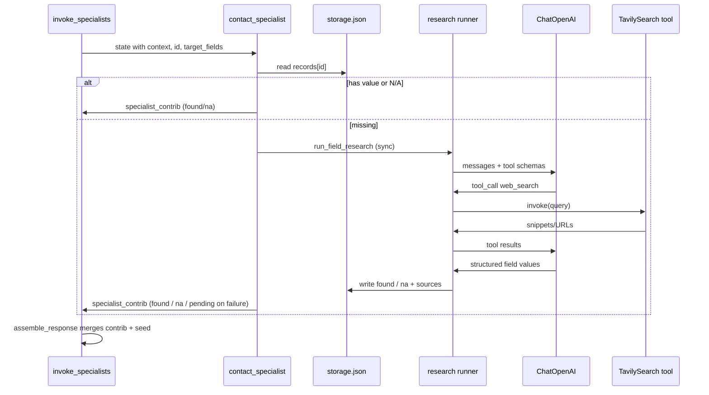

# Plan: Specialist Research — Phase 1 (Tavily + LLM tool loop)

**Status:** Implemented (June 2026). Approved by Paul; built via Cursor slices 1100–1400 (`prompts/cursor/done/2026-06-09-11xx`–`14xx`).  
**Depends on:** Seed-data-context graph (`docs/plans/seed-data-context-architecture.md`), Classification Engine (`docs/plans/classification-engine-phase1.md`), Agent Factory (`docs/plans/agent-factory-phase2.md`), `docs/architecture.md`, `prompts/system/CORE_PROMPT.md`

> **Lightweight priority:** Ship a **single shared research runner** and wire it through the **specialist Jinja template**. Phase 1 runs research **synchronously** in the specialist node (better demos; one query can return researched values). Design the runner API so **async** execution can return later without rewriting core logic. Defer Extract/Crawl and per-category prompt tuning. Keep the supervisor thin; no public API shape changes.

---

## Context

Mycelium specialists implement three storage scenarios (found / pending / N/A). **Before Phase 1**, research was a stub (`_stub_background_research` daemon thread, no persistence). **Phase 1 (implemented)** adds a bounded **LLM + tools** loop that discovers attribute values on the web, validates them, and persists into per-category `data/agents/<category>/storage.json`.

This plan is **research only** — not classification (Phase 1 intelligence), not Agent Factory creation, not changes to `EntityQuery` / MCP / CLI contracts.

### Agreed principles (from design discussion)

| Principle | Decision |
|-----------|----------|
| Who searches? | **Specialists only**, via shared `src/tools/`. Supervisor does not call search or research LLMs. |
| Provider | **Tavily** for web search (`langchain-tavily`; env `TAVILY_API_KEY`). |
| Tools and LLM | Tool **definitions** are passed to the LLM; **execution** stays in application code (or LangChain runner on our behalf). |
| Specialist invocation | **Always invoke** the specialist for classified requested attributes — even when seed already has `name` / `employer`. Specialist may **correct** seed (e.g. legal name vs shortened seed). |
| Merge order | **Specialist non-pending value wins** over seed; seed is **provisional** while specialist research is pending. Assembly implements this in `assemble_response` (attribute-scoped `results`; see slice `2026-06-04-1400-filter-query-results-and-trace-url`). |
| God agents | **No** single research agent for all categories. Each specialist runs research only for **its** `target_fields` and **its** storage. |
| Phase 1 execution | **Sync** — specialist blocks on `run_field_research` before returning `specialist_contrib`. **Future:** async (background thread or job queue) for latency; runner API and docs should not assume threads. |
| Observability | LangSmith tracing when enabled (research runs as part of the graph trace). `trace_id` on `PersonResponse` remains graph-level; CLI LangSmith URL stays **outside** JSON. |
| Low confidence | **`na`** with a clear **`reason`** (e.g. insufficient evidence), not `pending` and not a silent guess. |

---

## Current state (codebase)

- **Graph:** `supervisor` → `build_context` → `invoke_specialists` → `assemble_response` (`src/graphs/core.py`).
- **Specialists:** Six generated agents under `src/agents/specialists/`, template `src/agents/factory/templates/specialist_agent.py.j2`.
- **On cache miss (implemented):** Pre-mark `pending`, run **sync** `tools.research.run_field_research` when keys are set, reload storage, return `found` / `na` / `pending` in `specialist_contrib`. Retry `pending` + `last_error` on later queries.
- **invoke_specialists_node:** Appends contributions to `context._meta.contributions`; final response built in `assemble_response_node`.
- **Classification:** `src/agents/classification/` — LLM only for **first-time unknown attribute → category**; unrelated to per-person research.
- **Tools:** `src/tools/tavily.py` (web search), `src/tools/research.py` (LLM + tool loop), Jinja under `src/agents/factory/templates/research/`.

---

## Phase 1 goal

When a specialist has no stored value for an owned field:

1. Build a **research prompt** from person context + category + `target_fields`.
2. Run a **bounded tool-calling loop** (LLM + Tavily `web_search`).
3. **Parse and validate** structured proposals.
4. **Persist** to `SpecialistStorage` (`found`, `na`, or leave `pending` on failure).
5. **Audit** and LangSmith-trace the run.

**Phase 1 (sync):** The specialist runs steps 1–5 **before** returning `specialist_contrib`, so a single query can return `found` / `na` in `results` when keys and APIs are configured. **Tradeoff:** higher latency on cache misses. **Future:** move execution off the hot path (async thread, queue, or in-graph task) without changing storage shape or merge rules.

---

## Architecture overview



### Separation of concerns

| Layer | Responsibility |
|-------|----------------|
| **Supervisor** | Seed match, classify attributes, plan `specialists_to_invoke`. No tools. |
| **build_context** | Union seed + all specialist stores for `id`. |
| **Specialist node** | Read store, decide scenario; on miss run **sync** research, persist, return `specialist_contrib`. |
| **`src/tools/tavily.py`** | Tavily-backed `web_search` + `create_tavily_search_tool()` (thin wrapper, normalized `SearchHit`). |
| **`src/tools/research.py`** (new) | Prompt build, LLM loop, validation, persist helpers — **category-agnostic**. |
| **Jinja fragments** (new) | Per-category system prompt additions (examples, field semantics). |
| **assemble_response** | Merge seed + contributions; attribute-scoped `results`; messaging (unchanged contract). |

---

## LLM + tools interaction (Phase 1)

1. Research runner constructs **messages** (system + user).
2. Runner passes **tool definitions** to the model (`create_tavily_search_tool()` from LangChain Tavily integration).
3. Model may return **tool_calls** → runner executes Tavily → appends **tool result** messages.
4. Loop until model returns **no tool calls** or **max rounds** exceeded.
5. Model produces **structured output** (Pydantic) listing proposed values per field with confidence and source URLs.
6. Runner **validates** (schema, allowed fields, confidence threshold) then **writes** storage.

**Phase 1 tools:** `web_search` only.  
**Deferred:** `TavilyExtract` / crawl (step 2 when snippets are insufficient).

**Phase 1 models:** `ChatOpenAI` (e.g. `gpt-4o-mini`) — same stack as classification; configurable via env.

---

## Research prompt design

### Inputs

| Input | Source |
|-------|--------|
| `person_id` | `state.current_id` |
| **Full built context** | Same dict `build_context` produced — `context.seed` plus `context.specialists` (union of all categories for this `id`). Serialized into the research prompt so the model sees seed **and** peer specialist values. Seed `name` / `employer` are hints only (specialist may correct); merge rules at response time are unchanged. |
| `target_fields` | Owned attributes for this invocation — **only fields the model may propose**; does not limit what context is visible. |
| Category metadata | `data/categories.json` — description, examples |
| Specialist name | e.g. `contact_specialist` |

### System prompt (shared template)

- Role: research assistant for **one category** only.
- Rules: use tools for fresh facts; do not invent; cite URLs; respect `target_fields` only.
- Output: JSON matching `ResearchProposal` schema (see below).
- If evidence insufficient: mark field as `na` with reason, not guess.

### User prompt (per run)

- **Full context** (JSON or structured summary): seed row + per-category specialist slices for this `id`.
- `id` and **fields to research** (`target_fields`) with one-line semantics from category examples.
- Category fragment may add guidance (e.g. verify legal name vs abbreviated seed) — not a substitute for passing context.

### Category fragments

Small Jinja files, e.g. `src/agents/factory/templates/research/contact.md.j2`, included by runner — not six copies of the full loop.

---

## Structured output and storage

### Pydantic models (`src/tools/research.py` or `src/tools/research_models.py`)

```python
class FieldProposal(BaseModel):
    field: str
    value: str | None = None
    status: Literal["found", "na"]  # runner sets pending before call; not model output
    confidence: float = Field(ge=0.0, le=1.0)
    sources: list[str] = Field(default_factory=list)  # URLs

class ResearchProposal(BaseModel):
    fields: list[FieldProposal]
    notes: str = ""
```

### On-disk record shape (per field under `records[id]`)

Align with existing specialist helpers (`_field_has_value`, `_field_is_pending`, `_field_is_na`):

```json
{
  "email": {
    "status": "found",
    "value": "user@example.com",
    "confidence": 0.85,
    "sources": ["https://..."],
    "researched_at": "2026-06-04T12:00:00+00:00"
  }
}
```

```json
{
  "x_handle": {
    "status": "na",
    "reason": "Confidence 0.42 below threshold; search results did not corroborate a handle",
    "researched_at": "..."
  }
}
```

**Pending:** Used when research **cannot complete** (missing API keys, API/LLM failure, timeout) — `{"status": "pending", "started_at": "...", "last_error": "..."}` optional. Not used for “low confidence” outcomes (those are **`na` + `reason`**). With sync Phase 1, callers rarely see pending on success paths; a follow-up query after failure may still show pending until retry.

### Validation rules (runner)

- Reject proposals for fields not in `target_fields`.
- `found` requires `value` non-empty and `confidence >= RESEARCH_MIN_CONFIDENCE` (default `0.6`, env override).
- `found` requires at least one `source` URL when value is factual (not N/A).
- Below `RESEARCH_MIN_CONFIDENCE`: persist **`na`** with **`reason`** explaining low confidence / weak evidence.
- On LLM / tool failure: leave or set **`pending`** with `last_error` — do not write junk `found`.

---

## Research runner API

```python
def run_field_research(
    *,
    category: str,
    specialist_name: str,
    person_id: str,
    person_name: str,
    employer: str | None,
    target_fields: list[str],
    context: dict[str, Any],
    storage: SpecialistStorage,
) -> ResearchRunResult:
    """Execute LLM+tool loop and persist outcomes. Phase 1: called synchronously from specialist node."""
```

- **`ResearchRunResult`:** `fields_updated`, `errors`, `tool_calls_count`.
- **`is_research_available()`:** `TAVILY_API_KEY` + `OPENAI_API_KEY` present.
- If unavailable: log to `audit_log`, leave `pending` (no silent fake data).
- **Future async:** same function; specialist (or a thin wrapper) dispatches to a thread/queue without changing persist/validation logic.

### Bounded loop

| Limit | Default | Env |
|-------|---------|-----|
| Max tool rounds | 3 | `MYCELIUM_RESEARCH_MAX_TOOL_ROUNDS` |
| Max results per search | 5 | (Tavily tool ctor) |
| Search depth | `basic` | upgrade per-category later |
| Run timeout | 120s | `MYCELIUM_RESEARCH_TIMEOUT_SEC` |

---

## Specialist template changes

On cache miss, **call research synchronously** in the specialist node (replace stub thread):

```python
from tools.research import run_field_research, is_research_available

# Inside missing-field path, before building specialist_contrib:
if is_research_available():
    run_field_research(
        category="contact",
        specialist_name="contact_specialist",
        person_id=pid,
        context=context,  # full build_context payload
        target_fields=target_fields,
        storage=storage,
        ...
    )
# Re-read storage and build contrib from found / na / pending
```

Remove `_stub_background_research` daemon threads in Phase 1. Keep a **single hook** (e.g. `_run_field_research`) so a later slice can swap sync → async dispatch without duplicating prompt/validation logic.

**Rollout:** Prove on **`contact`** + **`email`** in slice 3; **regenerate all six** specialists in the same slice once the template is stable (Paul approved this order).

**Do not** build `PersonResponse` inside the research runner — only update storage; `assemble_response` merges as today.

---

## Sync vs async (Phase 1 decision)

| Mode | Phase | Behavior |
|------|-------|----------|
| **Sync (Phase 1)** | Now | Specialist runs `run_field_research` before returning; same query can show `found` / `na`. Higher latency on cache misses; best for demos and integration tests. |
| **Async (future)** | Later | Graph returns quickly with provisional seed + pending (or partial) while research runs off-thread or via a job. Reuse the same `run_field_research` implementation; change only dispatch in the template. Document in code (`research.py` module docstring) and this plan. |

**Implementation note:** Avoid baking “must be a daemon thread” into validation, storage, or prompts. The stub thread exists today only as a placeholder.

**Checkpointing:** Specialist data lives in `storage.json`, not LangGraph checkpoints — `thread_id` is optional for conversation continuity, not required to see research results after sync completion.

---

## Failure modes

| Condition | Behavior |
|-----------|----------|
| Missing `TAVILY_API_KEY` | Skip research; remain `pending`; audit line |
| Missing `OPENAI_API_KEY` | Same |
| Tavily rate limit / API error | Retry once with backoff; then pending + `last_error` |
| LLM refuses or malformed JSON | pending + audit |
| Low confidence | **`na`** + **`reason`** (required explanation) |
| Concurrent research (future async) | When async returns, guard duplicate starts via `pending` + `started_at` (not critical for sync Phase 1) |

---

## Observability

- When `LANGCHAIN_TRACING_V2=true`, research LLM/tool steps appear in LangSmith as part of the **same graph run** as the query (no separate product decision required). Implementers may add run tags/metadata for filtering; not blocking approval.
- Append specialist `audit_log`: `contact_specialist: research completed for id=… fields=[email] tool_calls=2`.
- Do **not** put raw search snippets in public `PersonResponse.debug` by default (optional `MYCELIUM_RESEARCH_VERBOSE_DEBUG=1`).

---

## Proposed file / folder structure

```
src/tools/
├── __init__.py              # re-exports (no name shadowing: module tavily.py, fn web_search)
├── tavily.py                # Tavily wrapper + SearchHit + create_tavily_search_tool
└── research.py              # run_field_research, prompt build, LLM loop, validation, persist

src/agents/factory/templates/
├── specialist_agent.py.j2   # wire _background_research → run_field_research
└── research/
    ├── _system.j2           # shared system skeleton
    ├── contact.md.j2
    ├── social.md.j2
    └── ...                  # one fragment per category

tests/
├── test_tavily.py           # mock Tavily (smoke)
└── test_research.py         # mock LLM + tool; persist shape (smoke + selective full)

.env.example                 # TAVILY_API_KEY, MYCELIUM_RESEARCH_* optional
docs/architecture.md         # pointer under Next phases (after implementation)
```

**Dependencies (after approval):** `langchain-tavily` in `pyproject.toml`.

**Explicitly untouched:** `EntityQuery` public shape, MCP tool list, graph topology, `categories.json` schema, supervisor routing logic.

---

## Implementation slices (Cursor)

| Slice | ID (suggested) | Scope |
|-------|----------------|-------|
| 1 | `2026-06-xx-1000-tavily-tool` | `src/tools/tavily.py`, env, smoke tests (mock API) |
| 2 | `2026-06-xx-1100-research-runner` | `research.py`, models, prompts template dir, unit tests with mocked LLM/tools |
| 3 | `2026-06-xx-1200-specialist-template-research` | Sync hook in `specialist_agent.py.j2`; prove **contact** + **email**; regen all six specialists |
| 4 | `2026-06-xx-1300-research-integration` | Full test: one query with attr → mock sync research → `found` / `na` in same response; docs |
| 5 | `2026-06-09-1400-specialist-research-capstone` | Polish: pending/retry/mixed messaging, integration `na` test, audit line (**done**) |

Each slice: claim via `prompts/cursor/WORKFLOW.md`, smoke by default, output in `prompts/cursor/done/`.

---

## Verification matrix

| Check | Command / action |
|-------|------------------|
| Unit | `uv run pytest -m smoke -q` |
| Research logic | `uv run pytest tests/test_research.py -q` |
| Lint | `uv run ruff check src tests` |
| Manual (keys required) | `uv run mycelium query --person-key "…" --attributes email` → same response includes researched value or `na` with reason (sync); may take tens of seconds |
| No key | Unset `TAVILY_API_KEY` → pending, no crash |
| Grep | No direct `TavilySearch` in specialist files (only via `tools`) |

---

## Risks and mitigations

| Risk | Mitigation |
|------|------------|
| Hallucinated contact info | Require sources + confidence threshold; N/A when weak |
| Runaway tool spend | Max rounds + timeout |
| Stale pending forever | `last_error` + audit; future: retry job |
| Storage writes | Keep `SpecialistStorage._atomic_write`; sync Phase 1 avoids concurrent writers per record |
| Name/employer conflation | Category fragments + explicit “verify legal name” for contact |
| Duplicate LLM concerns | Classification cache separate; research prompt includes only person-specific context |

---

## Out of scope (Phase 1)

- Tavily Extract / Crawl / Research API
- **Async** background research (daemon thread, job queue, or non-blocking graph node)
- Supervisor or MCP exposing `web_search` to external callers
- Embedding / vector retrieval
- Specialist-to-specialist messaging (peer context remains supervisor-built union)
- Editing generated specialist `.py` by hand for logic (template + regen only)
- `trace_url` in `PersonResponse` JSON

---

## Resolved decisions (Paul, 2026-06-04)

| Topic | Decision |
|-------|----------|
| Execution mode | **Sync** in Phase 1 (demos); **async** later — runner API and docs must stay dispatch-agnostic. |
| Low confidence | **`na`** with required **`reason`** (explanation), not `pending`. |
| LangSmith | No open product choice — traces follow the graph run when tracing is on; optional tags are implementation detail. |
| Rollout | Prove **`contact` + `email`**, then regen **all six** specialists from one template update. |
| Research prompt context | Pass **full** `build_context` output (seed + all specialist slices for the `id`); `target_fields` only limits **writes**, not what the model can read. |

---

## Approval checklist

- [x] Sync Phase 1 accepted (async deferred, design for swap)  
- [x] Storage record shape accepted  
- [x] Tavily-only tools accepted for v1  
- [x] Shared `research.py` + Jinja fragments accepted (preferred long-term; not a hard forever constraint)  
- [x] Slice order accepted  
- [x] Cursor prompts drafted (`prompts/cursor/next/2026-06-04-11xx-specialist-research-*.md`)
- [x] Implemented in repo (slices 1100–1400; reviews in `prompts/cursor/done/2026-06-09-*`)

---

**References:** `docs/architecture.md` (graph, merge rules), `src/agents/dispatch.py` (`assemble_response_node`), `src/agents/responses.py` (merge + shape), `src/agents/specialists/base.py` (`SpecialistStorage`), [Tavily LangChain docs](https://docs.tavily.com/documentation/integrations/langchain).