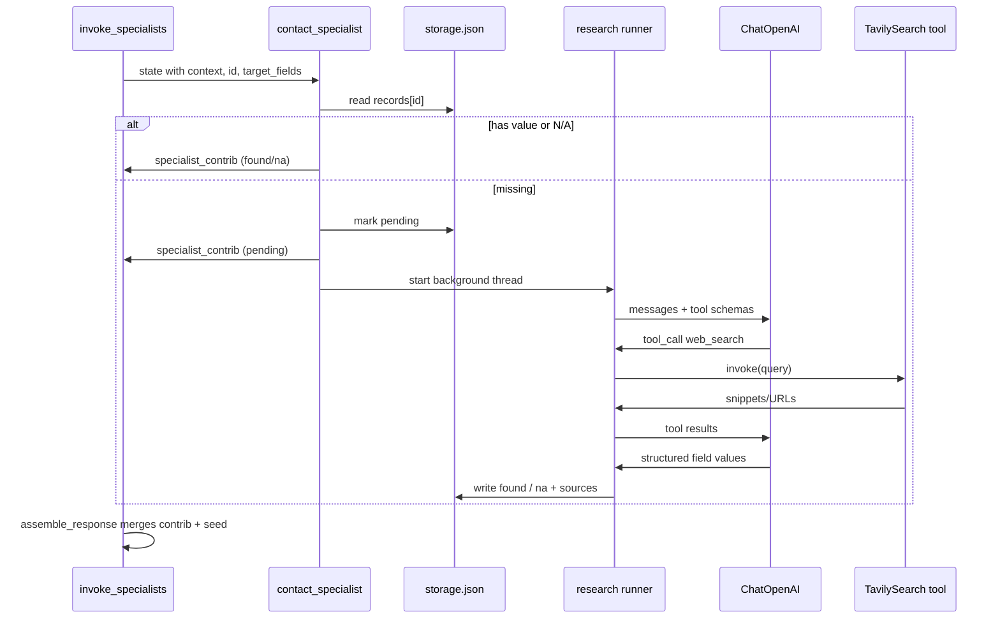

# Plan: Specialist Research — Phase 1 (Tavily + LLM tool loop)

**Status:** Draft for review (June 2026)  
**Depends on:** Seed-data-context graph (`docs/plans/seed-data-context-architecture.md`), Classification Engine (`docs/plans/classification-engine-phase1.md`), Agent Factory (`docs/plans/agent-factory-phase2.md`), `docs/architecture.md`, `prompts/system/CORE_PROMPT.md`

> **Lightweight priority:** Ship a **single shared research runner** and wire it through the **specialist Jinja template** (all six categories) before adding Extract/Crawl, sync in-graph research, or per-category prompt tuning. Keep the supervisor thin; no public API shape changes.

---

## Context

Mycelium specialists today implement three storage scenarios (found / pending / N/A) but **research is a stub**: `_stub_background_research` in each `*_specialist.py` starts a daemon thread and does nothing. Queries therefore return provisional seed values and messages like “verification in progress” without ever filling specialist storage.

Phase 1 of **specialist research** replaces that stub with a bounded **LLM + tools** loop that can discover attribute values on the web, validate them, and persist into per-category `data/agents/<category>/storage.json`.

This plan is **research only** — not classification (Phase 1 intelligence), not Agent Factory creation, not changes to `PersonQuery` / MCP / CLI contracts.

### Agreed principles (from design discussion)

| Principle | Decision |
|-----------|----------|
| Who searches? | **Specialists only**, via shared `src/tools/`. Supervisor does not call search or research LLMs. |
| Provider | **Tavily** for web search (`langchain-tavily`; env `TAVILY_API_KEY`). |
| Tools and LLM | Tool **definitions** are passed to the LLM; **execution** stays in application code (or LangChain runner on our behalf). |
| Specialist invocation | **Always invoke** the specialist for classified requested attributes — even when seed already has `name` / `employer`. Specialist may **correct** seed (e.g. legal name vs shortened seed). |
| Merge order | **Specialist non-pending value wins** over seed; seed is **provisional** while specialist research is pending. Assembly already implements this in `assemble_response` (slice 1400). |
| God agents | **No** single research agent for all categories. Each specialist runs research only for **its** `target_fields` and **its** storage. |
| Observability | LangSmith tracing on research runs (same project or tagged child runs). `trace_id` on `PersonResponse` remains graph-level; CLI LangSmith URL stays **outside** JSON. |

---

## Current state (codebase)

- **Graph:** `supervisor` → `build_context` → `invoke_specialists` → `assemble_response` (`src/graphs/core.py`).
- **Specialists:** Six generated agents under `src/agents/specialists/`, template `src/agents/factory/templates/specialist_agent.py.j2`.
- **On cache miss:** Mark field `pending` in `storage.json`, start `_stub_background_research` thread, return `specialist_contrib` with `values[field] = "pending"`.
- **invoke_specialists_node:** Appends contributions to `context._meta.contributions`; does **not** promote specialist-internal `response` to final state (final response built in `assemble_response_node`).
- **Classification:** `src/agents/classification/` — LLM only for **first-time unknown attribute → category**; unrelated to per-person research.
- **Tools package:** `src/tools/` exists; Tavily integration may be prototyped locally — **implementation follows approval of this plan**, not the other way around.

---

## Phase 1 goal

When a specialist has no stored value for an owned field:

1. Build a **research prompt** from person context + category + `target_fields`.
2. Run a **bounded tool-calling loop** (LLM + Tavily `web_search`).
3. **Parse and validate** structured proposals.
4. **Persist** to `SpecialistStorage` (`found`, `na`, or leave `pending` on failure).
5. **Audit** and LangSmith-trace the run.

Callers still get fast graph responses: research continues on the **existing async path** (background thread) unless we add sync mode in a later phase.

---

## Architecture overview



### Separation of concerns

| Layer | Responsibility |
|-------|----------------|
| **Supervisor** | Seed match, classify attributes, plan `specialists_to_invoke`. No tools. |
| **build_context** | Union seed + all specialist stores for `id`. |
| **Specialist node** | Read store, decide scenario, enqueue research, return `specialist_contrib`. |
| **`src/tools/tavily.py`** | Tavily-backed `web_search` + `create_tavily_search_tool()` (thin wrapper, normalized `SearchHit`). |
| **`src/tools/research.py`** (new) | Prompt build, LLM loop, validation, persist helpers — **category-agnostic**. |
| **Jinja fragments** (new) | Per-category system prompt additions (examples, field semantics). |
| **assemble_response** | Merge seed + contributions; attribute-scoped `results`; messaging (unchanged contract). |

---

## LLM + tools interaction (Phase 1)

1. Research runner constructs **messages** (system + user).
2. Runner passes **tool definitions** to the model (`create_tavily_search_tool()` from LangChain Tavily integration).
3. Model may return **tool_calls** → runner executes Tavily → appends **tool result** messages.
4. Loop until model returns **no tool calls** or **max rounds** exceeded.
5. Model produces **structured output** (Pydantic) listing proposed values per field with confidence and source URLs.
6. Runner **validates** (schema, allowed fields, confidence threshold) then **writes** storage.

**Phase 1 tools:** `web_search` only.  
**Deferred:** `TavilyExtract` / crawl (step 2 when snippets are insufficient).

**Phase 1 models:** `ChatOpenAI` (e.g. `gpt-4o-mini`) — same stack as classification; configurable via env.

---

## Research prompt design

### Inputs

| Input | Source |
|-------|--------|
| `person_id` | `state.current_id` |
| Seed identity | `context.seed` — `name`, `employer` (provisional hints, not authoritative) |
| Cross-specialist context | `context.specialists` — other categories’ stored values for same `id` |
| `target_fields` | Owned attributes for this invocation only |
| Category metadata | `data/categories.json` — description, examples |
| Specialist name | e.g. `contact_specialist` |

### System prompt (shared template)

- Role: research assistant for **one category** only.
- Rules: use tools for fresh facts; do not invent; cite URLs; respect `target_fields` only.
- Output: JSON matching `ResearchProposal` schema (see below).
- If evidence insufficient: mark field as `na` with reason, not guess.

### User prompt (per run)

- Person: name, employer, `id`.
- Fields to research: list with one-line semantics from category examples.
- Snippet of existing specialist data (if any partial/pending).
- Optional: “seed name may be abbreviated; prefer verified full name” for contact/demographic categories.

### Category fragments

Small Jinja files, e.g. `src/agents/factory/templates/research/contact.md.j2`, included by runner — not six copies of the full loop.

---

## Structured output and storage

### Pydantic models (`src/tools/research.py` or `src/tools/research_models.py`)

```python
class FieldProposal(BaseModel):
    field: str
    value: str | None = None
    status: Literal["found", "na"]  # runner sets pending before call; not model output
    confidence: float = Field(ge=0.0, le=1.0)
    sources: list[str] = Field(default_factory=list)  # URLs

class ResearchProposal(BaseModel):
    fields: list[FieldProposal]
    notes: str = ""
```

### On-disk record shape (per field under `records[id]`)

Align with existing specialist helpers (`_field_has_value`, `_field_is_pending`, `_field_is_na`):

```json
{
  "email": {
    "status": "found",
    "value": "user@example.com",
    "confidence": 0.85,
    "sources": ["https://..."],
    "researched_at": "2026-06-04T12:00:00+00:00"
  }
}
```

```json
{
  "x_handle": {
    "status": "na",
    "reason": "No public profile found after search",
    "researched_at": "..."
  }
}
```

**Pending** (in-flight): unchanged — `{"status": "pending", "started_at": "..."}` until thread completes.

### Validation rules (runner)

- Reject proposals for fields not in `target_fields`.
- `found` requires `value` non-empty and `confidence >= RESEARCH_MIN_CONFIDENCE` (default `0.6`, env override).
- `found` requires at least one `source` URL when value is factual (not N/A).
- On LLM/ tool failure: leave `pending` or revert to `pending` with `last_error` in record (optional debug sub-object) — do not write junk `found`.

---

## Research runner API

```python
def run_field_research(
    *,
    category: str,
    specialist_name: str,
    person_id: str,
    person_name: str,
    employer: str | None,
    target_fields: list[str],
    context: dict[str, Any],
    storage: SpecialistStorage,
) -> ResearchRunResult:
    """Execute LLM+tool loop and persist outcomes. Intended for background thread."""
```

- **`ResearchRunResult`:** `fields_updated`, `errors`, `tool_calls_count`, `langsmith_run_id` (optional).
- **`is_research_available()`:** `TAVILY_API_KEY` + `OPENAI_API_KEY` present.
- If unavailable: log to `audit_log`, leave `pending` (no silent fake data).

### Bounded loop

| Limit | Default | Env |
|-------|---------|-----|
| Max tool rounds | 3 | `MYCELIUM_RESEARCH_MAX_TOOL_ROUNDS` |
| Max results per search | 5 | (Tavily tool ctor) |
| Search depth | `basic` | upgrade per-category later |
| Thread timeout | 120s | `MYCELIUM_RESEARCH_TIMEOUT_SEC` |

---

## Specialist template changes

Replace `_stub_background_research` body with:

```python
from tools.research import run_field_research, is_research_available

def _background_research(...):
    if not is_research_available():
        return  # stays pending; audit elsewhere
    run_field_research(
        category="contact",
        specialist_name="contact_specialist",
        person_id=pid,
        ...
        storage=storage,
    )
```

**Regenerate** all six specialists from updated `specialist_agent.py.j2` (same pattern as prior factory regen slices).

**Do not** build `PersonResponse` inside research thread — only update storage; next query picks up values.

---

## Async vs sync (Phase 1 decision)

| Mode | Behavior |
|------|----------|
| **Async (default, Phase 1)** | Graph returns immediately with provisional seed + pending message; thread runs research. Matches today’s UX and keeps `run_query` fast. |
| **Sync (deferred)** | Optional flag `MYCELIUM_RESEARCH_SYNC=1` or per-query internal flag — block until research completes. Higher latency; simpler demos. |

**Follow-up query:** Same `thread_id` optional; new query reads updated `storage.json` — no checkpoint dependency for specialist data.

---

## Failure modes

| Condition | Behavior |
|-----------|----------|
| Missing `TAVILY_API_KEY` | Skip research; remain `pending`; audit line |
| Missing `OPENAI_API_KEY` | Same |
| Tavily rate limit / API error | Retry once with backoff; then pending + `last_error` |
| LLM refuses or malformed JSON | pending + audit |
| Low confidence | Treat as `na` or stay pending (config: `MYCELIUM_RESEARCH_LOW_CONFIDENCE_AS=na|pending`) |
| Duplicate thread | Existing `pending` + started_at prevents duplicate starts (keep current guard) |

---

## Observability

- Wrap `run_field_research` in LangSmith trace when `LANGCHAIN_TRACING_V2=true` (child run under graph trace when invoked from graph thread).
- Append specialist `audit_log`: `contact_specialist: research completed for id=… fields=[email] tool_calls=2`.
- Do **not** put raw search snippets in public `PersonResponse.debug` by default (optional `MYCELIUM_RESEARCH_VERBOSE_DEBUG=1`).

---

## Proposed file / folder structure

```
src/tools/
├── __init__.py              # re-exports (no name shadowing: module tavily.py, fn web_search)
├── tavily.py                # Tavily wrapper + SearchHit + create_tavily_search_tool
└── research.py              # run_field_research, prompt build, LLM loop, validation, persist

src/agents/factory/templates/
├── specialist_agent.py.j2   # wire _background_research → run_field_research
└── research/
    ├── _system.j2           # shared system skeleton
    ├── contact.md.j2
    ├── social.md.j2
    └── ...                  # one fragment per category

tests/
├── test_tavily.py           # mock Tavily (smoke)
└── test_research.py         # mock LLM + tool; persist shape (smoke + selective full)

.env.example                 # TAVILY_API_KEY, MYCELIUM_RESEARCH_* optional
docs/architecture.md         # pointer under Next phases (after implementation)
```

**Dependencies (after approval):** `langchain-tavily` in `pyproject.toml`.

**Explicitly untouched:** `PersonQuery`, MCP tool list, graph topology, `categories.json` schema, supervisor routing logic.

---

## Implementation slices (Cursor)

| Slice | ID (suggested) | Scope |
|-------|----------------|-------|
| 1 | `2026-06-xx-1000-tavily-tool` | `src/tools/tavily.py`, env, smoke tests (mock API) |
| 2 | `2026-06-xx-1100-research-runner` | `research.py`, models, prompts template dir, unit tests with mocked LLM/tools |
| 3 | `2026-06-xx-1200-specialist-template-research` | Update `specialist_agent.py.j2`, regen six specialists, audit strings |
| 4 | `2026-06-xx-1300-research-integration` | Full test: query with attr → pending → (mock research) → second query found; docs |
| 5 | `2026-06-xx-1400-research-polish` (optional) | LangSmith tags, timeout, `MYCELIUM_RESEARCH_LOW_CONFIDENCE_AS`, README |

Each slice: claim via `prompts/cursor/WORKFLOW.md`, smoke by default, output in `prompts/cursor/done/`.

---

## Verification matrix

| Check | Command / action |
|-------|------------------|
| Unit | `uv run pytest -m smoke -q` |
| Research logic | `uv run pytest tests/test_research.py -q` |
| Lint | `uv run ruff check src tests` |
| Manual (keys required) | `uv run mycelium query --person-key "…" --attributes email` → pending/provisional; after thread, re-query → value or N/A |
| No key | Unset `TAVILY_API_KEY` → pending, no crash |
| Grep | No direct `TavilySearch` in specialist files (only via `tools`) |

---

## Risks and mitigations

| Risk | Mitigation |
|------|------------|
| Hallucinated contact info | Require sources + confidence threshold; N/A when weak |
| Runaway tool spend | Max rounds + timeout |
| Stale pending forever | `last_error` + audit; future: retry job |
| Thread safety on storage | Keep `SpecialistStorage._atomic_write`; one thread per person+specialist |
| Name/employer conflation | Category fragments + explicit “verify legal name” for contact |
| Duplicate LLM concerns | Classification cache separate; research prompt includes only person-specific context |

---

## Out of scope (Phase 1)

- Tavily Extract / Crawl / Research API
- Sync in-graph research
- Supervisor or MCP exposing `web_search` to external callers
- Embedding / vector retrieval
- Specialist-to-specialist messaging (peer context remains supervisor-built union)
- Editing generated specialist `.py` by hand for logic (template + regen only)
- `trace_url` in `PersonResponse` JSON

---

## Open questions (for Paul / review)

1. **Low confidence:** default `na` vs stay `pending` for human retry?
2. **LangSmith:** child run name `specialist-research/{category}` vs flat?
3. **First slice to prove:** `contact` + `email` only before regen all six?
4. **Provisional seed in research prompt:** always include name/employer, or only for fields that overlap identity?

---

## Approval checklist

- [ ] Async-only Phase 1 accepted  
- [ ] Storage record shape accepted  
- [ ] Tavily-only tools accepted for v1  
- [ ] Shared `research.py` + Jinja fragments accepted  
- [ ] Slice order accepted  
- [ ] Ready for Cursor prompts (Grok drafts `prompts/cursor/next/` after approval)

---

**References:** `docs/architecture.md` (graph, merge rules), `src/agents/dispatch.py` (`assemble_response_node`), `src/agents/responses.py` (merge + shape), `src/agents/specialists/base.py` (`SpecialistStorage`), [Tavily LangChain docs](https://docs.tavily.com/documentation/integrations/langchain).