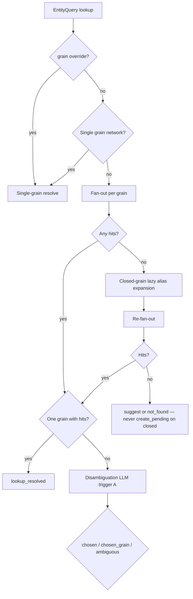

# Query grain router

Multi-grain networks (e.g. baseball `team` + `player`) fan out step-1 lookups per declared MVR grain, disambiguate when multiple grains hit, and persist the resolved grain on delivery scopes for step 2.

See also [architecture.md](architecture.md) § Target protocol and [seed-bootstrap.md](seed-bootstrap.md) § open vs closed identity.

## Fan-out filtering

For each declared grain `g`, the router builds:

```text
filtered = {k: v for k, v in lookup.items() if k in g.bind_fields}
```


| Lookup               | Team grain (`name`)       | Player grain (`name`, `team`) |
| -------------------- | ------------------------- | ----------------------------- |
| `{name: y, team: x}` | `{name: y}`               | `{name: y, team: x}`          |
| `{team: x}` only     | **skip** (empty filtered) | `{team: x}`                   |
| `{name: y}`          | `{name: y}`               | `{name: y}`                   |


**Agent note:** team-grain queries use the `**name`** bind field (canonical city+name). The key `**team**` applies to the **player** grain only as a disambiguator — not as the team entity’s primary key.

## Step-1 flow (lookup)




## 0-hit pipeline (closed grains)

1. Fan-out → all grains skipped or all return `[]`.
2. Lazy field alias expansion (slice 2) on each **closed** grain with non-empty `filtered`.
3. Re-fan-out the same lookup.
4. Still 0 → `lookup_suggested` or `not_found`; **never** `create_pending` on closed grains.

## Disambiguation LLM (trigger A)

Invoke **only when ≥2 grains** each have **≥1 hit**.


| Example                | Team hits | Player hits | LLM?                            |
| ---------------------- | --------- | ----------- | ------------------------------- |
| `{name: "Dodgers"}`    | 2         | 0           | **No** — single grain with hits |
| `{name: "Washington"}` | 1+        | 1+          | **Yes**                         |


Structured outcomes (mutually exclusive):


| Outcome                         | Action                                                      |
| ------------------------------- | ----------------------------------------------------------- |
| `chosen` + `{grain, entity_id}` | Resolve single entity on that grain                         |
| `chosen_grain`                  | Use all hits on that grain (1 → resolved, 2+ → multi-match) |
| `ambiguous`                     | Cross-grain `lookup_suggested` (3c)                         |


Env: `OPENAI_API_KEY` for production; `MYCELIUM_GRAIN_DISAMBIGUATION_MODEL` (default `gpt-4o-mini`). Tests inject a mock disambiguator.

## Cross-grain ambiguous (3c)

When the LLM returns `ambiguous` (e.g. one team + one player for the same string), step 1 returns `**lookup_suggested`** with candidates tagged with `**grain**`, `id`, and `suggested_lookup`. No mixed-grain `delivery_id` in v1 — the client sends a new step 1 with optional `grain` override.

Within one grain, multi-match delivery is unchanged (single `grain`, multiple `entity_ids`).

## `id`-only step 1

Search **all grains** for the uuid when `grain` is omitted:

- 0 matches → `not_found`
- 1 match → resolve with that grain on delivery
- 2+ grains contain the same id → `not_found` (data error)

No LLM.

## Optional `EntityQuery.grain`

When set on step 1: skip fan-out and disambiguation; run single-grain resolve (closed identity + lazy aliases on that grain only). Useful for tests, MCP, and power users.

## Delivery scope

`DeliveryScope.grain` is set at issue time from the resolved grain. Step 2 loads the matching registry and MVR via `scope.grain`.